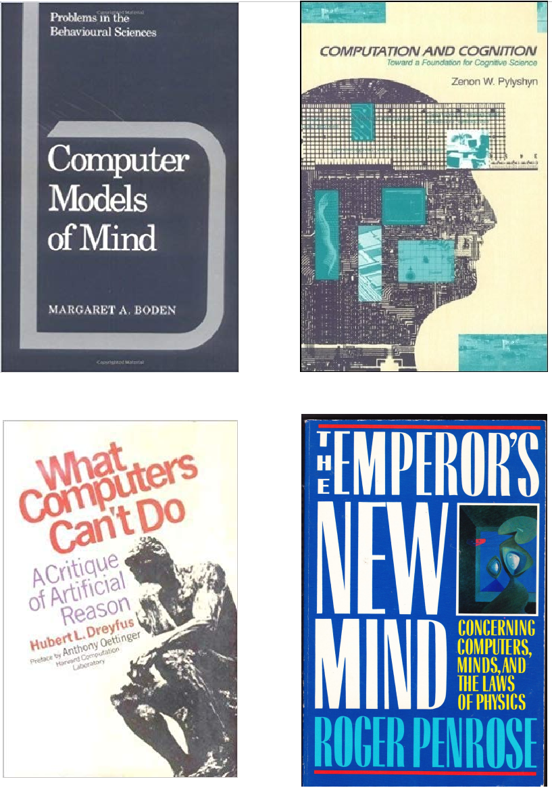
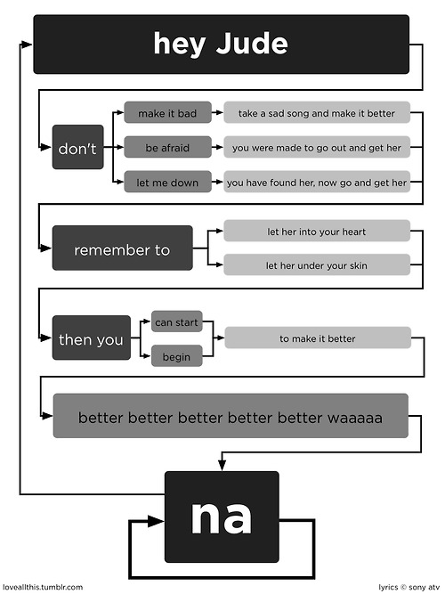
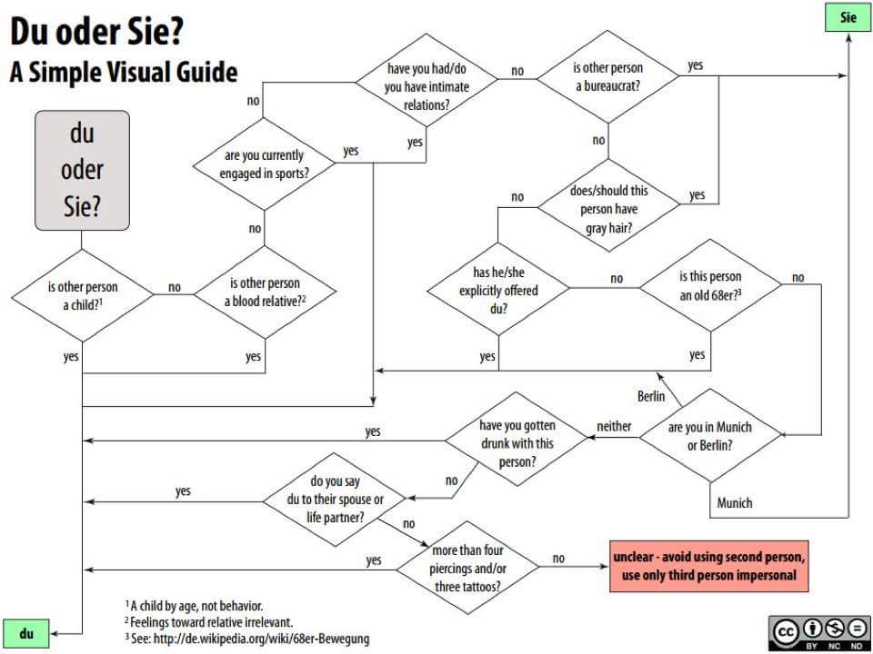
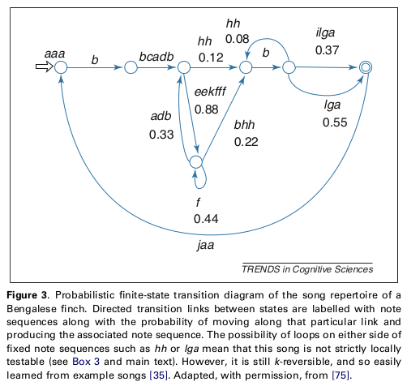
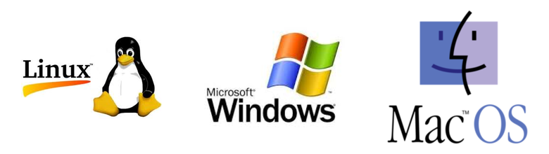

**********************
Automata and Computers
**********************

.. contents::

The Computational Theory of Mind
================================

Cognitive science founding disciplines :

-  Psychology
-  Linguistics
-  Philosophy of mind
-  Neurosciences
-  Computer science (Cybernetics + AI)

Could a machine think? Could the mind itself be a machine?

Computers were designed to simulate the mental operations realized by a
human mathematician performing a… computation (see Alan Turing)

The *Computational Theory of Mind* has been defended and attacked many
times.

   

More readings:

-  Zylberberg, Ariel, Stanislas Dehaene, Pieter R. Roelfsema, and
   Mariano Sigman. 2011. “The Human Turing Machine: A Neural Framework
   for Mental Programs.” *Trends in Cognitive Sciences*

-  Van Gelder, Tim. 1995. “What Might Cognition Be, If Not
   Computation?:” *Journal of Philosophy* 92 (7): 345–81.

-  Jerry Fodor *The Mind does not work that way*

-  Douglas Hoftstader *Gödel, Escher & Bach: an eternal golden braid* and *I am a strange loop*

What is computation anyway ?
============================

One common answer is:

   **"Computation is what a Turing machine can do"**

But what is a Turing machine?

The ancestors of the computer: the automata
===========================================

An **automaton** is a device designed to automatically follow a
predetermined sequence of operations.

.. figure:: images/automata.jpg

   Examples of Automata: A vending machine, A clock, Vaucanson’s duck

(see Descartes’ *Les Animaux Machines* `Lettre au Marquis de
Newcastle <http://www.ac-grenoble.fr/PhiloSophie/logphil/oeuvres/descarte/newcastl.htm>`__

Formal description of an automaton
==================================

At a abstract level, an automaton can be formally described by:

-  a set of internal **states**
-  a **transition** table (or diagram) that describes the **events**
   that lead to changes from one state to the other state.

.. figure:: images/fsa-table.png
   :alt: Diagram and Tabular representation of a finite state automaton

   Diagram and Tabular representation of a finite state automaton

Examples of transition diagrams
===============================

.. figure:: images/coin-counter.png
   :alt: The change counter of a vending machine

   The change counter of a vending machine

   Transition Diagram for the lyrics of *Hey Jude*

   Algorithm to decide if you must use “du” or “sie” in German

   A (Probabilistic) Finite state diagram for Bengalese Finch songs
   (Berwick et al., 2011 *Trends in Cognitive Sciences*)

--------------

A Finite State Automaton can be used to generate or recognize regular
languages.

In Formal Language Theory, a language is a set of strings.

Examples:

*  { a, aa, ab, ba, aab, bab, …}
*  { ha!, haha!, hahaha!, hahahaha!, …}
*  { ab, aabb, aaabbb, … }
*  { the set of grammatical English sentences}

What is a Computer?
===================

A computer is basically an automaton augmented with a *memory store*.

This is particularly clear in the case of the *Turing machine*, a mathematical model of computation (Turing offered the Turing machine as an analysis of the activity of an (idealised) human mathematician engaged in computing).

.. figure:: images/Turing-Machine0.jpg
   :alt: A Turing machine = FSA + memory store

   A Turing machine = FSA + memory store

A Turing machine is a finite state machine augmented with a tape and a
mechanism to read/write on it.

Read `Roger Penrose’s chapter’s on Turing machines <../pdfs/Penrose_Turing-machines.pdf>`__ and
https://en.wikipedia.org/wiki/Turing_machine. You may laos read the
`Alan Turing’s seminal paper <https://londmathsoc.onlinelibrary.wiley.com/doi/pdf/10.1112/plms/s2-42.1.230>`__.

.. figure:: images/turing.png
   :alt: A table describing a Turing machine: try to simulate it.

   A table describing a Turing machine: try to simulate it.

--------------

Other computing machines have been invented, yet:

"All attempts to give an exact analysis of the intuitive notion of an effectively calculable function have turned out to be equivalent, in the sense that each analysis offered has been proved to pick out the same class of functions, namely those that are computable by Turing machine.

The concept of effective calculability has turned out to be formalism-independent, in that all these different formalisms pick out exactly the same class of functions." (B. Jack Copeland “The Church-Turing thesis” in *Stanford Encyclopedia of Philosophy Archive*)

Another computing model which is closer to actual computers, is the *register machine*.

Register machines
=================

Read `The seven secrets of computer power revealed <../pdfs/Dan_Dennett-The_seven_secrets_of_computers_revealed.pdf>`__ (Chapter 24
from Daniel Dennett’s *Intuition Pumps and other tools for thinking*)

The RogRego computer possesses:

*  a bank of registers, or memory locations, each with a unique
   *address* (1, 2, 3, …), and each able to have, as *content*, a single
   integer (0, 1, 2, …)
*  a processing unit can execute instructions in a stepwise,
   one-at-a-time fashion. The processor knows only 3 instructions:

   1.  **End**: finishes the programs
   2.  **Increment register** with 2 arguments:
            - a register number to increment by 1
            - a step  (line) number to jump to when the increment is complete 
   3.  **Decrement register and Branch** with 3 arguments:
            - a register number to decrement by 1
            - a step number to jump if the register contains a non null value.
            - a step number to jump if the register contains 0

An online demo is available at http://proto.atech.tufts.edu/RodRego/

You can enter the following program “ADD[0,1]”, on a machine where Reg0
contains 4 and Reg1 contains 7. Try to explain what it is doing::

   1 DEB 0 2 3
   2 INC 1 1
   3 END

. . .

This program adds the content of register 0 to register 1 (destroying
the content of 0)

. . .

Exercice: write a program Program 2 “MOVE[4,5]” that moves the content
of reg4 intro reg5

. . .

::

   1 DEB 5 1 2
   2 DEB 4 3 4
   3 INC 5 2
   4 END

. . .

Program 3 “COPY[1,3]” copies the content of reg1 into reg3, leaving reg1
unchanged:

::

   1 DEB 3 1 2
   2 DEB 4 2 3
   3 DEB 1 4 6
   4 INC 3 5
   5 INC 4 3
   6 DEB 4 7 8
   7 INC 1 6
   8 END

Program 4 (NON DESTRUCTIVE ADD[1,2,3]):

::

    1 DEB 3 1 2
    2 DEB 4 2 3
    3 DEB 1 4 6
    4 INC 3 5
    5 INC 4 3
    6 DEB 4 7 8
    7 INC 1 6
    8 DEB 2 9 11
    9 INC 3 10
   10 INC 4 11
   11 DEB 4 12 13
   12 INC 2 11
   13 END

. . .

Note that *conditional branching* is the key instruction that gives the
power to the machine. Depending on the content of memory, the machine
can do either (a) or (b).

Exercice: implementation of a Register machine
~~~~~~~~~~~~~~~~~~~~~~~~~~~~~~~~~~~~~~~~~~~~~~

Write a Python script that simulates a `RodRego machine <http://sites.tufts.edu/rodrego/>`__ with 10 registers.
The program is stored in a string or in
file that is read and then executed. Your program must contain
a function which, given the 10 initial values of the registers, and
the program, returns the new register values when
the END command is reached.

Check two possible solutions:
- :download:`rodrego_maxime_caute.py <../coding-exercises/rodrego/rodrego_maxime_caute.py>`
- :download:`rodrego_christophe_pallier.py <../coding-exercises/rodrego/rodrego_christophe_pallier.py>`

---

The Seven secrets of computers revealed
=======================================

1. Competence without comprehension. A machine can do perfect arithmetic
   without having to comprehend what it is doing.

2. What a number in a register stands for depends on the program

3. The register machine can be designed to discriminate any pattern that
   can be encoded with numbers (e.g. figures, text, sensory inputs,…)

4. Programs can be encoded by numbers.

5. All programs can be given a unique number which can be treated as a
   list of instructions by a Universal Machine.

6. all improvements in computers over Turing machine (or Register
   machine), are simply ways of making them faster

7. There is no secret #7

Programmable computers
======================

-  The first computers were not programmable. They were hardwired!

-  An important milestone was the invention of the *programmable*
   computer:

   -  a program is a set of instructions stored in memory.
   -  Loaded and executed by a processor.
   -  Such programs are written in machine langage (the language of the
      processor)

Compilation and interpretation
==============================

Programs written in higher=level languages (rather than Machine
language) can be either:

=  **compiled**, or
=  **interpreted**

In both cases, you write the program as text files called **source
files**.

A **compiler** translates the program into an executable file in machine
language. The executable file is standalone, that is, the source code is
not needed.

An **interpreter** reads the file and execute the commands one by one.
It is slower, but easier to interact with. Disatvantage: you need the
interpreter to exectute it.

.. figure:: images/interpret-compile.png
   :alt: Interpretation and compilation

   Interpretation and compilation

Operating systems
=================

In the first computers, there was only **one** program running. One
would load the program into memory, then run it until it halted. Several
Programs were ran in *batch mode*, in a sequence.

Then, it was realized that computers could *time-share* between
programs, allowing several users (or programs) to share the computer.

This requires an **operating systems** (O.S.). The O.S. is the first
program that loads into the computer during the boot. When running:

-  The OS controls the hardware (screen/printer/disk/keybord/mouse,…)
   (drivers)

-  The OS manages all the other programs (processes/tasks/applications).

   -  sharing memory
   -  allocating processors and cores
   -  allocating time

   Check out *Task Manager* (Windows)/*System Monitor* (Linux)/
   *Activity Monitor* (Mac)

   Three popular operating systems

Different OSes offer different “views” of the computer (e.g. 1 button
mouse in Mac, 2 in Windows, 3 in Linux), so often programs are designed
to work on one OS (bad!). Prefer multiplatform software (like Python).

Several OS can be installed in a given machine:

-  choice at boot (multiboot)
-  an OS can run inside a **virtual machine**, that is a program running
   in another (or the same) OS, and emulating a full computer.

What is a Terminal?
===================

.. figure:: images/terminals.png
   :alt: Terminals

   Terminals

**Terminal** (or **console**): originaly, a device comprising a keyboard
and screen, allowing a human to *interact* with a computer.

Remarks:

Before keyboards and screens, there were punchcards and printers:

.. figure:: images/PunchedCard.jpg
   :alt: A punch card

   Early computers had no keyboard, no screen. The input was done
   through punched cards and output would be printed out

Historically, terminals used to be a dumb screen/keyboard connected to a
central computer.

.. figure:: images/terminals.jpeg
   :alt: Several terminals connected to a single, shared, computer. 

In the mainframe era, many terminals were connected to a single, powerful,
computer. Everybody was sharing the same computer

With the advent of *Personal Computers*, the terminal and the computer became a
single apparatus.

However, terminals can be *virtual*. A terminal is a program that let
you run text programs. You interact by typing and displaying text. No
graphical interface/no mouse.

When you open a terminal, a program called a `shell <http://en.wikipedia.org/wiki/Shell_%28computing%29>`_ is started that
displays a prompt, waiting for you to enter commands with the
keyboard.

.. figure:: images/terminal.png
   :alt: Picture of a ‘virtual’ terminal in Linux

   Picture of a ‘virtual’ terminal in Linux

