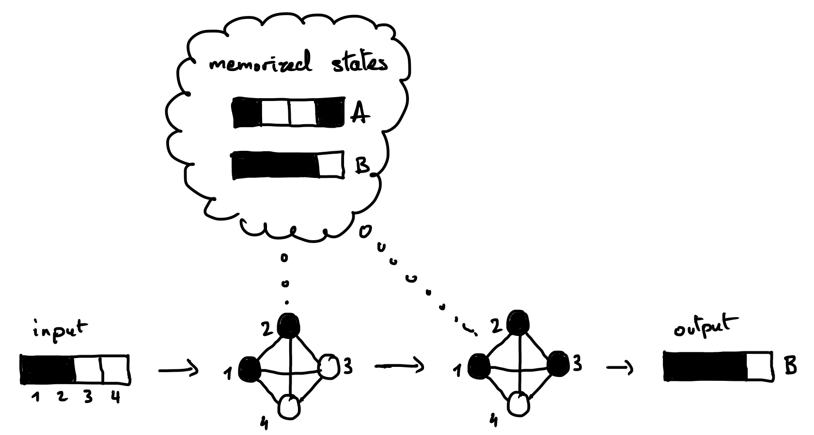

*****************
Hopfield Networks
*****************

Hopfield networks are a type of artificial neural network that can
implement an associative memory.

A Hopfield network can be wired to memorize certain states: when given
an incomplete or corrupted version of one of the memorized state, it
will restore the original state.
`Demo <https://www.youtube.com/watch?v=HOxSKBxUVpg>`__.

Model
=====

Structure
---------

-  A Hopfield network consists of N neurons, each of which can have two
   states, +1 or -1. The state of the whole network can be written as a
   binary vector of size N. We will use a 1-dimensional array to code
   that state, e.g. ``state = np.array([+1, -1, -1, -1])``.

-  The weights of the connections between the neurons can be written as
   a matrix of size N×N. We will use a 2-dimensional array to code that
   matrix,
   e.g. ``weight = np.array([[0, -1, -2, +1], [-1, 0, +3, -1], [-2, +3, 0, -1], [+1, -1, -1, 0]])``.

-  In Hopfield networks, the connections are symmetric and there are no
   self-recurrent connections. Thus, the weight matrix is symmetric
   (``weight[i, j] == weight[j, i]``) and its diagonal is zero
   (``weight[i, i] == 0``).

Updating
--------

-  The state of a neuron is updated according to the sign of the input
   it receives in the following way:

   .. figure:: images/hopfield_update_equation.png
      :alt: Update equation

-  Here we will use the synchronous update rule, where all of the
   neurons are updated at the same time from one time step to the next.

Exercise 1.
-----------

-  Write a function to compute the next state of a Hopfield network
   given the previous state and the weight matrix. **Tip**: You can use
   a `matrix
   multiplication <https://en.wikipedia.org/wiki/Matrix_multiplication>`__
   (to do it in NumPy, `see
   here <https://numpy.org/doc/stable/user/quickstart.html#basic-operations>`__).

-  Write a function to compute the final state reached by a network
   given an initial state and its weight matrix. This will either be a
   *stable state*, starting from which the next state remains the same,
   or the state after a max. number of iterations that you will set in
   case no stable state is reached.

-  Test your function with the below initial state and weight matrix.
   The final state should be ``[+1, -1, -1, +1]``. Is it a stable state?

   ::

        initial_state = np.array([+1, -1, -1, -1])
        weight = np.array([
            [0, -1, -1, +1],
            [-1, 0, +1, -1],
            [-1, +1, 0, -1],
            [+1, -1, -1, 0]])

A solution:
`hopfield_1.py <https://github.com/chrplr/PCBS/blob/master/simulations/hopfield/hopfield_1.py>`__.

Computing the weight matrix
===========================

To memorize a single state
--------------------------

Suppose you want to memorize the state ``[s1, s2, s3, s4]``. To do
so, you will set the matrix to:

   ::

        weight = np.array([
            [0    , s1*s2, s1*s3, s1*s4],
            [s2*s1, 0    , s2*s3, s3*s4],
            [s3*s1, s3*s2, 0    , s3*s4],
            [s4*s1, s4*s2, s4*s3, 0    ]])

Exercise 2a.
------------

-  Try it using your own example state. Replace the values in the above
   weight matrix with the values of the state you want to memorize, then
   test that it is stable state using the function you wrote earlier.

-  Also try an initial state that is a corrupted version of the
   memorized state where one neuron has been flipped. Is the state
   effectively restored?

To memorize multiple states
---------------------------

Now, suppose that you want to memorize multiple states. To do so, you
simply need to sum the weight matrices corresponding to each state
according to the previous formula.

Exercise 2b.
-------------

-  Write a function to compute the weight matrix from a set of states.

-  If you have time: Implement this function using the outer product (if
   you haven’t done so already). It gives a neat and efficient way to
   perform this computation.

   **Tip**: Formally, the individual weight matrix to memorize one state
   is the *outer product* of this state with itself. The `wikipedia
   page <https://en.wikipedia.org/wiki/Outer_product>`__ tells you how
   to compute this outer product with a matrix multiplication. You can
   then think of how to extend this operation for multiple states such
   that it gives you the sum of the outer products of individual states.

-  Test your function with two memorized states of size 4. Verify that
   they are stable states, and that you can recover them starting from a
   corrupted state with one neuron flipped.

A solution:
`hopfield_2.py <https://github.com/chrplr/PCBS/blob/master/simulations/hopfield/hopfield_2.py>`__.

Encoding images
===============

-  Let’s make all of this more visual and fun! We will encode 5×5 binary
   images into states. To define these images, we will use strings such
   as this one:

   ::

        """
        11111
        1....
        11111
        ....1
        11111
        """

Exercise 3.
-----------

-  Write a function to convert such a string into 2d matrix which
   represents the image. Test your function and display the image using
   ``matplotlib.pyplot.imshow()``.

-  Write a function to convert such a 2d image matrix into a 1d state
   vector that can be encoded by a Hopfield network, and another
   function to convert the state into a 2d image. `Here is a
   tip <https://numpy.org/doc/stable/reference/generated/numpy.reshape.html?highlight=reshape#numpy.reshape>`__.
   Test your functions.

A solution:
`hopfield_3.py <https://github.com/chrplr/PCBS/blob/master/simulations/hopfield/hopfield_3.py>`__.

Simulations
===========

Exercise 4
-----------

-  Make a network to memorize the `following
   images <https://github.com/chrplr/PCBS/blob/master/simulations/hopfield/str_pattern_defs.py>`__.

-  For each of the `following initial
   states <https://github.com/chrplr/PCBS/blob/master/simulations/hopfield/str_initial_state_defs.py>`__,
   compute the final state that the network reaches and plot the 2d
   images corresponding to the initial state and the final state
   side-by-side.

-  What do you observe? Does the network successfully restore the
   memorized images? Does it always converge to one of these images? Are
   there any unexpected behaviors?

A solution:
`hopfield_4.py <https://github.com/chrplr/PCBS/blob/master/simulations/hopfield/hopfield_4.py>`__.

Exercise 5
-----------

-  Now make another network to memorize the `following
   images <https://github.com/chrplr/PCBS/blob/master/simulations/hopfield/str_pattern_defs_2.py>`__

-  Test the network with those same states as initial states.

-  What do you observe?

A solution:
`hopfield_5.py <https://github.com/chrplr/PCBS/blob/master/simulations/hopfield/hopfield_5.py>`__.

Discussion
==========

What do you think are the strengths and weaknesses of such networks as a
model of the brain?
