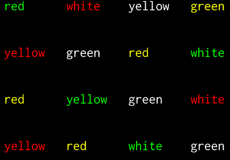

Creating static visual stimuli
==============================

We are going to use `pygame <http://www.pygame.org>`__.

Please read this `quick introduction on drawing with
pygame <https://www.cs.ucsb.edu/~pconrad/cs5nm/topics/pygame/drawing/>`__
and run and study the scripts
`square.py <../visual-illusions/square.py>`__,
`circle.py <../visual-illusions/circle.py>`__ and
`triangle.py <../visual-illusions/triangle.py>`__.

Kanizsa illusory contours
-------------------------

0. Starting from the ``square.py`` and ``circle.py`` scripts, create a
   new script to display the Kanizsa squares:

   .. figure:: images/Kanizsa-square.jpeg
      :alt: Kanizsa square

      Kanizsa square

   .. figure:: images/Kanizsa1.png
      :alt: Kanizsa triangle

      Kanizsa triangle

   Check out my solution:
   `visual-illusions/kanizsa-square.py <../visual-illusions/kanizsa-square.py>`__

   To find out more, google ``illusory contours``.

Herman grid
-----------

-  Starting from `square.py <../visual-illusions/square.py>`__, write a
   program to display the `Herman
   grid <https://en.wikipedia.org/wiki/Grid_illusion>`__

   .. figure:: images/HermannGrid.png
      :alt: Hermann Grid

      Hermann Grid

   Hints:

   -  use paper and pencil to draw the figure
   -  find out the formulas to compute the left top of the square in the
      ith row and jth column
   -  in your python scripts, use nested for loops over rows and columns
      to display each square one by one

-  Check out `my solution <../visual-illusions/grid.py>`__

-  Optional: Read
   https://stackabuse.com/command-line-arguments-in-python/ and use the
   ``sys.argv[]`` array from the ``sys`` module (or use the ``argparse``
   module) to get from the command lines the number of columns, rows,
   the size of square and the size of the margins. Play with those
   parameters to see if you can make the illusion come and go.

Ebbinghaus-Titchener
--------------------

-  Create the static `Ebbinghaus–Titchener
   stimulus <http://www.abc-people.com/illusion/illusion-3.htm#axzz5SqeF15yC>`__.

   .. figure:: images/ebbinghaus-titchener.png
      :alt: Ebbinghaus illusion

      Ebbinghaus illusion

Hint: A bit of `trigonometry <https://en.wikipedia.org/wiki/Unit_circle>`__ can help:
if you want to draw a circle at angle ``alpha`` from the horizontal line
and at distance ``R`` from the origin, the coordinates of its center are
``(R * cos(alpha), R * sin(alpha))``

-  Check out my solution
   `visual-illusions/ebbinghaus.py <../visual-illusions/ebbinghaus.py>`__

Honeycomb and Extinction illusions.
-----------------------------------

The extinction illusion is a variant of the Herman grid:

.. figure:: images/extinction.png
   :alt: Extinction illusion

   Extinction illusion

-  Program the stimulus (the lines can be horizontal and vertical rather
   than oblique)

-  Check out `my solution <../visual-illusions/extinction.py>`__

Here is the Honeycom illusion:

   Honeycomb illusion

-  Watch `this video <https://www.youtube.com/watch?v=fDBYSFDXsuE>`__
-  Check out `Bertamini, Herzog, and Bruno (2016). “The Honeycomb
   Illusion: Uniform Textures Not Perceived as
   Such.” <https://doi.org/10.1177/2041669516660727.%20https://www.ncbi.nlm.nih.gov/pmc/articles/PMC5030753/pdf/10.1177_2041669516660727.pdf>`__

-  Optional: Try to program the honeycomb stimulus above. A `solution
   using psychopy <../visual-illusions/Honeycomb.py>`__ is available on
   `Bertamini’s web
   site <https://www.programmingvisualillusionsforeveryone.online/scripts.html>`__.
   To run it you might need to install “wxpython” (beware: it can be
   troublesome)

   ::

        conda install wxPython
        pip install psychopy

Random-dot stereograms
----------------------

A random-dot stereogram is stereo pair of images of random dots which,
when viewed with the eyes focused on a point in front of or behind the
images, produces a sensation of depth. See
https://en.wikipedia.org/wiki/Random_dot_stereogram.

.. figure:: images/stereogram.jpg
   :alt: stereogram

   stereogram

-  Write a script that generate random-dot stereograms.

-  Check out my solution:
   `random_dot_stereogram.py <../random-dot-stereograms/random_dot_stereogram.py>`__

Creating dynamic visual stimuli
===============================

Wertheimer line-motion illusion.
--------------------------------

-  Check out `Jancke et al (2004) Imaging cortical correlates of
   illusion in early visual
   cortex <http://www.cnbc.cmu.edu/cns/papers/nature02396.pdf>`__.

-  Program the stimulus.

-  Check out my solution
   `visual-illusions/line-motion.py <../visual-illusions/line-motion.py>`__

Flash-lag illusion
------------------

-  Read about the `Flash-lag
   illusion <https://en.wikipedia.org/wiki/Flash_lag_illusion>`__.

-  Program the stimulus.

-  Check out my solution
   `visual-illusions/flash-lag.py <../visual-illusions/flash-lag.py>`__

Dynamic version of the Ebbinghaus-Titchener
-------------------------------------------

-  Watch `this video <https://www.youtube.com/watch?v=hRlWqfd5pn8>`__.

-  Program a version where the outer circles (inducers) grow and shrink
   in size.

-  Check out my solution
   `visual-illusions/ebbinghaus-dynamic.py <../visual-illusions/ebbinghaus-dynamic.py>`__

--------------

Creating and playing sounds
===========================

-  Install the *simpleaudio* module if it is not already installed on
   your computer (check with ipython: ``import simpleaudio``)::

        pip install simpleaudio

   Run the quick check with ipython::

        import simpleaudio.functionchecks as fc 
        fc.LeftRightCheck.run() 

-  Check out `simpleaudio tutorials <https://simpleaudio.readthedocs.io/en/latest/tutorial.html>`__

-  Study `sound_synth.py <../sound/sound_synth.py>`__

-  Write a script that loads the wav file ``cymbal.wav`` and plays it 10
   times, at a rhythm of one per seconds.

   Hint:

   -  use the following functions::

         import scipy.io.wavfile  # for scipy.io.wavfile.read
         import simpleaudio  # to play sound

         def load_sound_as_array(filename):
            [sample_rate, audio_data] = scipy.io.wavfile.read(filename)
            return [sample_rate, audio_data]

         def play_mono(nparray, sample_rate=22050, normalize=True):
             audio = nparray[:]
             if normalize:  # normalize to 16-bit range
                audio *= 32767 / np.max(np.abs(audio))
             # convert to 16-bit data
             audio = audio.astype(np.int16)
             play_obj = simpleaudio.play_buffer(audio, 1, 2, sample_rate)
             # wait for playback to finish before exiting
             play_obj.wait_done()

Sound localisation from binaural dephasing
------------------------------------------

Take a mono sound and create a stereo sound by progressively dephasing
the two channels.

Hints: load the sound file into a one dimensional numpy array, make
a copy of the array and shift it, assemble the two arrays in a
bidimensional array (matrix) and save it as a stereo file

Pulsation (Povel & Essen, 1985)
-------------------------------

Create rhythmic stimuli such as the ones described in `Povel and Essen (1985) Perception of Temporal Patterns <http://www.cogsci.ucsd.edu/~creel/COGS160/COGS160_files/PovelEssens85.pdf>`__

Experiments
===========

Simple reaction times
---------------------

1. Write a script that presents a series of trials in which a dot or a
   cross is presented at the center of the screen and the participant
   must click on the mouse as quickly as possible. The reaction times
   must be recorded in a file for further analyses.

2. Here is a `solution using pygame <../reaction-times/simple-detection-visual-pygame.py>`__. Run it
   and check ``reaction_times.csv``.

3. Here is a `solution using expyriment <../reaction-times/simple-detection-visual-expyriment.py>`__.

Run the previous script. Check the results file in the folder ``data``.
Launch ipython in the ``data`` folder and type::

   import pandas as pd
   d = pd.read_csv(‘simple-detection.xpd’,comment=‘#’)
   d.RT.mean()
   d.RT.std()
   d.RT[1:].mean()

   import matplotlib.pyplot as plt plt.hist(d.RT)

4. Read https://docs.expyriment.org/Tutorial.html to understand the
   basic principles of expyriment. See \`PCBS/expyriment_template.py`\`

5. Modify ``simple-detection-visual-expyriment.py`` to play a short
   sound (``click.wav``) in lieu of displaying a cross. Thus you have
   created a simple detection audio experiment.

6. Modify the script to have 3 blocks of trials: one in which the target
   is visual, one in which it is audio, and one in which it is randomly
   visual or auditory. Are we slowed down in the latter condition?

Posner’s attentional cueing task
--------------------------------

Program the  `Posner’s attentional cueing task <https://en.wikipedia.org/wiki/Posner_cueing_task>`__

See solution
in `Posner-attention/posner_task.py <../Posner-attention/posner_task.py>`__

Stroop Effect
-------------

The `Stroop Effect <https://en.wikipedia.org/wiki/Stroop_effect>`__
demonstrates the automaticity of reading. Write a python script to
create 4x8 cards for the task, avoiding repetitions of colors.

   Stroop card

You can read a tutorial on `how to display text with
pygame <https://nerdparadise.com/programming/pygame/part5>`__

-  After trying to program it yourself, you can compare with `my
   solution <Stroop-effect/create_stroop_cards.py>`__

-  Run `stroop_task.py <Stroop-effect/stroop_task.py>`__ and check the
   naming times in ``data``. Compute the average reading times as a
   function of the language (you can use R or Python).

Lexical Decision Task
---------------------

In a lexical decision experiment, a string of characters is flashed at
the center of the screen and the participant has to decide if it is real
word or not, indicating his/her decision by pressing a left or right
button. Reaction time is measured from the word onset, providing an
estimate of the speed of word recognition.

-  Visit the web site http://www.lexique.org
-  To learn to use lexique with R, follow the document
   http://chrplr.github.io/PCBS/lexique/interroger-lexique-avec-R.nb.html
-  Using [lexical-decision/select-words-from-lexique.py] as an example,
   select 20 high frequency nouns, 20 low frequency nouns, 20 high
   frequency verbs and 20 low frequency verbs, from Lexique382.txt —
   from http://www.lexique.org/public/Lexique382.zip. They must all have
   a length of 5 to 8 characters.
-  Generate 50 pseudowords using either `Lexique
   tools <http://www.lexique.org/toolbox/toolbox.pub/>`__ or
   `Wuggy <http://crr.ugent.be/programs-data/wuggy>`__
-  Program a lexical decision using expyriment.
-  Run it and compute the average decision times using pandas

A general audio visual stimulus presentation script
---------------------------------------------------

In some experiments, we know in avdvance the precise timing of all
stimuli (the program flow does not depends on external events). I wrote
a script that reads the timing of audiovisual stimuli and present them
at the expected times — Its code is available at
https://www.github.com/chrplr/audiovis

More examples using expyriment.org
----------------------------------

-  See http://docs.expyriment.org/old/0.9.0/Examples.html
-  Fork https://github.com/expyriment/expyriment-stash and contribute by
   adding new scripts!

Data Analyses
=============

Basic Data Analysis with R
--------------------------

See
http://www.pallier.org/examples-of-basic-data-analyses-with-r.html#examples-of-basic-data-analyses-with-r

Comparing means using Easy ANOVA (Analysis of Variance)
-------------------------------------------------------

See http://www.pallier.org/easy-anova-with-r.html#easy-anova-with-r

Permutation tests
-----------------

-  Read about the principle of `permutation tests <https://en.wikipedia.org/wiki/Resampling_(statistics)#Permutation_tests>`__

-  Implement a python script that uses a permutation test to compare two
   samples.

-  Check out my solution:
   `permutation_test/permutation_test.py <permutation_test/permutation_test.py>`__

Bootstrap
---------

-  Implement the
   `bootstrap <https://en.wikipedia.org/wiki/Bootstrapping_(statistics)>`__
   to obtain confidence intervals on the means of a sample.

Frequency Analysis
------------------

-  See
   `data-analysis/short-intro-fourier <data/analysis/short-intro-fourier>`__
   and the associated jupyter notebook `data-analysis/short intro to
   frequency analysis (Fourier
   series).ipynb <data-analysis/short%20intro%20to%20frequency%20analysis%20(Fourier%20series).ipynb>`__

Lexical Statistics
==================

Zipf law
--------

-  The script (word-count.py])[Zipf/word-count.py] computes the
   distribution of frequencies of occurences in a list of words. Use it
   to compute the distribution of word frequencies in `Alice in
   Wonderland <http://www.umich.edu/~umfandsf/other/ebooks/alice30.txt>`__.

   Note: To remove the punctuation, you can use the following function:

   import string def remove_punctuation(text): punct =
   string.punctuation + chr(10) return
   text.translate(str.maketrans(punct, " " \* len(punct)))

-  Zipf law states that the product rank X frequency is roughly
   constant. This ‘law’ was discovered by Estoup and popularized by
   Zipf. See http://en.wikipedia.org/wiki/Zipf%27s_law. Create the Zipf
   plot for the text of `Alice in Wonderland <Zipf/alice.txt>`__
   showing, on the y axis, the log of the frequency and on the x axis
   the word rank (sorting words from the most frequent to the least
   frequent).

-  Display the relationship between word length and word frequencies
   from the data in
   `lexical-decision/lexique382-reduced.txt <lexical-decision/lexique382-reduced.txt>`__

-  Generate random text (each letter from a-z being equiprobable, and
   the spacecharacter being 8 times more probable) of 1 million
   characters. Compute the frequencies of each ‘pseudowords’ and plot
   the rank/frequency diagram.

-  To know more about lexical frequencies:

   -  Read Harald Baayen (2001) *Word Frequency Distributions* Kluwer
      Academic Publishers.
   -  Read Michel, Jean-Baptiste, Yuan Kui Shen, Aviva P. Aiden, Adrian
      Veres, Matthew K. Gray, The Google Books Team, Joseph P. Pickett,
      et al. 2010. “Quantitative Analysis of Culture Using Millions of
      Digitized Books.” Science, December.
      https://doi.org/10.1126/science.1199644. (use scholar.google.com
      to find a pdf copy). Check out **google ngrams** at
      https://books.google.com/ngrams. (Note that at the bottom of the
      page, there is a message “Raw data is available for download
      here”).

Benford’s law.
--------------

Learn about `Benford’s
law <https://brilliant.org/wiki/benfords-law/>`__. Write a Python script
that displays the distribution of the most significant digit in a set of
numbers. Apply it to the variables in
`Benford-law/countries.xlsx <Benford-law/countries.xlsx>`__.

A solution: `Benford-law/Benford.py <Benford-law/Benford.py>`__

Simulations
===========

Monte Carlo Estimation
----------------------

-  Read about `Monte Carlo estimation of
   PI <https://academo.org/demos/estimating-pi-monte-carlo/>`__

-  Write a script that estimate pi using this method (then check my
   solution:
   `simulations/estimate_PI_by_MonteCarlo.py <simulations/estimate_PI_by_MonteCarlo.py>`__)

Fractals
--------

`Fractals <https://en.wikipedia.org/wiki/Fractal>`__ are figures that
are self-similar at several scales.

-  Write a script that displays the `Koch
   snowflake <https://en.wikipedia.org/wiki/Koch_snowflake>`__

   Hints:

   -  use the turtle module
   -  use recursion

   My solution: `games/koch.py <games/koch.py>`__

Cellular Automata
-----------------

Learn about Conway’s `Game of
Life <https://en.wikipedia.org/wiki/Conway%27s_Game_of_Life>`__. Watch
`this <https://www.youtube.com/watch?v=S-W0NX97DB0>`__ and
`that <https://www.youtube.com/watch?v=C2vgICfQawE>`__ videos.

-  Implement an `Elementary cellular
   automaton <https://en.wikipedia.org/wiki/Elementary_cellular_automaton>`__.
   The aim is to reproduce the graphics shown at the bottom on the
   previous page. you can take inspiration from the excellent `Think
   Complexity <http://greenteapress.com/wp/think-complexity-2e/>`__ by
   Allen B. Downey. My solution is at
   `cellular-automata/1d-ca.py <cellular-automata/1d-ca.py>`__.

-  Implement the Game of Life in 2D.

-  Going futher: If you enjoy Cellular Automata, you can read Stephen
   Wolfram’s `A New Kind of
   Science <https://en.wikipedia.org/wiki/A_New_Kind_of_Science>`__. A
   more general book about Complexity is Melanie Mitchell’s *Complexity:
   a guided tour*.

Artificial Neural networks
--------------------------

To understand the basics of artificial neural networks, I recommend that
you first read https://victorzhou.com/blog/intro-to-neural-networks/ and
then watch the four excellent videos at
https://www.youtube.com/playlist?list=PLZHQObOWTQDNU6R1_67000Dx_ZCJB-3pi
. The last two of them focus on the backpropagation algorithm that allow
to train network to learn mapping.

Next, you can read and try to understand this
`implementation <https://visualstudiomagazine.com/articles/2017/06/01/back-propagation.aspx>`__
of the backpropagation algorithm.

Then, see a modern and efficient implementation of neural networks:
https://pytorch.org/tutorials/beginner/deep_learning_nlp_tutorial.html

More readings:

-  `The Unreasonable Effectiveness of Recurrent Neural
   Networks <http://karpathy.github.io/2015/05/21/rnn-effectiveness/>`__
   on Andrej Karpathy’s blog.

-  `understanding LSTM
   Networks <http://colah.github.io/posts/2015-08-Understanding-LSTMs/>`__

-  `Pattern recognition and machine
   learning <https://www.springer.com/fr/book/9780387310732>`__ by
   Christopher M. Bishop

Natural Language Parsing
------------------------

Parsing refers to building the syntactic structure of a sentence from
the linear sequence of words that compose it. Explore the `various
parsing algorithms <http://www.nltk.org/book/ch08.html>`__\ using the
`Natural Language Toolkit <https://www.nltk.org/>`__.

Neuroimaging
------------

-  Check out `nilearn <http://nilearn.github.io/>`__ and
   `nistats <https://nistats.github.io/>`__ and
   `MNE-python <https://martinos.org/mne/stable/index.html>`__

-  See `data-analysis/Example of a single subject-single run fMRI
   analysis with
   nistats.ipynb <data-analysis/Example%20of%20a%20single%20subject-single%20run%20fMRI%20analysis%20with%20nistats.ipynb>`__

