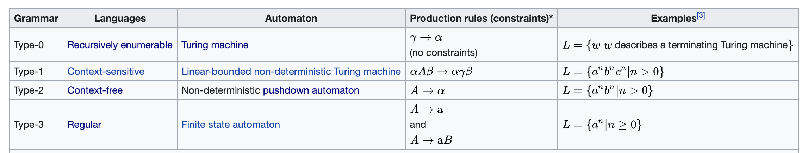

===================
Regular Expressions
===================

Tutorial
--------

**1. Watch the following introduction video to see how useful regular expressions can be.**

.. raw:: html

	<iframe width="560" height="315" src="https://www.youtube.com/embed/xseViAOrKvM" frameborder="0" allow="accelerometer; autoplay; clipboard-write; encrypted-media; gyroscope; picture-in-picture" allowfullscreen></iframe>

Use of regular expressions to extract and transform information from text.

`Watch on youtube <https://youtu.be/xseViAOrKvM>`_

**2. Read the first two sections in Chapter 7 of Al Sweigart's book "Automate the boring stuff", page 161 to 166.**

This will show you how regular expressions can be used in Python.

The book is `available on Schoology <https://app.schoology.com/course/4637783206/materials/gp/4653909275>`__

**3. Do all the lessons of the interactive tutorial at** `regexone.com <https://regexone.com/>`__

This will teach you, through practice, the syntax of regular expressions.

**4. Continue onto the practice problems at** `regexone.com <https://regexone.com/>`_

To practice putting regular expressions to use in real-world problems.

Example in Cognitive Science research
-------------------------------------

Regular expressions have many applications, especially in natural language processing. Check out, for example, the chapter `Regular Expressions, Text Normalization, Edit Distance <https://web.stanford.edu/~jurafsky/slp3/2.pdf>`__ from Dan Jurasfky and Alex Martin's book `Speech and Language Processing <https://web.stanford.edu/~jurafsky/slp3/>`__ .

Regular expressions were used to locate syllable boundaries in the phonetic representation of words by `Pallier (1999). Syllabation des représentations phonétiques de brulex et de lexique. <https://www.pallier.org/papers/syllabation.pdf>`__ (see https://github.com/chrplr/openlexicon/tree/master/scripts/french-syllabation for scripts and more). 

More on the Theory
------------------

A regular regression describes a *formal language*. A formal language is a set of strings over a finite alphabet. For example, the set L = { a\ :sup:`n`\ b\ :sup:`n` | n > 0} is a formal language.

A formal language is often defined by means of a *formal grammar*: a start symbol and a set of *production rules* that, when applied, generate all the strings of the language but no more. For example, the grammar with start symbol 'S' and production rules S -> aSb, S -> ab generates L.

The problem of *matching* or *recognizing* a language is to decide whether a given strings belongs to the language (as when deciding whether a string matches a regular expression). Depending on the language, this can be more or less difficult to solve. For example, L cannot be recognized by a finite-state automaton, but can be recognized by a type of automaton equipped with a stack (known as a pushdown automaton). One such automaton would push onto its stack each 'a' encountered starting from the beginning of the string, then pop one 'a' from the stack for each 'b' encountered, and would decide that the string matches iff the stack is empty when reaching the end of the string.

**Chomsky's hierarchy** establishes a direct correspondance between certain classes of languages or grammars and certain types of machines/automata that can recognize them. See `the wikipedia article <https://en.wikipedia.org/wiki/Chomsky_hierarchy#The_hierarchy>`_

  Chomsky's hierarchy (copied from wikipedia)

**Regular expressions are a class of languages that can be recognized very efficiently** while still being expressive enough for many applications, which is why they are such a practical tool for everyday practice. (Note: The "regular expressions" provided in modern computer software are a bit more expressive than the narrower "regular language" class as defined in theory, because they include additional mechanisms such as lookahead).

To learn more about theory, check out this reference book (chapter 3 for regular expressions and automata):

	Alfred V. Aho, Ravi Sethi & Jeffrey D. Ullman. "Compilers: principles, techniques, & Tools". Addison-Wesley, 1986.

