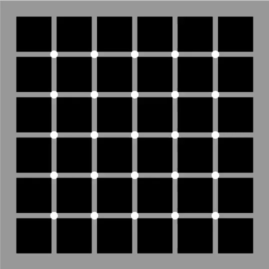
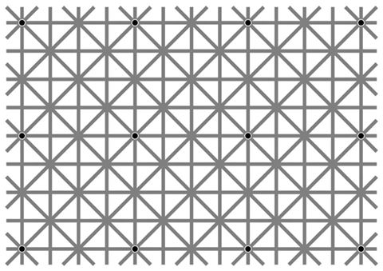
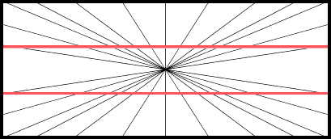
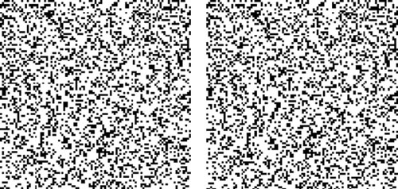
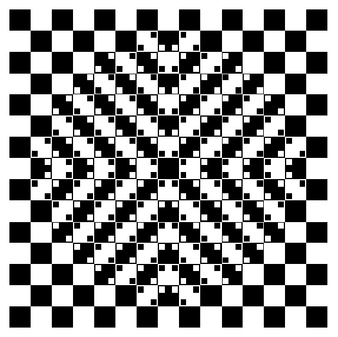
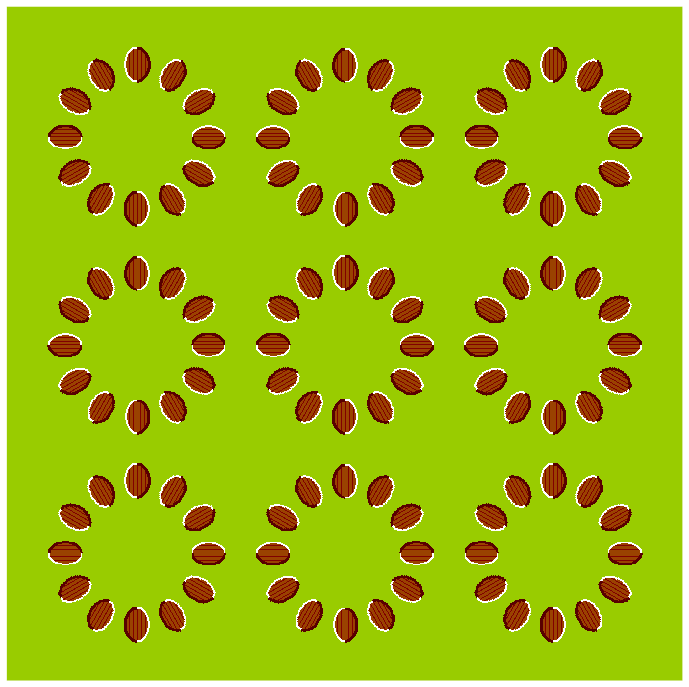
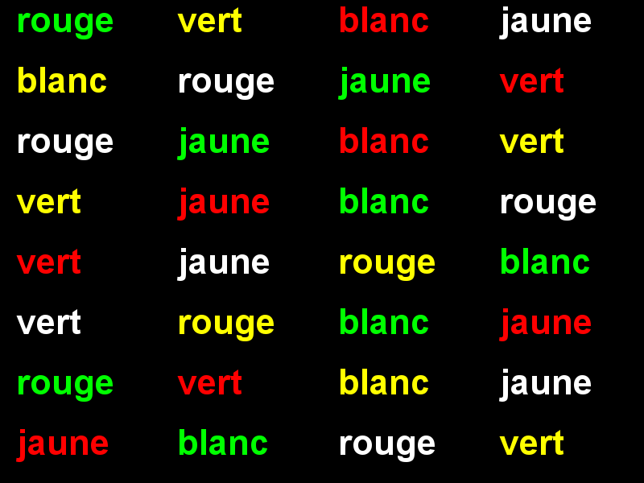
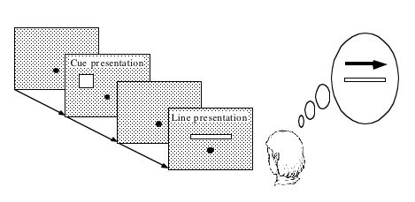

****************
Creating stimuli
****************

.. contents::

Static visual stimuli
=====================

To generate visual stimuli, we are going to rely on the Pygame_ module. You can check if it is installed on your system by typing ``python`` on a command line and, at the ``>>>`` prompt, ``import pygame``. If all is well, you should get the following message::

    >>> import pygame
    pygame 2.0.1 (SDL 2.0.14, Python 3.8.5)
    Hello from the pygame community. https://www.pygame.org/contribute.html

.. warning::
   
    If, instead, you obtain a message ending in ``ModuleNotFoundError: No module named 'pygame'``, one reason could be that you forgot to activate the virtual environment where you installed expyriment. Try ``conda activate expyriment`` or ``pyenv activate expyriment`` (use ``conda env list`` or ``pyenv virtualenvs`` to list all available environments) 
    
    If this does not work, you can install pygame with ``pip install pygame``.

    For more detailed instructions, see :doc:`software-installation`.

Displaying geometric shapes
---------------------------

Here is a Python script that opens a window and displays a square:

.. code:: python

    """ Display a square.

        See https://sites.cs.ucsb.edu/~pconrad/cs5nm/topics/pygame/drawing/
    """

    import pygame

    # Colors are triplets containint RGB values
    # (see <https://www.rapidtables.com/web/color/RGB_Color.html>
    BLACK = (0, 0, 0)
    WHITE = (255, 255, 255)
    GRAY = (127, 127, 127)
    RED = (255, 0, 0)
    GREEN = (0, 255, 0)
    BLUE = (0, 0, 255)

    # Parameters of the Graphics Window 
    W, H = 500, 500  # Size of the graphic window 
    # Note that (0,0) is at the *upper* left hand corner of the screen.
    center_x = W // 2
    center_y = H // 2

    pygame.init()

    # Create the Graphic Window (designated by a variable `screen`) 
    screen = pygame.display.set_mode((W, H), pygame.DOUBLEBUF)
    pygame.display.set_caption('square')

    screen.fill(WHITE)  # fill the window with white
    
    # Draw a rectangle at the center of the window (in the backbuffer)
    width, height = 200, 200  # dimensions of the rectangle in pixels
    left_x = center_x - width // 2  # x coordinates of topleft corner
    top_y = center_y - height // 2  # y coordinate of topleft corner
    pygame.draw.rect(screen, BLUE, (left_x, top_y, width, height))

    pygame.display.flip()  # display the backbuffer on the screen
                           # Note: this function is synonymous with `pygame.display.update()`

   # Save the image into a file
    pygame.image.save(screen, "square-blue.png")

    # Wait until the window is closed
    quit_button_pressed = False
    while not quit_button_pressed:
          pygame.time.wait(10)
          for event in pygame.event.get():
              if event.type == pygame.QUIT:
                   quit_button_pressed = True

    pygame.quit()

Download (:download:`square.py <../stimuli/visual-illusions/square.py>`) and run it by typing::

    python square.py

Have a look at the code.

Exercise (*): make a copy of the script and modify the copy to
   - change the color of the rectangle to RED
   - change the size of the rectangle to 100 x 300
   - comment the line `pygame.display.flip()` and run the script.  You should realize that merely drawing something to the display surface (`screen`) doesn't cause it to appear on the screen -- you need to call `pygame.display.flip()` to move the surface from general memory to video memory. This will be useful when you want to make an animation, that is, draw a sequences of images.  

Have a look at:
   - `Pygame drawing basics <https://ryanstutorials.net/pygame-tutorial/pygame-shapes.php>`__
   - `Pygame tutorial <https://pygame.readthedocs.io/>`__
   - `Pygame's on-line documentation <https://www.pygame.org/docs/>`__

It is of course possible to draw other shapes. Check out for example the two scripts:
- :download:`circle.py <../stimuli/visual-illusions/circle.py>` and
- :download:`triangle.py <../stimuli/visual-illusions/triangle.py>`

Exercice (*): modify :download:`circle.py <../stimuli/visual-illusions/circle.py>` to draw *two* circles, one red and on blue, side-by-side

   .. figure:: images/two-circles.png
      :alt: Two Circles

      Two Circles

  (solution in :download:`two_circles.py <../stimuli/visual-illusions/two_circles.py>`)

Exercise (*): Note that the circles above are filled with the color (actually, they are disks). Browse `Pygame online documentation <https://www.pygame.org/docs/>`__ to find how to color the circumference of the circle and keep its inner part white.

Troxler effect
--------------

Fixate your gaze at the center of the picture below for 30 seconds

    .. figure:: images/troxler.png
       :alt: Troxler Figure

       Troxler effect

What happened after a few seconds? This is the *fill-in phenomenon* (See https://en.wikipedia.org/wiki/Filling-in).

Exercise (*): Program the Troxler stimulus (hint: use  https://www.google.com/search?q=color+picker to find the RGB values for the disks)

For a solution, check out :download:`troxler.py <../stimuli/visual-illusions/troxler.py>`

Kanizsa illusory contours
-------------------------

Created by Italian psychologist Gaetano Kanizsa in 1955, the *Kanizsa Triangle* is a classic example of illusory contours. In the image below, a white equilateral triangle can be clearly perceived even though there are no explicit lines or enclosed spaces to indicate such a triangle. (To find out more about this illusion, perform a Google search with the keywords `illusory contours`.)

   .. figure:: images/Kanizsa1.png
      :alt: Kanizsa triangle

      Kanizsa triangle

There exists many variants, e.g. the Kanizsa squares:

   .. figure:: images/Kanizsa-square.jpeg
      :alt: Kanizsa square

      Kanizsa square

Exercice (\*\*): Inspiring yourself from the code in :download:`square.py <../stimuli/visual-illusions/square.py>` and  :download:`circle.py <../stimuli/visual-illusions/circle.py>`, create a script that displays the (right) Kanisza square .

  A possible solution is proposed in :download:`kanizsa-square.py <../stimuli/visual-illusions/kanizsa-square.py>`

Herman grid
-----------

   .. figure:: images/HermannGrid.png
      :alt: Hermann Grid

      Hermann Grid

Read about the `Herman grid illusion <https://en.wikipedia.org/wiki/Grid_illusion>`__

Exercise (\*\*) Using :download:`square.py <../stimuli/visual-illusions/square.py>` as a
starting point, write a program to display the grid.

   Hints:

   -  use paper and pencil to draw the figure
   -  find out the formulas to compute the left top of the square in the
      ith row and jth column
   -  in your python script, use nested ``for`` loops over rows and columns
      to display each square one by one.

   Check out :download:`grid.py <../stimuli/visual-illusions/grid.py>`.

Optional exercises:

  - Play with the parameters 'size of the squares' and 'space between the
    squares' to see how they affect the illusion.
  - Read https://stackabuse.com/command-line-arguments-in-python/ to learn how to read arguments on the command line use the ``sys.argv[]`` list from the ``sys`` module.  Create a version of the grid script that can get the number of columns, rows, the size of sides of squares, and the size of the space between squares. Play with those parameters to see if you    can make the illusion come and go. (see :download:`grid-args.py <../stimuli/visual-illusions/grid-args.py>`)

    Remark: there exists two powerful modules to help parse arguments on the command line: argparse_ or docopt_ 

.. _argparse: https://docs.python.org/3/howto/argparse.html
.. _docopt: http://docopt.org/

Extinction illusion
-------------------

   McAnany-Levine extinction illusion (see McAnany, J. J. and Levine, M. W. (2004) The blanking phenomenon: a novel form of visual disappearance. *Vision Research*, 44, 993-1001.)

Exercise: Program the McAnany-Levine extinction stimulus, that is, a grid of black squares with white circles at the intersection.

Check out :download:`extinction.py <../stimuli/visual-illusions/extinction.py>`

Remark: There exists variants of the extinction illusion:

-  Niño's Extinction illusion

   Niño's Extinction illusion

- The `Honeycomb illusion <https://www.youtube.com/watch?v=fDBYSFDXsuE>`__. You can read about it in `Bertamini, Herzog, and Bruno (2016) <https://www.bertamini.org/lab/Publications/BertaminiHerzogBruno2016.pdf>`__. A Python script to generate the stimulus is available on `Bertamini’s web site <https://www.programmingvisualillusionsforeveryone.online/scripts.html>`__  but it requires installing the module `PsychoPy <http://www.psychopy.org>`__ which can be challenging.

Ebbinghaus-Titchener
--------------------

   .. figure:: images/ebbinghaus-titchener.png
      :alt: Ebbinghaus illusion

      Ebbinghaus illusion

Read about the `Ebbinghaus–Titchener stimulus <http://www.abc-people.com/illusion/illusion-3.htm#axzz5SqeF15yC>`__.

Exercise (**): Using :download:`circle.py <../stimuli/visual-illusions/circle.py>` as a starting point, write a program to display a static stimulus (one central circle surrounded by a number of circles). 

   Hint: A little bit of `trigonometry <https://en.wikipedia.org/wiki/Unit_circle>`__ helps:

   The coordinates of a location at and at distance ``R`` from the origin and an angle ``alpha`` from the left-right line are::

     x = R * cos(alpha)
     y = R * sin(alpha)

   Consult https://www.mathsisfun.com/polar-cartesian-coordinates.html if you need to convince yourself about that.

Check out :download:`ebbinghaus.py <../stimuli/visual-illusions/ebbinghaus.py>`

Fixation cross
--------------

Many visual experiments require participants to fixate a central fixation cross (in order to avoid eye movements).

   .. figure:: images/fixation-cross.png
      :alt: fixation cross

      Fixation cross

Exercise (*): Using the function ``pygame.draw.line()``, write a script that displays a cross at the center the screen. (Solution at :download:`fixation-cross.py <../stimuli/visual-illusions/fixation_cross.py>`)

Hering illusion
---------------

   Hering illusion

Exercise (\*\*): Program the stimulus . Then, check a solution at :download:`hering.py <../stimuli/visual-illusions/hering.py>`

Random-dot stereograms
----------------------

A random dot stereogram is a pair of images of random dots which,
when viewed with the eyes focused on a point in front of or behind the
images, produces a sensation of depth  To see how they can be generated, read the wikipedia entry on
`random dot stereograms`_, to understand the phenomenon in details, read the one about Stereopsis_.

Exercise (\*\*\*) Write a script that generates random-dot stereograms (warning: this requires a bit of knowledge of Numpy_ to represent the images as 2d arrays, and of slicing_)

Check out :download:`random_dot_stereogram.py <../stimuli/random-dot-stereograms/random_dot_stereogram.py>`

.. _Stereopsis: https://en.wikipedia.org/wiki/Stereopsis
.. _random dot stereograms: https://en.wikipedia.org/wiki/Random_dot_stereogram
.. _slicing: https://www.w3schools.com/python/numpy_array_slicing.asp

Kitaoka visual illusions
------------------------

Professor Akiyoshi Kitaoka  has produced many fascinating `visual illusions <http://www.ritsumei.ac.jp/~akitaoka/index-e.html>`. Notably:

   The *Bulge* 

   The *Dongururin*

Other notable stimuli are: the *Rotary extinction illusion*, *Unstable square*, *Rotating snakes*, *Rotating rays*, *Primrose's field*, *Rollers*, *Slippage*, *Gaku ga gakugaku*, *Spa*, *Expanding cushions*, *Convection*, *The music*, *Seaweed*, *Joro-gumo*, *Packed cherries*, *Earthquake*, *Wedding in Japan*, *Sausages*, *Raspberries*, *A curtain*, *Pyramids of donguri*, *Dongurakokko (The donguri wave)*, *Brownian motion*, *Waterways*, *A flow of the ecological flooring*, *Computer worms*.
 
They are available on the following pages:

http://www.ritsumei.ac.jp/~akitaoka/index-e.html
http://www.psy.ritsumei.ac.jp/~akitaoka/o1saishe.html
http://www.psy.ritsumei.ac.jp/~akitaoka/kieru2e.html
http://www.psy.ritsumei.ac.jp/~akitaoka/saishin2e.html
http://www.psy.ritsumei.ac.jp/~akitaoka/saishin3e.html
http://www.psy.ritsumei.ac.jp/~akitaoka/saishin4e.html

Note: there are no exercise in this section. But, if you want to code some of the stimuli, feel free to do it, and please, share your code with us!

Stroop Effect
-------------

In the Stroop Task, participants are presented with a cards on which words are written in various colors. The task is to name as quickly as possible the colors of the printed words. 

   Stroop card

It is difficult to name the color of a color word if they do not match. This phenomenon, known as the  `Stroop Effect <https://en.wikipedia.org/wiki/Stroop_effect>`__, demonstrates the automaticity of reading. Write a python script to create 4x4 cards for the task, as image files, avoiding repetitions of colors in neighboring cells.

You will need to read about how to generate images containing text, for example, in the tutorial `How to display text with
pygame <https://nerdparadise.com/programming/pygame/part5>`__

Then, check  a solution at :download:`create_stroop_cards.py <../experiments/xpy_Stroop_task/create_stroop_cards.py>`

Dynamic visual stimuli
======================

Animated movies are just a succession of still pictures. If the rate of presentation is fast enough, the brain creates an illusion of continuity. 

With pygame, programming an animation will follow the following temporal logic::

    #draw picture1 in the backbuffer
    #flip the backbuffer to screen

    #draw picture2 in the backbuffer
    #wait for some time
    #flip the backbuffer to screen

    #draw picture3 in the backbuffer
    #wait for some time
    #flip the backbuffer to screen

    ...

We take advantage of the double buffering mode (set by the option ``DOUBLEBUF`` in the call to ``pygame.display.set_mode()``) to draw the next image in memory while the current one is displayed on the screen. It is only when we call ``pygame.display.flip()`` that the image in memory is displayed, replacing the current one on the screen.

Illusory line-motion
--------------------

Illusory line motion (ILM) refers to a situation in which flashing a light at one end of a bar prior to the bar's instantaneous presentation results in the percept of motion. 

   
   Illusory line-motion

Exercise (*):  Program the stimulus, that is, first draw a square, wait for a few milliseconds using the function `pygame.time.wait()`, then draw a rectangle overlapping with the initial square.   

  Check out :download:`visual-illusions/line-motion.py <../stimuli/visual-illusions/line-motion.py>`

Flash-lag illusion
------------------

* Download  :download:`visual-illusions/flash-lag.py <../stimuli/visual-illusions/flash-lag.py>` and run it. Do not look at the code yet. 

* Do you feel that the moving square's x position coincides with the flashing square or not? If you want to read about the `Flash-lag illusion <https://en.wikipedia.org/wiki/Flash_lag_illusion>`__.

Exercise:

1. Create a movie of a square moving horizontally, back and forth. The
   principle is simple: you just need to create a loop where you
   display a square at coordinates `x, y` ,wait a few milliseconds, then clear
   the screen, and increment or decrement the `x` coordinate by a fixed amount.
   This strategy is explained in details at http://programarcadegames.com/index.php?lang=en&chapter=introduction_to_animation

   Check out out version :download:`visual-illusions/moving_square.py <../stimuli/visual-illusions/moving_square.py>`

2. Add the presentation of a flashing square then the moving square passes the middle line, to generate the flash-lag illusion.

Now, you can look at the code in :download:`visual-illusions/flash-lag.py <../stimuli/visual-illusions/flash-lag.py>`

Dynamic version of the Ebbinghaus-Titchener
-------------------------------------------

-  Watch `this video <https://www.youtube.com/watch?v=hRlWqfd5pn8>`__.

-  Program a version where the outer circles (inducers) grow and shrink in size.

-  Check out :download:`visual-illusions/ebbinghaus-dynamic.py <../stimuli/visual-illusions/ebbinghaus-dynamic.py>`

Lilac Chaser
------------

The `Lilac Chaser`_ is a dynamic version of the Troxler fill-in illusion.  

.. _Lilac Chaser: https://en.wikipedia.org/wiki/Lilac_chaser

Exercise (\*\*): Program the Lilac Chaser stimulus, with 12 rose disks (you can use full disks without any blurring). Try different colors.

For a possible solution, check out :download:`visual-illusions/lilac_chaser.py <../stimuli/visual-illusions/lilac_chaser.py>`

(Optional exercise for advanced students: add blurring to the disks to make a stimulus similar to that of the wikipedia page `Lilac Chaser`_. Then, for a solution, check out :download:`visual-illusions/lilac_chaser_blurred.py <../stimuli/visual-illusions/lilac_chaser_blurred.py>`)

Creating and playing sounds
===========================

Install the `simpleaudio` module::

        pip install simpleaudio

Then run the quick check with ipython::

        import simpleaudio.functionchecks as fc 
        fc.LeftRightCheck.run() 

Check out `simpleaudio's tutorials <https://simpleaudio.readthedocs.io/en/latest/tutorial.html>`__

The module :download:`sound_synth.py <../stimuli/sound/sound_synth.py>` provides several functions to load, create, and play sounds. 

Exercise (\*\*) Using functions from the `sound_synth` module, write a script that loads the file ``cymbal.wav`` and plays it 10 times, at a rhythm of one per second. (Warning: a basic knowledge of numpy arrays is necessary to concatenate the samples).

Check a solution at :download:`cycle.py <../stimuli/sound/cycle.py>`

Shepard tone
------------

Watch `this video <https://www.youtube.com/watch?v=LVWTQcZbLgY
>`__ about *Shepard tones*.

Exercise (\*\*\*): Program a Shepard tone.

Sound localisation from binaural dephasing
------------------------------------------

Exercise (\*\*) Take the channel of a mono sound and create a stereo sound. Then dephase the two channels by various delays, and listen to the results.

Hints: load the sound file into a one dimensional numpy array, make a copy of the array and shift it, assemble the two arrays in a bidimensional array (matrix) and save it as a stereo file

If you know nothing about Numpy_, you may find useful tutorials on the web, e.g. at https://github.com/paris-saclay-cds/data-science-workshop-2019/blob/b370d46044719281932337ca4154e1b0b443ad97/Day_1_Scientific_Python/numpys/numpy_intro.ipynb

Pulsation (Povel & Essen, 1985)
-------------------------------

Exercise (\*\*\*) Create rhythmic stimuli such as the ones described in `Povel and Essen (1985) Perception of Temporal Patterns <http://www.cogsci.ucsd.edu/~creel/COGS160/COGS160_files/PovelEssens85.pdf>`__

More illusions
==============

You can train your Python skills by programming some of the illusions at https://www.illusionsindex.org/

.. _numpy: https://numpy.org/
.. _Pygame: http://www.pygame.org
