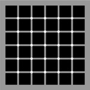
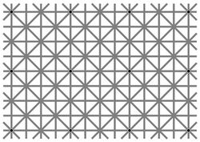
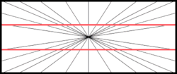
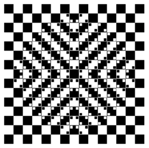
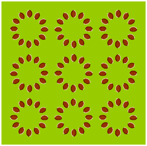

****************
Creating stimuli
****************

.. contents::

Static visual stimuli
=====================

We are going to use module Pygame_ to generate visual displays

Here is a Python script (:download:`square.py <../visual-illusions/square.py>`) that opens a window and displays a square. Run it.  

.. code:: python

    """ Display a square.

          See https://sites.cs.ucsb.edu/~pconrad/cs5nm/topics/pygame/drawing/
    """

    import pygame

    # Colors are triplets containint RGB values (see <https://www.rapidtables.com/web/color/RGB_Color.html>
    BLACK = (0, 0, 0)
    WHITE = (255, 255, 255)
    GRAY = (127, 127, 127)
    RED = (255, 0, 0)
    GREEN = (0, 255, 0)
    BLUE = (0, 0, 255)

    W, H = 500, 500  # Size of the graphic window size
    # Note that (0,0) is at the *upper* left hand corner of the screen.

    #  create the window
    pygame.init()
    screen = pygame.display.set_mode((W, H), pygame.DOUBLEBUF)

    screen.fill(WHITE)  #  fill it with white

    # Draw a rectangle
    width, height = 200, 200
    left, top = (W - width) // 2, (H-height) // 2
    pygame.draw.rect(screen, BLUE, (left, top, width, height))

    pygame.display.flip()  # display the backbuffer

    # save the image into a file
    pygame.image.save(screen, "square-blue.png")
    
    # wait until the window is closed
    done = False
    while not done:
          pygame.time.wait(10)
          for event in pygame.event.get():
              if event.type == pygame.QUIT:
                   done = True

     pygame.quit()

Exercise (*): modify the script to
   - change the color of the rectangle to RED
   - change the size of the rectangle to 100 x 300

   You can consult the `Quick introduction on drawing with pygame <https://www.cs.ucsb.edu/~pconrad/cs5nm/topics/pygame/drawing/>`__ for help.

   Pygame's reference manual is available at https://www.pygame.org/docs/

It is of course possible to draw other shapes. Check out for example the two scripts :download:`circle.py <../visual-illusions/circle.py>` and
and :download:`triangle.py <../visual-illusions/triangle.py>`.

Exercice (*): modify the script :download:`circle.py <../visual-illusions/circle.py>` to draw two circles, one red and on blue, side-by-side

   .. figure:: images/two-circles.png
      :alt: Two Circles

      Two Circles

  (check out :download:`two_circles.py <../visual-illusions/two_circles.py>`)

Toxler effect
-------------

Fixate your gaze at the center of the picture below for 30 seconds

    .. figure:: images/troxler.png
       :alt: Troxler Figure

       Troxler effect

What happened after a few seconds? This is the *fill-in phenomenon* (See https://en.wikipedia.org/wiki/Filling-in).

Exercise (*): Program the Troxler stimulus (hint: use  https://www.google.com/search?q=color+picker to find the RGB values for the disks)

For a solution, check out :download:`troxler.py <../visual-illusions/troxler.py>`

Kanizsa illusory contours
-------------------------

Created by Italian psychologist Gaetano Kanizsa in 1955, the Kanizsa Triangle is a classic example of illusory contours. In the image below, a white equilateral triangle can be clearly perceived even though there are no explicit lines or enclosed spaces to indicate such a triangle. (To find out more about this illusion, do a google search with the keywords `illusory contours`.)

   .. figure:: images/Kanizsa1.png
      :alt: Kanizsa triangle

      Kanizsa triangle

There exists many variants, e.g. the Kanizsa squares:

   .. figure:: images/Kanizsa-square.jpeg
      :alt: Kanizsa square

      Kanizsa square

Exercice (**): Inspiring yourself from the code in :download:`square.py <../visual-illusions/square.py>` and   :download:`circle.py <../visual-illusions/circle.py>`, create a script which displays the (right) Kanisza square .

  A possible solution is proposed in :download:`kanizsa-square.py <../visual-illusions/kanizsa-square.py>`

Herman grid
-----------

   .. figure:: images/HermannGrid.png
      :alt: Hermann Grid

      Hermann Grid

Read about the `Herman grid <https://en.wikipedia.org/wiki/Grid_illusion>`__

Exercise (**) Using :download:`square.py <../visual-illusions/square.py>` as a starting point, write a
   program to display the grid.

   Hints:

   -  use paper and pencil to draw the figure
   -  find out the formulas to compute the left top of the square in the
      ith row and jth column
   -  in your python script, use nested for loops over rows and columns
      to display each square one by one

   Check out :download:`grid.py <../visual-illusions/grid.py>`

Optional exercises:

  - Play with the parameters 'size of the squares' and 'space between the
    squares' to see how they affect the illusion.
  - Read https://stackabuse.com/command-line-arguments-in-python/ and use the
    ``sys.argv[]`` list from the ``sys`` module (or use the ``argparse`` module)
    to get from the command lines the number of columns, rows, the size of
    square and the size of the margins. Play with those parameters to see if you
    can make the illusion come and go. (see :download:`grid-args.py <../visual-illusions/grid-args.py>`

Extinction illusion
-------------------

   McAnany-Levine extinction illusion (see McAnany, J. J. and Levine, M. W. (2004) The blanking phenomenon: a novel form of visual disappearance. *Vision Research*, 44, 993-1001.)

Exercise: Program the McAnany-Levine extinction stimulus, that is, a grid of black squares with white circles at the intersection.

Check out :download:`extinction.py <../visual-illusions/extinction.py>`

Remark: There exists variants of the extinction illusion:

-  Niño's Extinction illusion

   Niño's Extinction illusion

- The `Honeycomb illusion <https://www.youtube.com/watch?v=fDBYSFDXsuE>`__. You can read about it in `Bertamini, Herzog, and Bruno (2016) <https://www.bertamini.org/lab/Publications/BertaminiHerzogBruno2016.pdf>`__. A Python script to generate the stimulus is available on `Bertamini’s web site <https://www.programmingvisualillusionsforeveryone.online/scripts.html>`__  but it requires installing the module `PsychoPy <http://www.psychopy.org>`__ which can be challenging.

Ebbinghaus-Titchener
--------------------

   .. figure:: images/ebbinghaus-titchener.png
      :alt: Ebbinghaus illusion

      Ebbinghaus illusion

Read about the `Ebbinghaus–Titchener stimulus <http://www.abc-people.com/illusion/illusion-3.htm#axzz5SqeF15yC>`__.

Exercise (**): Using :download:`circle.py <../visual-illusions/circle.py>` as a starting point, write a program to display a static stimulus (one central circle surrounded by a number of circles). 

   Hint: A littel bit of `trigonometry <https://en.wikipedia.org/wiki/Unit_circle>`__ helps:

   The coordinates of a location at and at distance ``R`` from the origin and an angle ``alpha`` from the left-right line are::

     x = R * cos(alpha)
     y = R * sin(alpha)

   Consult https://www.mathsisfun.com/polar-cartesian-coordinates.html if you need to convince yourself about that.

Check out :download:`ebbinghaus.py <../visual-illusions/ebbinghaus.py>`

Hering illusion
---------------

   Hering illusion

Exercise: Program the stimulus (hint: use the function `pygame.draw.line()`. Then, check a solution :download:`hering.py <../visual-illusions/hering.py>`

Random-dot stereograms
----------------------

.. figure:: images/stereogram.jpg
   :alt: random dot stereogram

A random dot stereogram is a pair of images of random dots which,
when viewed with the eyes focused on a point in front of or behind the
images, produces a sensation of depth  To see how they can be generated, read the wikipedia entry on
`random dot stereograms`_, to understand the phenomenon in details, read the one about Stereopsis_.

Exercise (\*\*\*) Write a script that generates random-dot stereograms (warning: this requires a bit of knowledge of Numpy_ to represent the images as 2d arrays, and of slicing_)

Check out :download:`random_dot_stereogram.py <../random-dot-stereograms/random_dot_stereogram.py>`

.. _Stereopsis: https://en.wikipedia.org/wiki/Stereopsis
.. _random dot stereograms: https://en.wikipedia.org/wiki/Random_dot_stereogram
.. _slicing: https://www.w3schools.com/python/numpy_array_slicing.asp

Kitaoka visual illusions
------------------------

Professor Akiyoshi Kitaoka  has produced many fascinating `visual illusions <http://www.ritsumei.ac.jp/~akitaoka/index-e.html>`. Notably:

   The *Bulge* 

   The *Dongururin*

Other notable stimuli are: the *Rotary extinction illusion*, *Unstable square*, *Rotating snakes*, *Rotating rays*, *Primrose's field*, *Rollers*, *Slippage*, *Gaku ga gakugaku*, *Spa*, *Expanding cushions*, *Convection*, *The music*, *Seaweed*, *Joro-gumo*, *Packed cherries*, *Earthquake*, *Wedding in Japan*, *Sausages*, *Raspberries*, *A curtain*, *Pyramids of donguri*, *Dongurakokko (The donguri wave)*, *Brownian motion*, *Waterways*, *A flow of the ecological flooring*, *Computer worms*.
 
They are available on the following pages:

http://www.ritsumei.ac.jp/~akitaoka/index-e.html
http://www.psy.ritsumei.ac.jp/~akitaoka/o1saishe.html
http://www.psy.ritsumei.ac.jp/~akitaoka/kieru2e.html
http://www.psy.ritsumei.ac.jp/~akitaoka/saishin2e.html
http://www.psy.ritsumei.ac.jp/~akitaoka/saishin3e.html
http://www.psy.ritsumei.ac.jp/~akitaoka/saishin4e.html

Note: there are no exercise in this section. But, if you want to code some of the stimuli, feel free to do it, and please, share your code with us!

Dynamic visual stimuli
======================

Animated movies are just a succession of still pictures. If the rate of presentation is fast enough, the brain creates an illusion of continuity. 

With pygame, programming an animation will follow the following temporal logic:

    #draw picture1 in the backbuffer
    #flip the backbuffer to screen

    #draw picture2 in the backbuffer
    #wait for some time
    #flip the backbuffer to screen

    #draw picture3 in the backbuffer
    #wait for some time
    #flip the backbuffer to screen

    ...

We take advantage of the double buffering mode (set by the option ``DOUBLEBUF`` in the call to ``pygame.display.set_mode()``) to draw the next image in memory while the current one is displayed on the screen. It is only when we call ``pygame.display.flip()`` that the pre-prepared image is displayed, replacing the current one.

Illusory line-motion
--------------------

Illusory line motion (ILM) refers to a situation in which flashing a light at one end of a bar prior to the bar's instantaneous presentation results in the percept of motion. 

   
   Illusory line-motion

Exercise (*):  Program the stimulus, that is, first draw a square, wait for a few milliseconds using the function `pygame.time.wait()`, then draw a rectangle overlapping with the initial square.   

  Check out :download:`visual-illusions/line-motion.py <../visual-illusions/line-motion.py>`

Flash-lag illusion
------------------

* Download  :download:`visual-illusions/flash-lag.py <../visual-illusions/flash-lag.py>` and run it. Do not look at the code yet. 

* If you want to read about the `Flash-lag illusion <https://en.wikipedia.org/wiki/Flash_lag_illusion>`__.

Exercise:

1. Create a "movie" of a square moving horizontally, back and forth. The
   principle is simple: you just need to create a loop where you
   display a square at coordinates `x, y` ,wait a few milliseconds, then clear
   the screen, and increment or decrement the `x` coordinate by a fixed amount.
   This strategy is explained in details at http://programarcadegames.com/index.php?lang=en&chapter=introduction_to_animation

   Check out out version :download:`visual-illusions/moving_square.py <../visual-illusions/moving_square.py>`

2. Add the presentation of a flashing square then the moving square passes the middle line, to generate the flash-lag illusion.

Now, you can look at the code in :download:`visual-illusions/flash-lag.py <../visual-illusions/flash-lag.py>`

Dynamic version of the Ebbinghaus-Titchener
-------------------------------------------

-  Watch `this video <https://www.youtube.com/watch?v=hRlWqfd5pn8>`__.

-  Program a version where the outer circles (inducers) grow and shrink in size.

-  Check out :download:`visual-illusions/ebbinghaus-dynamic.py <../visual-illusions/ebbinghaus-dynamic.py>`

Lilac Chaser
------------

The `Lilac Chaser`_ is a dynamic version of the Troxler fill-in illusion.  

.. _Lilac Chaser: https://en.wikipedia.org/wiki/Lilac_chaser

Exercise: Program the Lilac Chaser stimulus, with 12 rose disks (you can use rose disk without any blurring).

For a possible solution, check out :download:`visual-illusions/lilac_chaser.py <../visual-illusions/lilac_chaser.py>`

(Optional exercise for advanced students: add blurring to the disks to make a stimulus similar to that of the wikipedia page `Lilac Chaser`_)

Creating and playing sounds
===========================

Install the `simpleaudio` module::

        pip install simpleaudio

Then run the quick check with ipython::

        import simpleaudio.functionchecks as fc 
        fc.LeftRightCheck.run() 

Check out `simpleaudio's tutorials <https://simpleaudio.readthedocs.io/en/latest/tutorial.html>`__

The module :download:`sound_synth.py <../sound/sound_synth.py>` provides several functions to load, create, and play sounds. 

Exercise (\*\*) Using functions from the `sound_synth` module, write a script that loads the file ``cymbal.wav`` and plays it 10 times, at a rhythm of one per second. (Warning: a basic knowledge of numpy arrays is necessary to concatenate the samples).

Check a solution at :download:`cycle.py <../sound/cycle.py>`

Sound localisation from binaural dephasing
------------------------------------------

Exercise (\*\*) Take the channel of a mono sound (e.g. :download:`https://www.signalogic.com/melp/EngSamples/Orig/male.wav` and create a stereo sound. Then dephase the two channels by various delays, and listen to the result.

Hints: load the sound file into a one dimensional numpy array, make
a copy of the array and shift it, assemble the two arrays in a
bidimensional array (matrix) and save it as a stereo file

If you know nothing about Numpy_, you may find useful tutorials about it on the web, e.g. at https://github.com/paris-saclay-cds/data-science-workshop-2019/blob/b370d46044719281932337ca4154e1b0b443ad97/Day_1_Scientific_Python/numpys/numpy_intro.ipynb

Pulsation (Povel & Essen, 1985)
-------------------------------

Exercise (\*\*\*) Create rhythmic stimuli such as the ones described in `Povel and Essen (1985) Perception of Temporal Patterns <http://www.cogsci.ucsd.edu/~creel/COGS160/COGS160_files/PovelEssens85.pdf>`__

More illusions
==============

You can train your Python skills by programming some of the illusions at https://www.illusionsindex.org/

.. _numpy: https://numpy.org/
.. _Pygame: http://www.pygame.org
