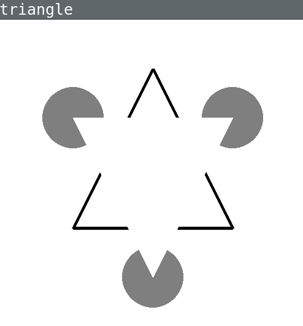

.. _check:

***********************
Check your installation  
***********************

.. contents:: :depth: 2

Check R and Rstudio
-------------------

Launch Rstudio, and in the Console (left window), type::

   example(density)

This should display a series of graphics (Press <Return> to advance).

Then type::

  require(tidyverse)

If the package ``tidyyverse`` is not found, you need to install it with::

  install.packages('tidyverse')

  
Close RStudio. That will be all.
  
    
Check if Python can be executed in a Terminal
-----------------------------------------------

Open a Terminal (that is, `Git Bash` for Windows users) and type::

  which python

This should print the location of the python interpreter,  ``/home/macron/anaconda3/bin/python``

If no message is displayed, the PATH environment variable --- which lists the directories where programs can be found --- is messed up, most probably due not following closely the installation instructions (for Windows users, check the Anaconda and Git for Windows instructions)

Type  ``python`` and press 'Enter'.

You should see a prompt `>>>` followed by a blinking cursor. Python is waiting for your commands! Type::

  2**100

This should display the 100 power of 2. Press `Ctrl-D` to exit python, and again the exit the Terminal. Basic Python is working. 

	      
Check Git
---------

Download the course materials using Git by entering the following command line in a Terminal:: 

    git clone https://github.com/chrplr/PCBS.git

You should see a message ``Cloning into 'PCBS'...`` and, if everything goes well, all the
course materials (python scripts, data files, ...) should be downloaded in a new subdirectory called ``PCBS``, within the current working directory. You can cd into it and list its content:

.. code-block:: bash

    cd PCBS
    pwd
    ls

Your Terminal window should more or less look like this:

.. image:: images/term-git-clone-pcbs.png
  :width: 600
  :alt: Terminal showing the results of git clone...

.. warning::
   If a folder named ``PCBS`` already exists in the current working
   directory, git will stop and will not download the content of the remote PCBS
   repository. In that case, you must delete or move the existing ``PCBS`` folder
   before running the ``git clone`` command above.

   When you open a Terminal, the current working directory is your “home”, or
   “user”, directory, until you start navigating in the filesystem with the ``cd
   (change directory)`` command. If you are lost at this point, read `Navigating
   the file system <http://linuxcommand.sourceforge.net/lc3_lts0020.php>`_.

Check Python
------------

This tests if Python3 is installed and correctly configured.

.. code-block:: bash

    cd ~/PCBS/games
    python human-guess-a-number.py

.. image:: images/guess-number.png
   :width: 600

.. code-block:: bash

    python matches.py

.. warning::
  If you receive an error message such as ``bash: python: No such file or directory``, and you are sure that python is installed, the most likely reason is that the problems lies with the `PATH environment variable <https://linuxhint.com/path_in_bash/>`__) listing all the directories: the directory containing the python executable file may be missing from the list. This happens for example, if you run the Anaconda3 installer and did not check the relevant box. 

Check basic graphics
--------------------

.. code-block:: bash

  cd ~/PCBS/simulations/fractals
  python koch0.py

.. code::

  python tree.py

.. image:: images/tree.png
     :width: 200

Check matplotlib
----------------

matplotlib is a python library to create and display graphics.

.. code-block:: bash

    cd ~/PCBS/stimuli/visual

.. code-block:: bash

   python bullseye.py

.. code-block:: bash

    python contrast_modulated_grating.py

.. code-block:: bash

    python gabor.py

.. code-block:: bash

    python image-manipulation.py

.. code-block:: bash

   python wedgering.py

Check pygame
------------

`Pygame <http://www.pygame.org>`__ is a Python library to create simple audio visual games. It was installed along with expyriment. If you had to create a Python virtual environment when you installed expyriment, you need to activate it::

  conda activate expyriment  # if you use conda
  pyenv activate expyriment  # if you use standard python with pyenv

You can then check if pygame is installed by starting ``python`` on a command line and typing ``import pygame`` a the ``>>>` prompt. A message ``Hello from the pygame community.`` should be displayed. 
    
.. code-block:: bash

   cd ~/PCBS/stimuli/visual-illusions/
   python kanizsa_triangle.py

.. code-block:: bash

   python hering.py

.. code-block:: bash

   python extinction-rotated.py 

.. image:: images/exctinction.png

   python lilac_chaser_blurred.py

Check Expyriment
----------------

`Expyriment <http://expyriment.org>`__ is a Python library for designing and conducting behavioural and neuroimaging experiments. 

If you had to create a Python virtual environment when you installed expyriment, you need to activate it (unless it is already activated in your current Terminal)::

  conda activate expyriment  # if you use conda
  pyenv activate expyriment  # if you use standard python with pyenv

Try to run the following three experiments (Note that the programs can be interrupted at any time by pressing the ``Esc`` key).
  

.. code-block:: bash

   cd ~/PCBS/experiments/xpy_Posner_attention_networks_task
   python posner_task.py 

   cd ~/PCBS/experiments/xpy_parity_decision
   python parity_feedback.py

Appendices
----------

Keep your local copy of the course material up to date
------------------------------------------------------

The course materials are often updated. To make sure you have the latest version, you can synchronize your local copy with the github repository http://github.com/chrplr/PCBS, with the commands:

.. code-block:: bash

      cd ~/PCBS
      git pull

Notes:

- if the PCBS directory is not in your home directory (``-``), you will need to use the appropriate path in the first cd command.
- do not manually modify or create new files in the ``PCBS`` folder.
  If you do so, git will notice it and might prevent an automatic upgrade
  and ask you to ‘resolve conflicts’. If you get such a message, the
  simplest course of action, for beginners, is to delete the PCBS folder (or
  move it if you wnat to keep a copy of your modifications) and reissue the
  ``git clone`` command above to reload the full folder.)

.. _survival:

Basic surviving skill: how to enter command lines in a Terminal
---------------------------------------------------------------

Watch the video at   https://www.youtube.com/watch?v=2yhcWvBt7ZE&t and try to perform the activities in it (the instructions also work for Mac or Linux: you just need to open a standard Terminal while in Windows you start 'Git Bash'). Note: the game scripts mentioned in the video are available at https://github.com/chrplr/PCBS/tree/master/games/games.zip

For the moment, you mostly need to know the following three commands:

-  ``ls``: list the content of the current working directory
-  ``pwd``: path of current working directory
-  ``cd``: change directory

Read about them in http://linuxcommand.sourceforge.net/lc3_lts0020.php

Here are some resources to learn more about how to control your computer from a terminal:

     - Learning the Shell  http://linuxcommand.org/lc3_learning_the_shell.php
     - OpenClassRoom : https://openclassrooms.com/en/courses/43538-reprenez-le-controle-a-laide-de-linux/37813-la-console-ca-se-mange

.. rubric:: Footnotes

.. [1]  Read https://linuxhint.com/path_in_bash/ , locate the folder containing ``subl``,  then use a text editor to add the following line at the end of the file ``~/.bashrc``::

       export PATH="path_to_the_directory_containing_subl":"${PATH}"

   Once this is done, type `. ~/.bashrc` and enter the command ``subl``
