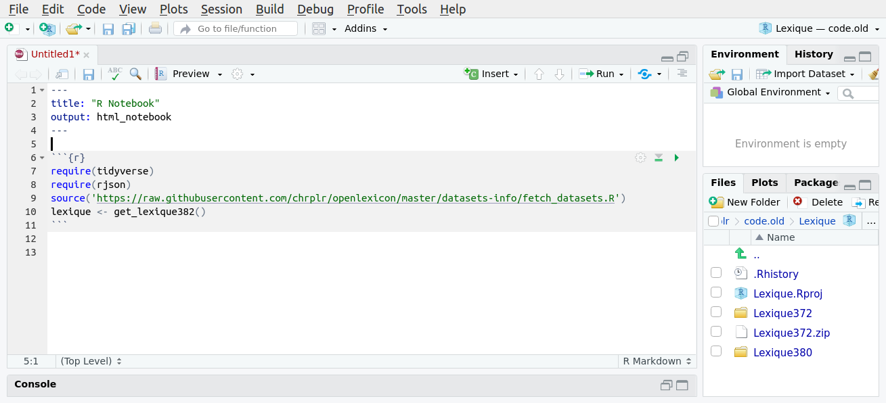

Ce document montre comment interroger et manipuler la base [Lexique](http://www.lexique.org) hors-ligne avec le logiciel [R](https://fr.wikipedia.org/wiki/R_(langage)) 

Note: Il fait parti du cours [Programmation pour les Sciences Cognitives](https://chrplr.github.io/PCBS/). Merci de signaler d'éventuelles erreurs à <christophe@pallier.org>


## Installation

1. S'ils ne sont pas déjà installés sur votre ordinateur, vous devrez installer les deux logiciels (en acceptant les options par défaut):

   * [R](https://cran.r-project.org/) 
   * [RStudio Desktop](https://www.rstudio.com/products/rstudio/#Desktop). 
   
2. Démarrer le programme **Rstudio** puis, dans l'onglet **Console** situé dans la fenêtre en bas à gauche, copier la ligne suivante puis appuyez sur 'Entrée'

```{r warning=FALSE,  message=FALSE, results='hide'}
install.packages(c('rjson', 'tidyverse'))
```

   Laissez RStudio se débrouiller (mais vous devrez peut-être sélectionner un serveur). 

   Puis créez un nouveau projet (Menu `File/New Project/New Directory/New project`) que vous nommerez *lexique*. 

   Vous êtes prêt ! Vous n'aurez plus jamais à refaire ces étapes.

## Chargement de la table *lexique*

Tout se déroule dans le logiciel **RStudio**. 

Dans le menu `File`, ouvrez le projet *lexique* créé dans la section précédente (Après un redémarrage de RStudio, vous pouvez utiliser le menu `File/Recent Projects` pour retrouver ce projet).

- Cliquez le menu `File/New File/R Notebook`: Un document "Untitled" apparait dans la fenêtre en haut à gauche. C'est dans ce document que nous allons entrer du code R.

- Commencez par supprimer tout ce que se trouve après la ligne 4 (ne conservez que les 4 premières lignes).

- Placez le curseur sur la ligne 5 (juste après la ligne contenant '---'), et cliquez sur le bouton *Insert* puis choisisez *R* (ou appuyer sur *Ctrl+Alt+I*). 
  
  Copiez les lignes suivantes à l'intérieur du bloc de code qui vient d'être créé. 

```{r warning=FALSE,  message=FALSE, results='hide'}
require(tidyverse)
require(rjson)
source('https://raw.githubusercontent.com/chrplr/openlexicon/master/datasets-info/fetch_datasets.R')
lexique <- get_lexique383()
```


La fenêtre `Rstudio` doit ressembler à la figure 1.



   En faisant bien attention que le curseur soit _à l'intérieur du bloc de code_, cliquez sur `Run/Run current chunk` (ou bien appuyez sur la petite *flèche verte*, ou bien encore sur les touches *Ctrl-Shift-Enter*). 

  La variable `lexique` doit maintenant apparaitre dans l'onglet **Environment** en haut à droite ; Vous pouvez cliquez dessus pour consulter la table. 


## Exploration de la distribution des fréquences

Supprimons les mots très rares, de fréquence d'occurrence inférieure à 0.5 par million dans le corpus des livres :

```{r}
lexique1 <- subset(lexique, freqlivres > 0.5)
lexique1$logfreq <- log10(lexique1$freqlivres)
```

Puis calculons l'histogramme des fréquences, et affichons le sur un graphique avec des axes logarithmiques:

```{r}
with(lexique1, {
  histdata <- hist(logfreq, plot=FALSE, nclass=50)
  plot(histdata$breaks[-1], histdata$count, log="y", type='h', lwd=10, lend=2, las=1, xlab='log10(freqlivres)', ylab='count')
  }
)
```

Note: On retrouve la [loi de Zipf](https://fr.wikipedia.org/wiki/Loi_de_Zipf), c'est à dire une relation à peu près linéaire sur ce graphique log-log, qui reflète une distribution en loi de puissance.  

## Recherche de mots

Supposons que vous vouliez extraire les lignes de la table lexique correspondant, par exemple, aux mots *bateau, avion, maison, arbre*. 

Créez un bloc de code (Ctrl-Alt-I) et copiez-y le code suivant :

```{r}
items <- c('bateau', 'avion', 'maison', 'arbre')

selection <- subset(lexique, ortho %in% items)

head(selection)
```

Exécutez ce code (Ctrl-Shift-Enter). La variable `selection` doit contenir les lignes pertinentes. Vous pouvez inspecter son contenu en cliquant sur son nom dans l'onglet **Environment** situé dans la fenêtre en haut à droite de RStudio.

Pour sauvegarder les résultats obtenus dans un fichier, exéctuez la commande suivante:

```{r}
write_tsv(selection, 'selection.tsv')
```

Cela doit créer un fichier `selection.tsv` dans le répertoire du projet (*lexique*).

Notez que les fichiers ayant l'extension `tsv` (tab-separated-values) peuvent être [ouverts avec Excel](https://rievent.zendesk.com/hc/en-us/articles/360000029172-FAQ-How-do-I-open-a-tsv-file-in-Excel-), ou OpenOffice Calc, ou même avec n'importe quel éditeur de texte. Note: le package `readr` de R fournit aussi des fonctions `write_excel_csv` et `write_excel_csv2` qui peuvent intéresser certains.

Si vous avez une liste de mots plus longue, il serait fastidieux d'écrire la ligne `items <- ...`. Plus simplement vous pouvez utiliser:

```{r}
items = scan(what='characters')
```

Et coller la liste de mots. Pour finir la liste,  entrez une ligne vide (en appuyant deux fois successivement sur la touche *Entrée*), puis, à nouveau:

```{r}
selection <- subset(lexique, ortho %in% items)
```

Comme la fonction `scan` permet aussi de lire la liste dans un fichier externe, si vous avez une liste de mots dans fichier `liste.txt`, vous pouvez extraire les lignes de lexique qui contiennent spécifiquement ces mots avec le code suivant:

```{r}
liste <- scan('liste.txt', what='characters')
selection <- subset(lexique, ortho %in% liste)
```

## Sélection par critères

Supposons que vous vouliez sélectionner tous les noms de 5 lettres, singuliers, de fréquence lexicale (films) comprise entre 10 et 100. Voici la ligne magique:

```{r}
selection = subset(lexique, cgram=='NOM' & nombre != 'p' & nblettres==5 & freqlivres > 10 & freqlivres < 100)
head(selection)
```


Le symbole `&` signifie 'et'. L'expression `nombre != p` signitif que la valeur dans la colonne *nombre* ne doit pas être `p`.

## Sélection par "pattern"

### Les expressions régulières

Les expressions réulières, ou **regex**, sont des “patterns” qui permettent de rechercher des mots ayant certaines propriétés. Par exemple n'importe `a.b` désigne un mot contenant un `a` et un `b` séparés par une lettre quelconque. Voici d'autre exemples:

- **`^maison$`** : recherche le mot “maison” exactement
- **`^anti`** : recherche tous les mots commençant par “anti”
- **`^(jour|nuit|matin|soir)$`** : “jour” ou “nuit” ou “matin” ou “soir” (permet de rechercher une liste de mots)
- **`ion`** : recherche les mots qui contiennent la chaine “ion” dans n’importe quelle position
- **`ion$`** : mots se terminant par “ion”
- **`^pr`** : mots commençant par “pr”
- **`^p..r`$** : mots de quatre lettres commençant par “p”, finisant pas “r”
- **`^p.*r$`** : mots commencant par ‘”p’ et finissant par “r”
- **`[aeiou][aeiou]`** : mots contenant 2 voyelles successives
- **`^[aeiou]`** : mots commençant par une voyelle
- **`^[^aeriou]`** : mots ne commençant pas par une voyelle

Il existe de nombreux tutoriaux sur les regex sur le web, notamment <http://regextutorials.com/intro.html> 

Une expression régulière décrit un automate de transitions à états finis. Le site <https://regexper.com/> vous permet de visualiser l’automate associé à une regex. Par exemple `[ptk].*[aiou][aiou].?ion$` correspond à l’automate fini:


### Recherches dans R avec grepl

R permet d'effectuer des recherches par pattern grâce à la fonction `grepl`. La syntaxe est `grepl(`_regex_, _variable_`)` pour rechercher les lignes où la variable "matche" la regex (Voir la [doc R de grepl](https://stat.ethz.ch/R-manual/R-devel/library/base/html/grep.html).

Cette fonction permet de localiser les lignes qui 'matchent' une expression, ou bien, en la niant avec le signe `!`, de supprimer des lignes qui matchent un pattern.

Voici quelques exemples:

* Pour obtenir tous les mots qui finissent par `tion` :

```{r}
lexique %>% filter(grepl("tion$", ortho)) -> selection2
head(selection2)
```

Encore une fois, vous pouvez sauvegarder ces résultats avec:


```{r}
write_tsv(selection2, 'mots-en-tion.tsv')
```

* Pour lister tous les mots contenant un cluster de consonnes plosives, mais pas debut de mot:

```{r}
lexique %>% filter(grepl('.[ptkbdg][ptkbdg]', phon)) -> selection3
head(selection3)
```


* L'opérateur `filter`peut être appeler plusieurs fois pour affiner progressivement la recherche. 

  Par exemple, pour obtenir tous les mots de 8 lettres qui ne finissent pas `ent`:
  
```{r}
lexique %>% filter(nblettres == 8) %>% filter(!grepl("ent$", ortho)) -> selection4
head(selection4)
```


# Chargement d'autres tables d'OpenLexicon


Le projet [OpenLexicon](https://github.com/chrplr/openlexicon) comprend de nombreuses tables lexicales (voir <https://chrplr.github.io/openlexicon/datasets-info/>).

Pour accéder à ces tables, vous pouvez utiliser la fonction `fetch_datatset` définie dans <https://raw.githubusercontent.com/chrplr/openlexicon/master/datasets-info/fetch_datasets.R>. 

Elle télécharge automatiquement les bases de données définies dans les fichiers .json listés dans   <https://raw.githubusercontent.com/chrplr/openlexicon/master/datasets-info/_json>.


Par exemple, pour charger la table SUBTLEX-US:

    ```{r}
    source('https://raw.githubusercontent.com/chrplr/openlexicon/master/datasets-info/fetch_datasets.R')
    subtlexus <- readRDS(fetch_dataset('SUBTLEX-US', format='rds')$datatables[[1]])
    ```


## Going further  

Check the scripts at 
<https://github.com/chrplr/openlexicon/tree/master/scripts>


