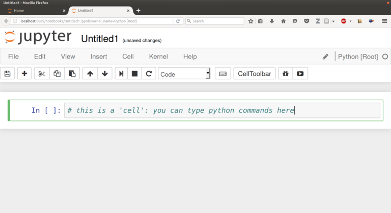
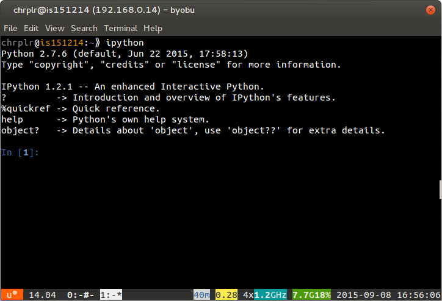

% Python in a nutshell
% Christophe Pallier
%hton

# Progamming in  Python

You can program in Python in (at least) three different ways: interactively with `jupyter notebook` or with an `ipython` command line, or using an edit-run cycle approach with a program editor (e.g. `atom`, `idle`, `spyder`,...).

In all cases, you need to be able to open a command line window (a.k.a. a **terminal**):
  * Ubuntu-Linux: Ctrl-Alt-T (see https://help.ubuntu.com/community/UsingTheTerminal)
  * MacOSX: Open Finder/Applications/Utilities/Terminal (see http://www.wikihow.com/Get-to-the-Command-Line-on-a-Mac)
  * Windows: Win+X+Command-Prompt (see http://pcsupport.about.com/od/commandlinereference/f/open-command-prompt.htm)


## using jupyter notebook

The first step is to type `jupyter notebook` in a terminal

    mkdir -p AIP2016-files  # only if AIP2016-file does not yet exist
    cd AIP2016-myfiles
    jupyter notebook

A browser will open woth a page like the one shown on the left panel of the figure below. Then, by cliking on `New` and selecting `Python [root]`, a new tab will show a page like the right panel, where you can enter python code in 'cells'. To execute the code in a cell, just move the cursor there and press `Ctrl+Enter`

------------------------------ ------------------------------
 
------------------------------ ------------------------------

A nice feature of the "n jupyter notebooks" is that they are saved automatically, in .ipynb files that can be shared with other people. This is very handy, for example, to send a data analysis report by email.

Jupyter's documentation si available at http://jupyter.readthedocs.io/en/latest/index.html

## using ipython

You can launch `ipython` in a terminal, and start typing python commands that are *interpreted* and *executed* when you press 'Enter'.


2. Type `ipython` on the command-line and press `Enter`:

------------------------------ ------------------------------
 
------------------------------ ------------------------------


3. When you terminal looks like the one of the right, you are  "talking" to ipython. Enter the following commands:

```python
	import turtle
	turtle.circle(50)
	turtle;forward(100)
	turtle.circle(50)

	turtle.right(90)
	turtle.forward(100)
	turtle.right(90)
	turtle.heading()
```

. . .

This way of using Python is fine if you need to quickly test an idea. But as soon as you quit `ipython` (by pressing `Ctrl-D`), you lose all traces of what you have done. To avoid that, you want to use the **Edit-run* approach.


## Using a text editor (Edit-run cycle)

Using a **text editor**, e.g. *atom*, you write a python script, that is, a series of commands, that you save in a file; then you give this file to interpret to a python interpreter. Here is how:

1. Open a Text-Editor (e.g. Atom)  and a Terminal window side-by-side:


2. Create a `New File` in the Editor and enter the following text:

```python
	import turtle
	turtle.forward(50)
	turtle.left(120)
	turtle.forward(100)
	turtle.left(120)
	turtle.forward(100)
	turtle.left(120)
	turtle.forward(50)
```


3. Using 'File/Save as',  save the this text under the filename `myscript.py` in your personal (home) directory
* *run* with a python interpreter, by typing `python myscript.py` on a command line of the Terminal. Try it now.

Important: you must make sure that the current working direcoty of the terminal is the same directory where the file myscript.py has been saved. Otherwise, you will get an error message such as 'No such file or directory'. To fix this problem, you must use the 'cd' command to navigate the directory structure.


Remarks:

* You can learn more about Turtle graphics by reading the documentation at <https://docs.python.org/2/library/turtle.html>

* there exist a third approach which combines interactivity and persistence --- the `ipython notebook`. Like Mathematica, handy for numerical processing.

# First programs

### Warming up


Create a script `hello.py` in the editor, save it and run it on the command-line:

	name = raw_input('What is your name?')  # input() if using Python3
	print('Hello ' + name + '!')

Concepts: string constant, variable (name), affectation, string concatenation with '+'

. . .


	# multiplication by successive addition
    a, b = 10, 5
	sum = 0
	while (a > 0):
		sum = sum + b
		a = a - 1
	print(sum)

Concepts: multiple affectation, modifying a variable, while loop, indentation for blocks,


## Types

###

Do the following in interactive mode (ipython):

	type(10)
	type(10.5)
	type('bonjour')

	a = 20
	type(a)

Concept: types

	print(10 + 5)
	print("10" + "5")
	print("10" + 5)

10 is an integer, 10.0 is a float, "10" is a string. It is possible to convert from one type to another:

	print('Il y a ' + str(10) + ' ans...')
	print(int("10"))

. . .

	num = raw_input('entrez en nombre')
	print(num)

Question: `num` est-il un nombre ou une chaîne de caractères?


Exercices: faire les exercices 2.3 et 2.4 de _How to think like a computer scientist?_


# Complex types (lists, dictionnaries):

	type([1, 2, 3])
	type(['a', 'b', 'c'])

. . .

	seq1 = ['jean', 'marie', 'paul']
	seq1[0]
	seq1[1]
	seq1[2]

. . .

    dico = {'windows':0, 'macos':0, 'linux':1}
	type(dico)
    dico['windows']
    dico['macos']
    dico['linux']

## for Loops

	for x in [1, 2, 3, 4]:
		print(x*x + 2*x + 1)

Concept: for loop

. . .

	numbers = [1, 2, 5, 10]
	y = [(x*x + 2*x + 1) for x in numbers]
	y

concept: lists (or sequences)

See <http://effbot.org/zone/python-list.htm>


. . .

	for _ in range(100):
		print('All work and no play makes Jack a dull boy')

Concepts: range to generate a list of numbers, 'for' loop, indentation of instuction block

. . .

	for name in ('Jack', 'John', 'Tim'):
		for _ in range(10):
			print('All work and no play makes ' + name + ' a dull boy!')

Concepts: list of strings, double imbrication

Exercice: write a program that computes the sum of the first n integers (1+2+...+n)

. . .

	n = 100
	for i in range(1, n+1)
		sum = sum + i
	print(sum)

. . .

# Guess a number

Type the following code in a text editor, save it as a Python script (with extension .py) and run it.

```python
    # guess a number
	import random

	target = random.randint(1, 100)

	print("I am thinking about a number between 1 and 100")

	guess = raw_input("Your guess? ")

	while guess != target:
        if guess < target:
            print("Too low!")
        else:
            print("Tow high!")
        guess = raw_input("Your guess? ")

    print("You win! The number was indeed " + target)
```


# Programs (a.k.a scripts)

A program typically consists in  a series of  *instructions* (aka *commands*).
The main types of instructions are:

## Assignments to variables:

```
a = <expression>
a, b = <expression1>, <expression2>
```

Examples:

```python
a = 24 + 56
b = 'bonjour'
c = ['aga', 'bobo', 'glop']
x, y = 100, 200
```

An expression is a valid formula containing constants, variables, operators and function calls.

Example of expressions

```python
2 ** (5 + 3)
'alpha' + '\t' + 'beta'
a < b
0b10010 & 0b10
math.sin(10)
```

For a description of Python
<http://www.tutorialspoint.com/python/python_basic_operators.htm>

## Function calls

```
<functionname>(<expression1>, <expression2>, ...).
object.functname(<expressins1>, ...)
```

Examples:

```python
print('bonjour')
bin(10)

c = ['aga', 'bobo', 'glop']
c.pop()
```

Note that a function can perform some action and return a value, some only return a value.

## Testing and branching instructions:

```
if expression:
    bloc_instructions
else:
	bloc_instructions

while expression:
	bloc_instructions

for variable in sequence:
	bloc_instructions
```

Examples:

```python
response = 'no'
if response == 'ok':
   	print 'accepted'
else:
	print 'rejected'
```

```python
n = 0
while n < 10:
      n = n + 1
print n
```


## function definition

```
def <funcname>(list of parameters):
	bloc_instructions
```

Examples:

```python
def max(a, b):
	if a > b:
		return a
	else:
		return b
```


## importation of modules

```
import <module_name>
from <module_name> import <function_name>
```


Examples:

```python
from math import sin, pi
print(sin(pi/2))
```

```python
import turtle
turtle.circle(50)
turtle.forward(100)
turtle.circle(50)
```


# Variables Assignments


Variables are names that point to objects in memory

An environment is a mapping of variables names to memory locations.

An expression is always evaluated in a environment.

When calling a function, a new environment is created which links the
value of parameters to the local variables.


```python
a = 3
b = a
print a, b
a = 4 # a points to a new object
print a, b
```

```python
a = [1, 2, 3]
b = a    # points to the same object (a list)
c = a[:] # makes a copy
a[0] = 10
print a, b, c
```
