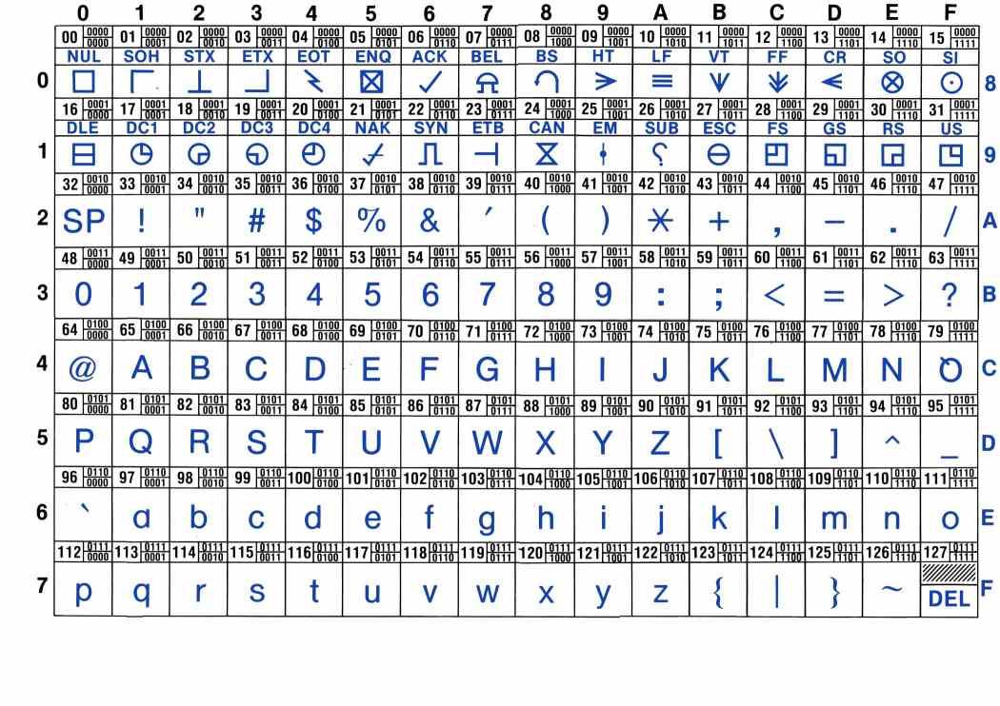

% How numbers, images and texts are represented in the computer
% Christophe@pallier.org
% Sept. 2015

# Representation of integers

*There are 10 kinds of people: those who count in binary and the others.*

Computers represent everything as series of 0 and 1, also known as *bits* (for "binary digits").

Just like a number can be written in base 10, it can be written in base 2 (or in any other base):

	12 = 10  + 2 = 1.(10^1) + 2.(10^0) 
	12 = 8 + 4 = 2^3 + 2^1 => 1010

    33 = 30  + 3 = 3.(10^1) + 3.(10^0)
	33 = 32 + 1 = 2^5 + 2^0 => 100001

The binary representions of the first integers:

	1 :   1
	2 :  10
	3 :  11
	4 : 100
	5 : 101
	6 : 110
	7 : 111
	...


Remember that a number represented by four digits "d3 d2 d1 d0" in a basis 'b', has a value of d3*b^3 + d2*b^2 + d1*b^1 + d0*b^0

- In binary, there are only two possibilities for the digits: {0,1}
- In decimal, 10 possible characters
- In hexadecimal, 16 possible characters 0-9, A, B, C, D, E, F
(D8F1 = 14*16^3 + 8*10^2 + 15*16^1 + 1*16^0)

To learn more about how integer numbers are represented in binary format, you can check out <http://csunplugged.org/binary-numbers>

(@) Convert (manually) into decimal the following binary numbers:
- 101
- 1000
- 1011
- 11111111

. . .

*Answer:* 5, 8, 11, 255

## From  binary to decimal


(@) Let us write a function that, given the binary representation of a number as a string of '0' and '1', returns its value as a integer.


1. Let us first suppose that we want to convert a string containing exactly 8 binary digits (e.g. '01011010') into decimal. How would you do that? 

. . .

```python
def todec8bits(s):
	return int(s[0])*128 + int(s[1])*64 + int(s[2])*32 + \
	       int(s[3])*16 + int(s[4])*8 + int(s[5])*4 + \
		   int(s[6])*2 + int(s[7])

todec8bits("01010101")
```

One issue with this code:

```python
todec8bits("0101010")
todec8bits("010101010")

```

Remark: on your computers, integers are represented either as 32 or 64 bits, depending on your processor/operating system.

Why is this is relevant: suppose you perform an EEG recording with 256 electrodes every milliseconds for one hour. How large is the data?


Beware: your computer can make mistakes if you add too large numbers!!!


Another solution demonstrating several new Pythonic constructions that we have not seen yet:

```python
pow2 = [2 ** n for n in range(7, -1, -1)]
n = 0
for b, p in zip(s, pow2):
	n += int(b) * p
print(n)
```
. . .

We could modify it to adapt to the size of the string 's'.

My favorite which has the advantage of working with strings of unlimited size:

```python
def todec(s):
	""" convert a string of 0 and 1 representing a binary number into an integer """
	n = 0
	for b in s:
		n = n * 2 + int(b)
	return n

for i in ['101', '1000', '1011', '11111111']:
	print(todec(i))
```	

------------------------

## From decimal to binary

(@) Now we will go in the other direction: Our aim is to write a program that, given a number (in decimal), computes its binary representation.

If you have an idea how to program it, please proceed. If not, we propose that you follow the following steps:

(@) Study the program below.  Execute it with various values of the variable *num*. Do you understand the last line? Do you see a limitation of this program?

```python
num = 143
d3 = int(num/1000) % 10 # thousands
d2 = int(num/100)  % 10 # hundreds
d1 = int(num/10)   % 10 # dec
d0 =  num % 10
print(str(d3) + str(d2) + str(d1) + str(d0))
```

(@) Adapt the above program to print the binary representation of num

. . .

```python	
num = 17
b0 = num % 2
b1 = int(num/2) % 2
b2 = int(num/4) % 2
b3 = int(num/8) % 2
b4 = int(num/16)  % 2
b5 = int(num/32)  % 2
b6 = int(num/64)  % 2
b7 = int(num/128) % 2
b8 = int(num/256) % 2
print(str(b8) + str(b7) +  str(b6) + str(b5) + str(b4) + str(b3) + str(b2) + str(b1) + str(b0))
```


. . .

(@) Modify the above program to print the binary representations of every number between 0 and 255.

. . .

```python	
def tobin(num):
	b7 = int(num/128) % 2
	b6 = int(num/64)  % 2
	b5 = int(num/32)  % 2
	b4 = int(num/16)  % 2
	b3 = int(num/8) % 2
	b2 = int(num/4) % 2
	b1 = int(num/2) % 2
	b0 = num % 2
    return (str(b7) +  str(b6) + str(b5) + str(b4) + \
	        str(b3) + str(b2) + str(b1) + str(b0))

for n in range(256):
	print(n, tobin(n))

```

. . .

(@) (Advanced) Write an improved version that uses a loop and does not have a limitation in size.

. . .

```python
def binary(n):
	if n==0:
		return "0"
	s = ""
	while n > 0:
		b = str(n % 2)
		s = b + s
		n = n / 2
	return s
```

. . .

(@) Study the following code. Do you understand why it works?

```
def binary(num):
	if num == 0:
		return "0"
	if num == 1:
		return "1"
	return(binary(int(num /2)) + binary(num % 2))

print(binary(1234))
```

. . .

*Answer:*
It is a recursive function which calls itself. See <http://en.wikipedia.org/wiki/Recursion_%28computer_science%29>

. . .

Remark: measures of memory size

* 1 byte = 8 bits
* 1 Kilobyte (KB) = 1024 bytes
* 1 Megabyte (MB) = 1024 kbytes = 1048576 bytes
* 1 Gigabytes (GB) = 1024 Mbytes
* Terabyte, Petabyte, Exabyte...


Exercice (advanced): Write a function that return the hexadecimal representation (base 16) of a number.


To go further:

* If you want to know how negative integer numbers are represented, see <http://en.wikipedia.org/wiki/Two%27s_complement>

* To understand how real numbers are encoded, read  [What Every Programmer Should Know About Floating-Point Arithmetic](http://floating-point-gui.de/)
and <https://docs.python.org/2/tutorial/floatingpoint.html#tut-fp-issues>


# Representation of text

A text file is nothing but a sequences of characters.

For a long time, characters were encoded using ASCII code.




In Python, you can know the code of a character with the function `ord`:

    print(ord('a'))
    print(ord('@'))
	
The inverse of `ord` is `chr`.

(@) lookup the ASCII representation of  your first name in the table and use the `chr` function of Python to print it.

. . .

For example, if you name is 'ZOE', you would type:

	print(chr(90)+chr(79)+chr(69))


Remark: **ASCII** codes use one byte (=8bits) per character. This is fine for English, but cannot cover all the caracters of all alphabets. It cannot even encode french accented letters.

**Unicode** was invented that associate a unique 2 bytes number to each character of any human script. It is possible to write text files using these number, but more economic to encode the most common letters with one byte, and keep the compatibility with ASCII (UTF-8).


    print("".join([unichr(c) for c in range(20000, 21000)]))


# Strings

In Python, text can be stored in objects called *strings*.

String constants are enclosed between single quotes

    'Bonjour le monde!'

Or double quotes


    "Bonjour le monde !"

Or "triple" quotes for multilines strings

    """
    Bonjour le monde!

    Longtemps je me suis levé de bonne heure,
	Les sanglots longs des violons,
    ...
	"""

They have a type 'str'.

    >>> type('bonjour')
    <type 'str'>

To convert an object to a string representation:

	str(10)
	a = dict((("a",1), ("b",2)))
	str(a)

A string is nothing but a sequence of characters.

	a = 'bonjour'
	print(a[0])
	print(a[1])
	print(a[2])
	print(a[2:4])
	print(len(a))
	
	for c in 'bonjour':
		print(c)


Operations on strings

	a = 'bonjour'
	b = 'hello'
	a + b
	a + ' ' + b


A set of functions to manipulate strings is available in the module 'string'.


	import string
	string.upper(a)
	string.lower('ENS')

## search/replace a substring within a string

	a = 'alain marie jean marc'
    a.find('alain')
    a.find('marie')
	a.find('ma')
	a.find('marc')
	a.find('o')
	
	a.replace('marie','claude')
	a

## splitting a strings at delimiters

    a = 'alain marie jean marc'
    a.split(" ")


Read (see [https://docs.python.org/2/library/string.html](https://docs.python.org/2/library/string.html])) to learn about more string functions.


# Interactive input from the command line:

```python
name = raw_input('Comment vous appelez-vous ? ')

print "Bonjour " + name + '!'
```

# Reading and writing to text files


#. With Atom, create a text file containing a few lines of arbitrary content, an save it under the filename 'test.txt'
#. with ipython running in the same directory where you saved test.txt 


```python
f = file('test.txt')
o = f.read()
print(o)
lines = o.split("\n")
print(lines)
```


# Counting lines and words in a text file.

Download [Alice in Wonderland](http://www.pallier.org/cours/AIP2013/alice.txt)

```python
f = file('alice.txt')
o = f.read()
print(o)
lines = o.split("\\n")
print(lines)
```

(@) Write a program that counts the number of lines, and number of words in alice.txt (we suppose that words are separated by spaces).

. . .

```python
f = file('alice.txt')
o = f.read()
print(o)
lines = o.split("\n")

nlines = len(lines)

nw = 0
for l in lines:
	nw += len(l.split(" "))

print(nlines)
print(nw)
```

-------

(@) Write a program that detects if a text file contains the word 'NSA'

. . .

```python
def spot_nsa(filename):
	f = file(filename)
	o = f.read()
	lines = o.split("\n")
	found = False
	for l in lines:
		if "NSA" in l.split(" "):
			found = True
			break
	return found
```


# Representation of images

Images can be stored either:

* as bitmaps, that is a two dimensional arrays of dots (formats: bmp, png, gif, jpeg...)
* as vectorized formats, the image contain instruction for drawing objects (eps, pdf, svg, ...).

Here we are just going to manipulate bitmaps.


Each dot (pixel) is either '0' (black) or '1' (white).


(@) What is the size in kilobytes of a 1024x768pixels black and white image ?

. . .

*Answer:* 1024*768/8/1024=96 KB


(@) Execute the following code in ipython:

```python
import numpy as np
import matplotlib.pyplot as plt

a = np.array([[0, 0, 0, 0, 0, 0, 0],
              [0, 0, 1, 1, 1, 0, 0],
			  [0, 0, 1, 1, 1, 0, 0],
			  [0, 0, 1, 0, 1, 0, 0],
			  [0, 0, 1, 1, 1, 0, 0],
			  [0, 0, 1, 1, 1, 0, 0],
			  [0, 0, 0, 0, 0, 0, 0]])
plt.imshow(a, cmap=plt.cm.gray, interpolation='nearest')
plt.show()
```

Numpy's arrays are a new type of object. There are similar to lists, but optimised for mathematical computations. Notably, they can be multidimensional (i.e. you can use a[i,j] notation). You can learn more about arrays in the documents <http://www.pallier.org/cours/AIP2013/python4science.pdf> and <http://wiki.scipy.org/Tentative_NumPy_Tutorial>.


Here is another example:


. . .

```python
a = np.zeros((200,200))
for i in range(200):
	a[i, i] = 1
plt.imshow(a, cmap=plt.cm.gray, interpolation='nearest')
plt.show()

a[0:200:2,] = 1
plt.imshow(a, cmap=plt.cm.gray, interpolation='nearest')
plt.show()
```

# Grey level pictures

Each dot is now associated to an integer value, e.g. ranging from 0 to 255 for 8-bits codes, coding for a grey level (smaller=darker). Each dot needs one byte.

How large is the file for an image 1024x768 pixels with 256 grey levels?


The following code displays an image:

```python
import scipy.misc
l = scipy.misc.lena()
plt.imshow(l,  cmap=plt.cm.gray)
plt.show()
```

This code runs a low pass (averaging) filter on it:

```python
import scipy.ndimage
bl = scipy.ndimage.gaussian_filter(l, 3)
plt.imshow(bl,  cmap=plt.cm.gray)
plt.show()
```

**Edge detector** It is easy to implement an edge detector with a neural network. See <https://courses.cit.cornell.edu/bionb2220/UnderstandingLateralInhibition.html>.

Using the `ndimage.convolve` function, apply the following filters to the image and diplay the results.

```python
kernel1 = np.array([[-1, -1, -1],
                   [-1,  8, -1],
                   [-1, -1, -1]])

bl=scipy.ndimage.convolve(l,kernel1)
plt.imshow(bl,  cmap=plt.cm.gray)
plt.show()


kernel2 = np.array([[-1, -1, -1, -1, -1],
                   [-1,  1,  2,  1, -1],
                   [-1,  2,  4,  2, -1],
                   [-1,  1,  2,  1, -1],
                   [-1, -1, -1, -1, -1]])
bl=scipy.ndimage.convolve(l,kernel2)
plt.imshow(bl,  cmap=plt.cm.gray)
plt.show()

```

More manipulations are available at <http://scipy-lectures.github.io/advanced/image_processing/>.


### Colored bitmaps

Each dot is now associated to three bytes, representing the Red, Gree and Blue intensities (see <http://www.colorpicker.com/>).

How large is the file for a 1024x768 RGB image?

Exercice: What are the RGB triplets for BLACK, WHITE, RED, YELLOW?
