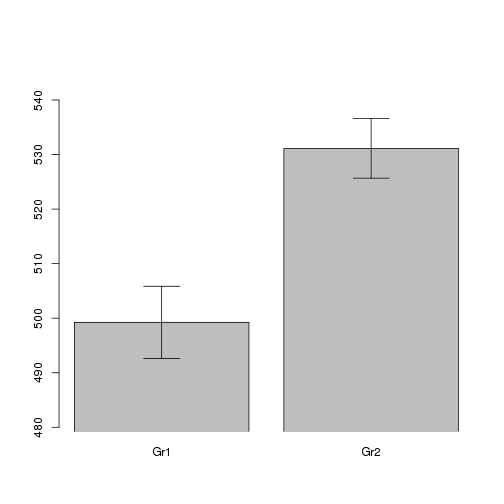

Estimation - Confidence intervals
=================================

christophe@pallier.org

Here, we just show how to get confidence intervals for the proportion or the mean obtained from a sample. For confidence intervalle of comparisons, see the other files.

## Estimating a proportion


```r
n <- 100
a <- rbinom(n, size = 1, prob = 1/3)
```


```r
table(a)
```

```
## a
##  0  1 
## 73 27
```

```r
prop.table(table(a))
```

```
## a
##    0    1 
## 0.73 0.27
```

```r
mean(a)
```

```
## [1] 0.27
```


### Inferential stats


```r
prop.test(table(a))
```

```
## 
## 	1-sample proportions test with continuity correction
## 
## data:  table(a), null probability 0.5
## X-squared = 20.25, df = 1, p-value = 6.795e-06
## alternative hypothesis: true p is not equal to 0.5
## 95 percent confidence interval:
##  0.6304 0.8116
## sample estimates:
##    p 
## 0.73
```

```r
prop.test(table(a))$conf.int
```

```
## [1] 0.6304 0.8116
## attr(,"conf.level")
## [1] 0.95
```


## Estimating a mean


```r
n <- 100
a <- rnorm(n, mean = 100, sd = 15)
```


## Exploratory graphics


```r
par(las = 1)
stripchart(a, method = "jitter", vertical = TRUE)
abline(h = mean(a), lty = 2)
```

 

```r
boxplot(a)
```

 

```r
hist(a)
rug(a)
```

 

```r
plot(density(a))
abline(v = mean(a), lty = 2)
rug(a)
```

 


If the sample is small, you can use a `dotchart`


```r
dotchart(a[1:20])
```

 


## Descriptive stats


```r
summary(a)
```

```
##    Min. 1st Qu.  Median    Mean 3rd Qu.    Max. 
##    61.4    89.6    98.7    98.7   108.0   133.0
```

```r
mean(a)
```

```
## [1] 98.68
```

```r
mean(a[abs(a - mean(a)) < 2 * sd(a)])  # after deleting point beyond 2 stddev 
```

```
## [1] 98.42
```


## Confidence intervals


```r
t.test(a)
```

```
## 
## 	One Sample t-test
## 
## data:  a
## t = 68.4, df = 99, p-value < 2.2e-16
## alternative hypothesis: true mean is not equal to 0
## 95 percent confidence interval:
##   95.82 101.55
## sample estimates:
## mean of x 
##     98.68
```

```r
t.test(a)$conf.int
```

```
## [1]  95.82 101.55
## attr(,"conf.level")
## [1] 0.95
```

```r

require(boot)
```

```
## Loading required package: boot
```

```r
sampmean <- function(x, d) {
    mean(x[d])
}
boota <- boot(a, sampmean, 1000)
boot.ci(boota)
```

```
## Warning: bootstrap variances needed for studentized intervals
```

```
## BOOTSTRAP CONFIDENCE INTERVAL CALCULATIONS
## Based on 1000 bootstrap replicates
## 
## CALL : 
## boot.ci(boot.out = boota)
## 
## Intervals : 
## Level      Normal              Basic         
## 95%   ( 95.82, 101.65 )   ( 95.83, 101.73 )  
## 
## Level     Percentile            BCa          
## 95%   ( 95.64, 101.54 )   ( 95.69, 101.62 )  
## Calculations and Intervals on Original Scale
```


