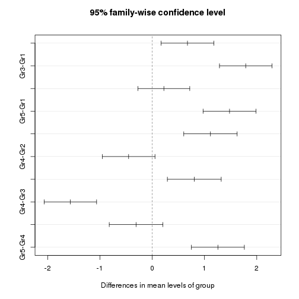

Comparing several means, iwhtin subject
===========================================

christophe@pallier.org

This file was generated by this  


```r
rm(list = ls())
require(ez)
```

```
## Loading required package: ez
```

```r
require(gplots)
```

```
## Loading required package: gplots
## KernSmooth 2.23 loaded
## Copyright M. P. Wand 1997-2009
## 
## Attaching package: 'gplots'
## 
## The following object is masked from 'package:stats':
## 
##     lowess
```

```r
require(lme4)
```

```
## Loading required package: lme4
## Loading required package: lattice
## Loading required package: Matrix
```


## Creation of simulated data


```r
nsub <- 20  # number of subjects (statistical units)
nconds <- 5  # number of conditions 
effects <- c(110, 110, 120, 140, 100)
sd_between_sub <- 10
sd_within_sub <- 4

ot <- data.frame(sub = factor(rep(paste("s", 1:nsub, sep = ""), each = nconds)), 
    cond = factor(rep(paste("cond", 1:nconds, sep = ""), nsub)), y = effects + 
        rep(rnorm(nsub, sd = sd_between_sub), each = nconds) + rnorm(nsub * 
        nconds, sd = sd_within_sub))
```


### Exploration plots


```r
with(ot, interaction.plot(cond, sub, y, main = "Cond * Subject plot", legend = FALSE))
```

 

```r

ot$ycorr <- ot$y + mean(ot$y) - tapply(ot$y, ot$sub, mean)[ot$sub]
with(ot, interaction.plot(cond, sub, ycorr, main = "Cond * Sub after removing Sub main effect", 
    legend = FALSE))
```

 


### Classical analysis of variance model:


```r
require(ez)
# summary(aov_model <- aov(y ~ cond + Error(sub/cond), data=ot))

ez_model <- ezANOVA(data = ot, dv = y, wid = sub, within = cond)
print(ez_model)
```

```
## $ANOVA
##   Effect DFn DFd     F        p p<.05    ges
## 2   cond   4  76 245.7 1.22e-42     * 0.6725
## 
## $`Mauchly's Test for Sphericity`
##   Effect      W     p p<.05
## 2   cond 0.5862 0.412      
## 
## $`Sphericity Corrections`
##   Effect    GGe     p[GG] p[GG]<.05    HFe     p[HF] p[HF]<.05
## 2   cond 0.8109 5.088e-35         * 0.9976 1.519e-42         *
```

```r

ezPlot(data = ot, dv = y, wid = sub, within = cond, x = cond)
```

 


```r
require(lme4)
summary(lmer_model <- lmer(y ~ cond + (1 | sub), data = ot))
```

```
## Linear mixed model fit by REML ['lmerMod']
## Formula: y ~ cond + (1 | sub) 
##    Data: ot 
## 
## REML criterion at convergence: 616.4 
## 
## Random effects:
##  Groups   Name        Variance Std.Dev.
##  sub      (Intercept) 72.1     8.49    
##  Residual             17.9     4.23    
## Number of obs: 100, groups: sub, 20
## 
## Fixed effects:
##             Estimate Std. Error t value
## (Intercept)   109.23       2.12    51.5
## condcond2       1.28       1.34     1.0
## condcond3      12.12       1.34     9.1
## condcond4      29.58       1.34    22.1
## condcond5      -9.12       1.34    -6.8
## 
## Correlation of Fixed Effects:
##           (Intr) cndcn2 cndcn3 cndcn4
## condcond2 -0.315                     
## condcond3 -0.315  0.500              
## condcond4 -0.315  0.500  0.500       
## condcond5 -0.315  0.500  0.500  0.500
```

```r
anova(lmer_model)
```

```
## Analysis of Variance Table
##      Df Sum Sq Mean Sq F value
## cond  4  17555    4389     246
```

```r
require(car)
```

```
## Loading required package: car
```

```r
Anova(lmer_model)
```

```
## Analysis of Deviance Table (Type II Wald chisquare tests)
## 
## Response: y
##      Chisq Df Pr(>Chisq)    
## cond   983  4     <2e-16 ***
## ---
## Signif. codes:  0 '***' 0.001 '**' 0.01 '*' 0.05 '.' 0.1 ' ' 1
```


```r
# plotmeans(y ~ cond, data=ot, gap=0.1)
plotmeans(ycorr ~ cond, data = ot, gap = 0.1)
```

```
## Warning: "gap" is not a graphical parameter
```

 


