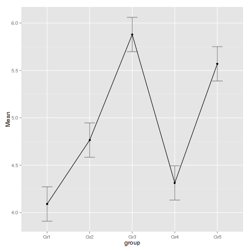

Comparing the means of several independent groups
=================================================

christophe@pallier.org


Data are in a spreasheet format, in `oneway.csv`


```r
ow <- read.csv("oneway.csv")
head(ow)
```

```
##   X group     y
## 1 1   Gr1 2.972
## 2 2   Gr1 5.604
## 3 3   Gr1 3.812
## 4 4   Gr1 4.393
## 5 5   Gr1 4.075
## 6 6   Gr1 5.049
```

```r
str(ow)
```

```
## 'data.frame':	288 obs. of  3 variables:
##  $ X    : int  1 2 3 4 5 6 7 8 9 10 ...
##  $ group: Factor w/ 5 levels "Gr1","Gr2","Gr3",..: 1 1 1 1 1 1 1 1 1 1 ...
##  $ y    : num  2.97 5.6 3.81 4.39 4.07 ...
```


We can perform the same operations as we did for the two samples case.


### Graphical explorations


```r
attach(ow)
hist(y)
```

 

```r
plot(y ~ group)
```

 

```r
stripchart(y ~ group, vertical = TRUE)
```

 

```r
for (g in group) {
    plot(density(y[group == g]), main = g)
    rug(y[group == g])
}
```

     

```r
detach(ow)
```


### Descriptive stats


```r
attach(ow)
signif(tapply(y, group, mean), 3)
```

```
##  Gr1  Gr2  Gr3  Gr4  Gr5 
## 4.09 4.76 5.88 4.31 5.57
```

```r
signif(tapply(y, group, median), 3)
```

```
##  Gr1  Gr2  Gr3  Gr4  Gr5 
## 4.24 4.72 5.87 4.44 5.62
```

```r
signif(tapply(y, group, sd), 3)
```

```
##   Gr1   Gr2   Gr3   Gr4   Gr5 
## 1.010 0.981 1.040 0.926 0.975
```

```r


signif(tapply(y, group, se), 3)
```

```
##   Gr1   Gr2   Gr3   Gr4   Gr5 
## 0.131 0.131 0.138 0.120 0.132
```

```r

detach(ow)
```


### Inferential statistics


```r
require(ez)
```

```
## Loading required package: ez
```

```r
ez_model <- ezANOVA(data = ow, dv = y, between = group)
```

```
## Error: argument "wid" is missing, with no default
```

```r
print(ez_model)
```

```
## Error: object 'ez_model' not found
```

```r

ow$sub <- factor(1:nrow(ow))
ezPlot(data = ow, dv = y, wid = sub, between = group, x = group)
```

```
## Warning: Data is unbalanced (unequal N per group). Make sure you specified a well-considered value for the type argument to ezANOVA().
## Warning: Unbalanced groups. Mean N will be used in computation of FLSD
```

 


```r
summary(av <- aov(y ~ group, data = ow))
```

```
##              Df Sum Sq Mean Sq F value Pr(>F)    
## group         4    140    35.1    35.9 <2e-16 ***
## Residuals   283    276     1.0                   
## ---
## Signif. codes:  0 '***' 0.001 '**' 0.01 '*' 0.05 '.' 0.1 ' ' 1
```

```r
TukeyHSD(av)
```

```
##   Tukey multiple comparisons of means
##     95% family-wise confidence level
## 
## Fit: aov(formula = y ~ group, data = ow)
## 
## $group
##            diff     lwr      upr  p adj
## Gr2-Gr1  0.6744  0.1703  1.17854 0.0026
## Gr3-Gr1  1.7887  1.2869  2.29049 0.0000
## Gr4-Gr1  0.2229 -0.2724  0.71829 0.7305
## Gr5-Gr1  1.4793  0.9728  1.98574 0.0000
## Gr3-Gr2  1.1142  0.6038  1.62472 0.0000
## Gr4-Gr2 -0.4515 -0.9556  0.05263 0.1031
## Gr5-Gr2  0.8048  0.2898  1.31989 0.0002
## Gr4-Gr3 -1.5657 -2.0675 -1.06391 0.0000
## Gr5-Gr3 -0.3094 -0.8222  0.20340 0.4627
## Gr5-Gr4  1.2563  0.7498  1.76280 0.0000
```

```r
plot(TukeyHSD(av))
```

 


The output of `lm` provides additonal information

```r
contrasts(ow$group) <- contr.treatment
summary(lmtr <- lm(y ~ group, data = ow))
```

```
## 
## Call:
## lm(formula = y ~ group, data = ow)
## 
## Residuals:
##    Min     1Q Median     3Q    Max 
## -2.580 -0.650  0.093  0.650  2.572 
## 
## Coefficients:
##             Estimate Std. Error t value Pr(>|t|)    
## (Intercept)    4.090      0.128   32.06  < 2e-16 ***
## group2         0.674      0.184    3.67  0.00029 ***
## group3         1.789      0.183    9.79  < 2e-16 ***
## group4         0.223      0.180    1.24  0.21760    
## group5         1.479      0.184    8.02  2.8e-14 ***
## ---
## Signif. codes:  0 '***' 0.001 '**' 0.01 '*' 0.05 '.' 0.1 ' ' 1
## 
## Residual standard error: 0.988 on 283 degrees of freedom
## Multiple R-squared:  0.337,	Adjusted R-squared:  0.327 
## F-statistic: 35.9 on 4 and 283 DF,  p-value: <2e-16
```

```r

contrasts(ow$group) <- contr.sum
summary(lmsum <- lm(y ~ group, data = ow))
```

```
## 
## Call:
## lm(formula = y ~ group, data = ow)
## 
## Residuals:
##    Min     1Q Median     3Q    Max 
## -2.580 -0.650  0.093  0.650  2.572 
## 
## Coefficients:
##             Estimate Std. Error t value Pr(>|t|)    
## (Intercept)   4.9234     0.0583   84.50  < 2e-16 ***
## group1       -0.8331     0.1147   -7.26  3.7e-12 ***
## group2       -0.1586     0.1177   -1.35     0.18    
## group3        0.9556     0.1169    8.17  1.0e-14 ***
## group4       -0.6101     0.1147   -5.32  2.1e-07 ***
## ---
## Signif. codes:  0 '***' 0.001 '**' 0.01 '*' 0.05 '.' 0.1 ' ' 1
## 
## Residual standard error: 0.988 on 283 degrees of freedom
## Multiple R-squared:  0.337,	Adjusted R-squared:  0.327 
## F-statistic: 35.9 on 4 and 283 DF,  p-value: <2e-16
```

 


 
 
