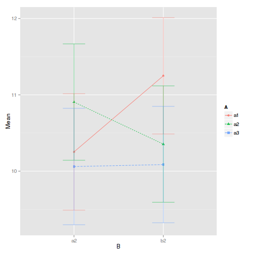
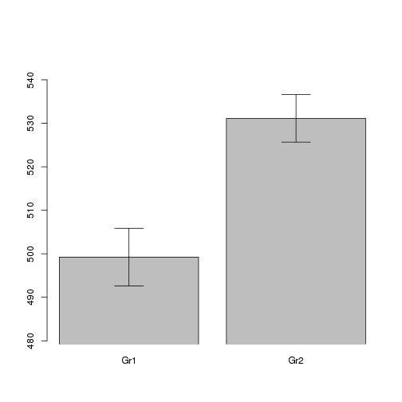

Comparing two groups (continous dependent variable)
===================================================

christophe@pallier.org


```r
g1 <- 500 + rnorm(30, sd = 40)
g2 <- 520 + rnorm(20, sd = 30)
write(g1, "group1.dat")
write(g2, "group2.dat")
rm(g1, g2)
```


Data for this example are in two text files `group1.dat` and `group2.dat`. 


```r
g1 <- scan("group1.dat")
g2 <- scan("group2.dat")
```


We arrange them into a data frame with two columns: `group` (a factor with two modalities: `Gr1` and `Gr2`), and `y` which contains the values themselves.


```r
tg <- data.frame(group = factor(rep(c("Gr1", "Gr2"), c(length(g1), length(g2)))), 
    y = c(g1, g2))

head(tg)
```

```
##   group     y
## 1   Gr1 472.9
## 2   Gr1 552.4
## 3   Gr1 455.6
## 4   Gr1 507.7
## 5   Gr1 535.2
## 6   Gr1 514.7
```

```r
str(tg)
```

```
## 'data.frame':	50 obs. of  2 variables:
##  $ group: Factor w/ 2 levels "Gr1","Gr2": 1 1 1 1 1 1 1 1 1 1 ...
##  $ y    : num  473 552 456 508 535 ...
```

```r
table(tg$group)
```

```
## 
## Gr1 Gr2 
##  30  20
```


### Graphical explorations


```r
hist(tg$y)
```

 


```r
boxplot(tg$y ~ tg$group)
```

 


When the samples are small, stripchart may be the best:


```r
stripchart(tg$y ~ tg$group, vertical = TRUE, pch = 1)
```

 


If the samples are large enough, you can create density plots:


```r
par(mfrow = (c(2, 1)))
xsca <- range(tg$y)
for (gr in levels(tg$group)) {
    with(subset(tg, group == gr), {
        plot(density(y), xlim = xsca, main = gr, bty = "l")
        rug(y, ticksize = 0.1)
    })
}
```

 


Obtain the basic descriptive stats


```r
attach(tg)
signif(tapply(y, group, mean), 3)
```

```
## Gr1 Gr2 
## 499 531
```

```r
signif(tapply(y, group, median), 3)
```

```
## Gr1 Gr2 
## 505 531
```

```r
signif(tapply(y, group, sd), 3)
```

```
##  Gr1  Gr2 
## 36.2 24.4
```

```r
signif(tapply(y, group, se), 3)
```

```
##  Gr1  Gr2 
## 6.61 5.46
```

```r
detach(tg)
```


### Inferential statistics


Student T-tests. First assuming equal variance, then relaxing this assumption

```r
t.test(y ~ group, data = tg, var.equal = TRUE)
```

```
## 
## 	Two Sample t-test
## 
## data:  y by group
## t = -3.445, df = 48, p-value = 0.001196
## alternative hypothesis: true difference in means is not equal to 0
## 95 percent confidence interval:
##  -50.50 -13.28
## sample estimates:
## mean in group Gr1 mean in group Gr2 
##             499.2             531.1
```

```r
t.test(y ~ group, data = tg)
```

```
## 
## 	Welch Two Sample t-test
## 
## data:  y by group
## t = -3.719, df = 47.98, p-value = 0.0005238
## alternative hypothesis: true difference in means is not equal to 0
## 95 percent confidence interval:
##  -49.13 -14.65
## sample estimates:
## mean in group Gr1 mean in group Gr2 
##             499.2             531.1
```


Somewhat more information can be obtained by fitting linear models. 

First with a parametrisation (`contr.treatment`) of group where the intercept will correspond to the mean of group 1 and the effect will estimate the difference between the two groups. 


```r
contrasts(tg$group) <- contr.treatment
contrasts(tg$group)
```

```
##     2
## Gr1 0
## Gr2 1
```

```r
summary(lm(y ~ group, data = tg))
```

```
## 
## Call:
## lm(formula = y ~ group, data = tg)
## 
## Residuals:
##    Min     1Q Median     3Q    Max 
## -63.94 -24.69   1.42  22.73  79.86 
## 
## Coefficients:
##             Estimate Std. Error t value Pr(>|t|)    
## (Intercept)   499.24       5.85   85.27   <2e-16 ***
## group2         31.89       9.26    3.44   0.0012 ** 
## ---
## Signif. codes:  0 '***' 0.001 '**' 0.01 '*' 0.05 '.' 0.1 ' ' 1
## 
## Residual standard error: 32.1 on 48 degrees of freedom
## Multiple R-squared:  0.198,	Adjusted R-squared:  0.182 
## F-statistic: 11.9 on 1 and 48 DF,  p-value: 0.0012
```


Alternatively, one can prefer a parametrisation where the intercept estimates the global mean and the first parameter is the deviation from the global mean.


```r
contrasts(tg$group) <- contr.sum
contrasts(tg$group)
```

```
##     [,1]
## Gr1    1
## Gr2   -1
```

```r
summary(lm(y ~ group, data = tg))
```

```
## 
## Call:
## lm(formula = y ~ group, data = tg)
## 
## Residuals:
##    Min     1Q Median     3Q    Max 
## -63.94 -24.69   1.42  22.73  79.86 
## 
## Coefficients:
##             Estimate Std. Error t value Pr(>|t|)    
## (Intercept)   515.18       4.63  111.30   <2e-16 ***
## group1        -15.95       4.63   -3.44   0.0012 ** 
## ---
## Signif. codes:  0 '***' 0.001 '**' 0.01 '*' 0.05 '.' 0.1 ' ' 1
## 
## Residual standard error: 32.1 on 48 degrees of freedom
## Multiple R-squared:  0.198,	Adjusted R-squared:  0.182 
## F-statistic: 11.9 on 1 and 48 DF,  p-value: 0.0012
```


### Barplot with standard errors

Barplot with the means and their associated standard errors (note this is not the standard error for the difference between the groups' means, which is roughly $\sqrt{2}$ larger and, maybe for this reason, rarely used in psychology papers (like they rarely report confidence intervals))


```r
attach(tg)
par(mfrow = c(1, 1))
means <- tapply(y, group, mean)
ses <- tapply(y, group, se)

ysca = c(min(means - 3 * ses), max(means + 3 * ses))

mp <- barplot(means, ylim = ysca, xpd = F)
arrows(mp, means - ses, mp, means + ses, code = 3, angle = 90)
```

 

```r

detach(tg)
```


A much nicer plot can be constructed, with confidence intervals for the means and for their difference (Cumming, Geoff, and Sue Finch. 2005. “Inference by Eye: Confidence Intervals and How to Read Pictures of Data.” American Psychologist 60 (2): 170–180.)


```r
attach(tg)
m1 <- t.test(y[group == "Gr1"])$conf.int
m2 <- t.test(y[group == "Gr2"])$conf.int
di <- diff(t.test(y ~ group)$conf.int)
ysca <- c(min(c(m1, m2) - 0.3 * diff(range(c(m1, m2)))), max(c(m1, m2) + 0.3 * 
    diff(range(c(m1, m2)))))

plot(c(Gr1 = 1, Gr2 = 2, difference = 3), c(mean(m1), mean(m2), mean(m2)), pch = c(16, 
    16, 17), ylim = ysca, xlim = c(0.5, 3.5), axes = F, xlab = "", ylab = "")
axis(2, las = 1)
axis(1, at = 1:3, labels = c("Gr1", "Gr2", "difference"))
arrows(1:3, c(m1[1], m2[1], mean(m2) - di/2), 1:3, c(m1[2], m2[2], mean(m2) + 
    di/2), code = 3, angle = 90)
abline(h = mean(m1), lty = 2)
abline(h = mean(m2), lty = 2)
```

 

```r

detach(tg)
```


