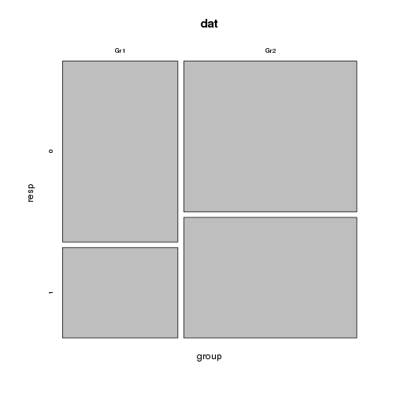

Comparing two proportions (binary response)
===========================================

christophe@pallier.org

A binary variable `resp` has been measured in two independent groups (no matching). 

We therefore have four counts.

We first put them into a table. 


```r
dat <- as.table(matrix(c(40, 20, 50, 40), nrow = 2, byrow = T, dimnames = list(group = c("Gr1", 
    "Gr2"), resp = 0:1)))
dat
```

```
##      resp
## group  0  1
##   Gr1 40 20
##   Gr2 50 40
```


Note: There may a better/simpler way to create a table... If you know one, please let me know.

Now we can obtain the proportions in each group:

```r
signif(prop.table(dat, 1), 2)
```

```
##      resp
## group    0    1
##   Gr1 0.67 0.33
##   Gr2 0.56 0.44
```


And plot the table:


```r
plot(dat)
```

 


If you do not like the mosaicplot, you can use a barplot


```r
barplot(prop.table(dat[, 1]), ylim = c(0, 1))
```

 


Then we compute inferential stats to see if we can reject the null hypothesis that the two samples come from populations with identical proportions. 

If no cell is less than 5, a Pearson's $\Chi^2$ test will do. There are many 
ways to perform it:


```r
chisq.test(dat)
```

```
## 
## 	Pearson's Chi-squared test with Yates' continuity correction
## 
## data:  dat
## X-squared = 1.418, df = 1, p-value = 0.2338
```

```r
prop.test(dat)
```

```
## 
## 	2-sample test for equality of proportions with continuity
## 	correction
## 
## data:  dat
## X-squared = 1.418, df = 1, p-value = 0.2338
## alternative hypothesis: two.sided
## 95 percent confidence interval:
##  -0.06015  0.28237
## sample estimates:
## prop 1 prop 2 
## 0.6667 0.5556
```


```r
require(gmodels)
```

```
## Loading required package: gmodels
```

```r
CrossTable(dat, chisq = TRUE)
```

```
## 
##  
##    Cell Contents
## |-------------------------|
## |                       N |
## | Chi-square contribution |
## |           N / Row Total |
## |           N / Col Total |
## |         N / Table Total |
## |-------------------------|
## 
##  
## Total Observations in Table:  150 
## 
##  
##              | resp 
##        group |         0 |         1 | Row Total | 
## -------------|-----------|-----------|-----------|
##          Gr1 |        40 |        20 |        60 | 
##              |     0.444 |     0.667 |           | 
##              |     0.667 |     0.333 |     0.400 | 
##              |     0.444 |     0.333 |           | 
##              |     0.267 |     0.133 |           | 
## -------------|-----------|-----------|-----------|
##          Gr2 |        50 |        40 |        90 | 
##              |     0.296 |     0.444 |           | 
##              |     0.556 |     0.444 |     0.600 | 
##              |     0.556 |     0.667 |           | 
##              |     0.333 |     0.267 |           | 
## -------------|-----------|-----------|-----------|
## Column Total |        90 |        60 |       150 | 
##              |     0.600 |     0.400 |           | 
## -------------|-----------|-----------|-----------|
## 
##  
## Statistics for All Table Factors
## 
## 
## Pearson's Chi-squared test 
## ------------------------------------------------------------
## Chi^2 =  1.852     d.f. =  1     p =  0.1736 
## 
## Pearson's Chi-squared test with Yates' continuity correction 
## ------------------------------------------------------------
## Chi^2 =  1.418     d.f. =  1     p =  0.2338 
## 
## 
```


