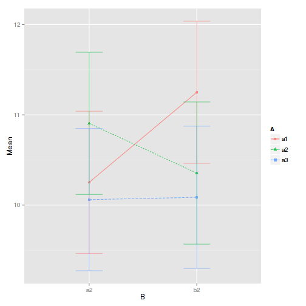

Factorial ANOVAs
================


```r
rm(list = ls())
require(ez)
```

```
## Loading required package: ez
```


Generation of a dataset S<A3*B2>


```r
subject = factor(paste("sub", 1:30, sep = ""))
A = gl(3, 10, 30, labels = c("a1", "a2", "a3"))
B = gl(2, 5, 30, labels = c("a2", "b2"))
x = rnorm(30, mean = 10) + 1 * (A == "a1" & B == "b2")
dat = data.frame(subject, A, B, x)
```


```r
rm(subject, A, B, x)
attach(dat)
```


Classical R approach


```r
table(A, B)
```

```
##     B
## A    a2 b2
##   a1  5  5
##   a2  5  5
##   a3  5  5
```

```r
tapply(x, list(A, B), mean)
```

```
##       a2    b2
## a1 10.25 11.25
## a2 10.91 10.35
## a3 10.06 10.09
```

```r
interaction.plot(A, B, x)
```

 

```r
summary(aov(x ~ A * B, data = dat))
```

```
##             Df Sum Sq Mean Sq F value Pr(>F)
## A            2    2.6   1.306    0.96   0.40
## B            1    0.2   0.186    0.14   0.72
## A:B          2    3.1   1.530    1.12   0.34
## Residuals   24   32.8   1.366
```


Using ez


```r
ezPlot(data = dat, dv = .(x), wid = .(subject), between = .(A, B), x = .(B), 
    split = .(A))
```

 

```r

ezANOVA(data = dat, dv = x, wid = subject, between = c("A", "B"))
```

```
## $ANOVA
##   Effect DFn DFd      F      p p<.05     ges
## 1      A   2  24 0.9562 0.3985       0.07380
## 2      B   1  24 0.1364 0.7152       0.00565
## 3    A:B   2  24 1.1202 0.3427       0.08538
## 
## $`Levene's Test for Homogeneity of Variance`
##   DFn DFd  SSn   SSd    F      p p<.05
## 1   5  24 2.99 11.21 1.28 0.3049
```


```r
detach(dat)
```


Same dataset but with A & B within subject 


```r
subject = gl(5, 1, 30, labels = paste("sub", 1:5, sep = ""))
dat$subject = subject
table(dat$subject, dat$A, dat$B)
```

```
## , ,  = a2
## 
##       
##        a1 a2 a3
##   sub1  1  1  1
##   sub2  1  1  1
##   sub3  1  1  1
##   sub4  1  1  1
##   sub5  1  1  1
## 
## , ,  = b2
## 
##       
##        a1 a2 a3
##   sub1  1  1  1
##   sub2  1  1  1
##   sub3  1  1  1
##   sub4  1  1  1
##   sub5  1  1  1
```


```r
attach(dat)
```

```
## The following object is masked _by_ .GlobalEnv:
## 
##     subject
```

```r
interaction.plot(A:B, subject, x)
```

 

```r
summary(aov(x ~ A * B + Error(subject/(A * B))))
```

```
## 
## Error: subject
##           Df Sum Sq Mean Sq F value Pr(>F)
## Residuals  4  0.872   0.218               
## 
## Error: subject:A
##           Df Sum Sq Mean Sq F value Pr(>F)
## A          2   2.61    1.31    0.64   0.55
## Residuals  8  16.22    2.03               
## 
## Error: subject:B
##           Df Sum Sq Mean Sq F value Pr(>F)
## B          1   0.19   0.186    0.12   0.74
## Residuals  4   5.98   1.494               
## 
## Error: subject:A:B
##           Df Sum Sq Mean Sq F value Pr(>F)
## A:B        2   3.06    1.53    1.26   0.33
## Residuals  8   9.71    1.21
```

```r
summary(aov(x ~ A + Error(subject/A), data = dat, subset = (B == 1)))
```

```
## Error: contrasts can be applied only to factors with 2 or more levels
```

```r
summary(aov(x ~ A + Error(subject/A), data = dat, subset = (B == 2)))
```

```
## Error: contrasts can be applied only to factors with 2 or more levels
```

```r

for (a in levels(A)) {
    print(paste("Effect of B for A =", a))
    print(summary(aov(x ~ B + Error(subject/(B), data = dat, subset = (A == 
        a)))))
}
```

```
## [1] "Effect of B for A = a1"
## 
## Error: subject
##           Df Sum Sq Mean Sq F value Pr(>F)
## Residuals  4  0.872   0.218               
## 
## Error: subject:B
##           Df Sum Sq Mean Sq F value Pr(>F)
## B          1   0.19   0.186    0.12   0.74
## Residuals  4   5.98   1.494               
## 
## Error: Within
##           Df Sum Sq Mean Sq F value Pr(>F)
## Residuals 20   31.6    1.58               
## [1] "Effect of B for A = a2"
## 
## Error: subject
##           Df Sum Sq Mean Sq F value Pr(>F)
## Residuals  4  0.872   0.218               
## 
## Error: subject:B
##           Df Sum Sq Mean Sq F value Pr(>F)
## B          1   0.19   0.186    0.12   0.74
## Residuals  4   5.98   1.494               
## 
## Error: Within
##           Df Sum Sq Mean Sq F value Pr(>F)
## Residuals 20   31.6    1.58               
## [1] "Effect of B for A = a3"
## 
## Error: subject
##           Df Sum Sq Mean Sq F value Pr(>F)
## Residuals  4  0.872   0.218               
## 
## Error: subject:B
##           Df Sum Sq Mean Sq F value Pr(>F)
## B          1   0.19   0.186    0.12   0.74
## Residuals  4   5.98   1.494               
## 
## Error: Within
##           Df Sum Sq Mean Sq F value Pr(>F)
## Residuals 20   31.6    1.58
```

```r
detach(dat)
```


```r
ezPlot(data = dat, dv = .(x), wid = .(subject), between = .(A), within = .(B), 
    x = .(B), split = .(A))
```

```
## Warning: The column supplied as the wid variable contains non-unique
## values across levels of the supplied between-Ss variables. Automatically
## fixing this by generating unique wid labels.
```

 

```r

ezANOVA(data = dat, dv = x, wid = subject, within = .(A, B))
```

```
## $ANOVA
##   Effect DFn DFd      F      p p<.05     ges
## 2      A   2   8 0.6442 0.5503       0.07380
## 3      B   1   4 0.1246 0.7419       0.00565
## 4    A:B   2   8 1.2605 0.3343       0.08538
## 
## $`Mauchly's Test for Sphericity`
##   Effect      W      p p<.05
## 2      A 0.8025 0.7189      
## 4    A:B 0.3146 0.1765      
## 
## $`Sphericity Corrections`
##   Effect    GGe  p[GG] p[GG]<.05    HFe  p[HF] p[HF]<.05
## 2      A 0.8351 0.5282           1.3629 0.5503          
## 4    A:B 0.5933 0.3284           0.6991 0.3313
```


Split-plot ANOVA (A within, B between)


```r
subject = gl(10, 1, 30, labels = paste("sub", 1:10, sep = ""))
dat$subject = subject
table(dat$subject, dat$A, dat$B)
```

```
## , ,  = a2
## 
##        
##         a1 a2 a3
##   sub1   1  1  1
##   sub2   1  1  1
##   sub3   1  1  1
##   sub4   1  1  1
##   sub5   1  1  1
##   sub6   0  0  0
##   sub7   0  0  0
##   sub8   0  0  0
##   sub9   0  0  0
##   sub10  0  0  0
## 
## , ,  = b2
## 
##        
##         a1 a2 a3
##   sub1   0  0  0
##   sub2   0  0  0
##   sub3   0  0  0
##   sub4   0  0  0
##   sub5   0  0  0
##   sub6   1  1  1
##   sub7   1  1  1
##   sub8   1  1  1
##   sub9   1  1  1
##   sub10  1  1  1
```

```r
table(dat$subject, dat$B:dat$A)
```

```
##        
##         a2:a1 a2:a2 a2:a3 b2:a1 b2:a2 b2:a3
##   sub1      1     1     1     0     0     0
##   sub2      1     1     1     0     0     0
##   sub3      1     1     1     0     0     0
##   sub4      1     1     1     0     0     0
##   sub5      1     1     1     0     0     0
##   sub6      0     0     0     1     1     1
##   sub7      0     0     0     1     1     1
##   sub8      0     0     0     1     1     1
##   sub9      0     0     0     1     1     1
##   sub10     0     0     0     1     1     1
```

```r
summary(aov(x ~ A * B + Error(subject/A), data = dat))
```

```
## 
## Error: subject
##           Df Sum Sq Mean Sq F value Pr(>F)
## B          1   0.19   0.186    0.22   0.65
## Residuals  8   6.85   0.856               
## 
## Error: subject:A
##           Df Sum Sq Mean Sq F value Pr(>F)
## A          2   2.61    1.31    0.81   0.46
## A:B        2   3.06    1.53    0.94   0.41
## Residuals 16  25.92    1.62
```


```r
ezANOVA(data = dat, dv = x, wid = subject, within = .(A), between = .(B))
```

```
## $ANOVA
##   Effect DFn DFd      F      p p<.05     ges
## 2      B   1   8 0.2175 0.6534       0.00565
## 3      A   2  16 0.8059 0.4640       0.07380
## 4    B:A   2  16 0.9441 0.4097       0.08538
## 
## $`Mauchly's Test for Sphericity`
##   Effect      W      p p<.05
## 3      A 0.7241 0.3231      
## 4    B:A 0.7241 0.3231      
## 
## $`Sphericity Corrections`
##   Effect    GGe  p[GG] p[GG]<.05    HFe  p[HF] p[HF]<.05
## 3      A 0.7838 0.4403           0.9411 0.4581          
## 4    B:A 0.7838 0.3931           0.9411 0.4056
```

