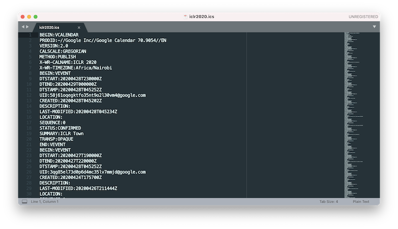
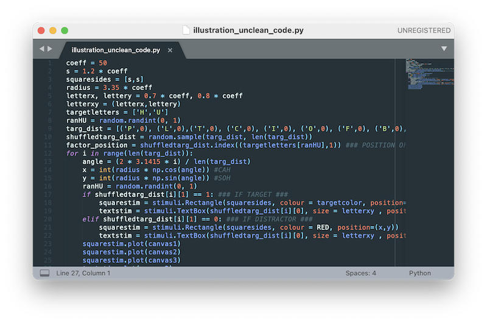
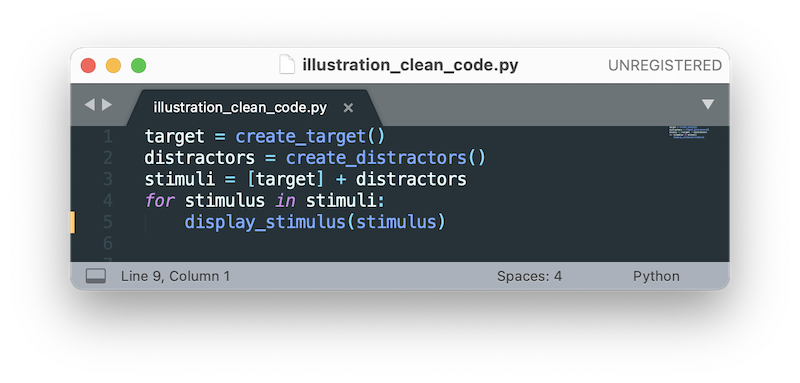
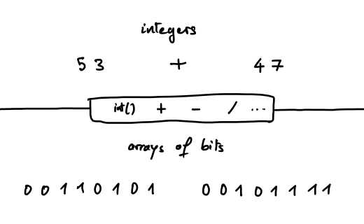
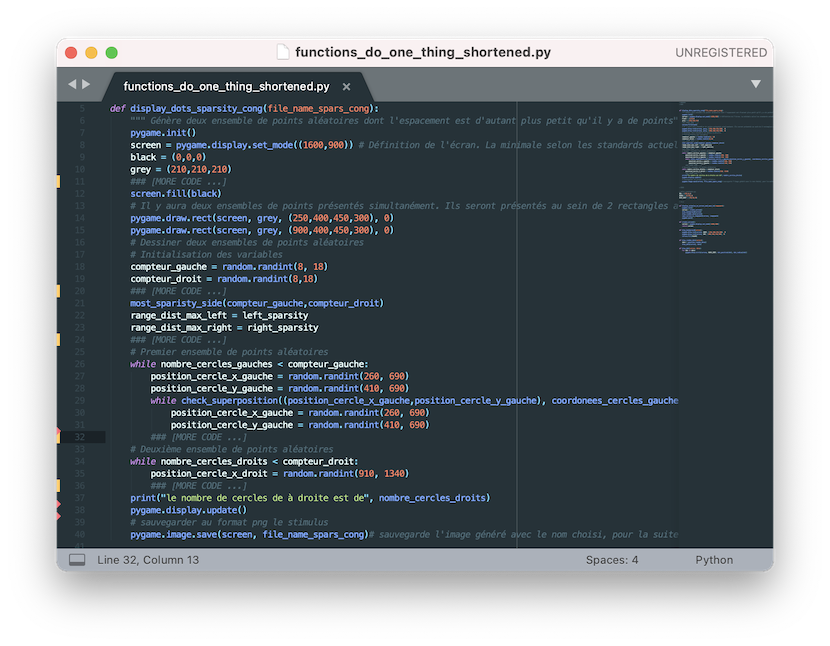
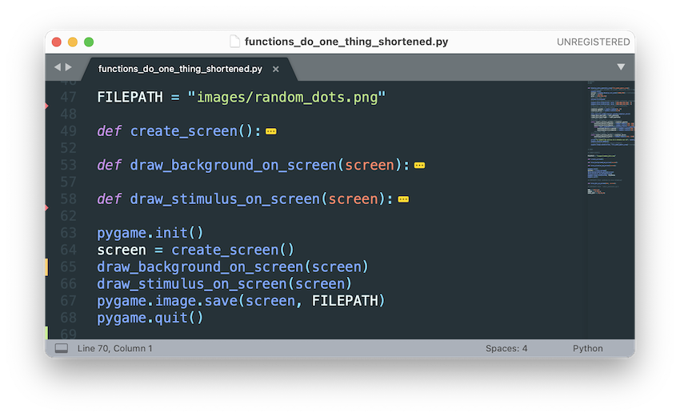
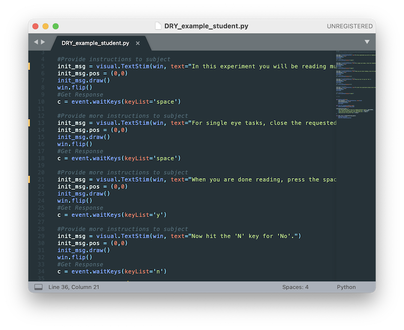
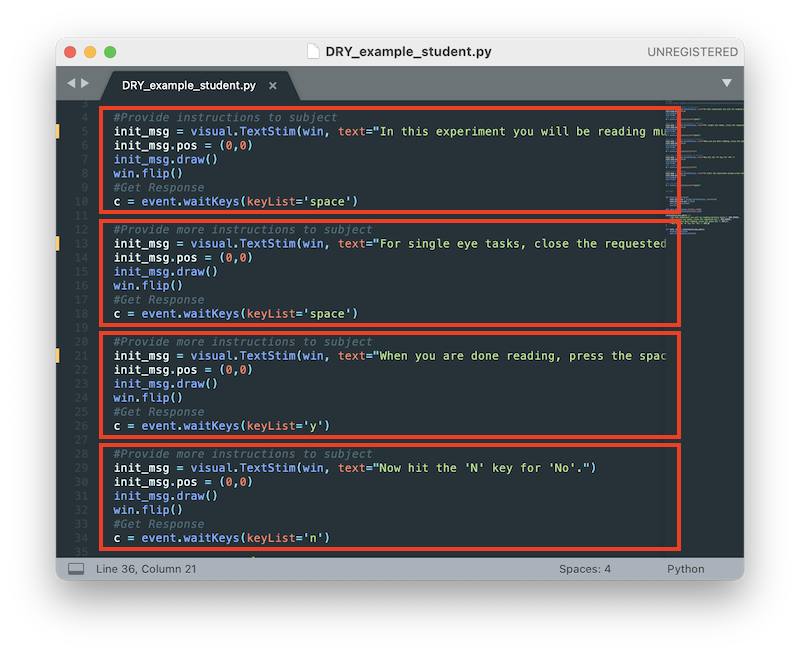
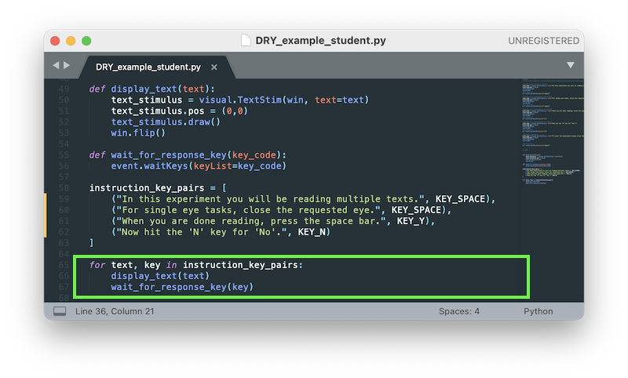

# Clean Code


---

# The goal of *clean code* is to make your code **easy to understand** and **easy to change**.

---

Analogy: making a schedule using [the .ics format](images/iclr2020_ics_screenshot.png)

---

Analogy: making a schedule using [the .ics format](images/iclr2020_ics_screenshot.png)

* hard to understand
* hard to change



---

Analogy: making a schedule using [a google calendar](images/iclr2020_calendar_google_screenshot.png)


---

Analogy: making a schedule using [a google calendar](images/iclr2020_calendar_google_screenshot.png)

* easy to understand
* easy to change

    <!-- (the "things" we care about are immediately visible; unimportant details are abstracted away; easy to see the interactions between different parts;
    easy to navigate between different levels of description) -->


---

You can make code that's hard to understand and hard to change…





---

Or you can make code that's easy to understand and easy to change.



---

Let's illustrate the principles of *clean code* **[CC]** by example.

---

First example:

```
w = x2 - x1
```

---

First example:

```
w = x2 - x1
```

* What are `w`, `x1` and `x2`?
    * What do they represent?
    * What are they used for?


---

First example:

```
w = x2 - x1
```

* What are `w`, `x1` and `x2`?
    * What do they represent?
    * What are they used for?
* Does "w" stand for "weight", "window", "word", or is it just a symbol for a generic computation?


---

First example:

```
w = x2 - x1
```


* What are `w`, `x1` and `x2`?
    * What do they represent?
    * What are they used for?
* Does "w" stand for "weight", "window", "word", or is it just a symbol for a generic computation?


```
width = x_right - x_left
```


* This answers all of the previous questions!

---

# **CC1. Use meaningful names**

---

**[CC1]** Give names that **reveal the purpose** of things.

    !python
    width = x_right - x_left

---

Next:

    !python
    width = x_right - x_left + 10


---

Next:

    !python
    width = x_right - x_left + 10

Where does '10' come from?

What does it represent?

Can I change it?

---

Next:

    !python
    width = x_right - x_left + 10

Where does '10' come from?

What does it represent?

Can I change it?

    !python
    width = x_right - x_left + 2 * horizontal_margin

---

Next:

    !python
    width = x_right - x_left + 10

Where does '10' come from?

What does it represent?

Can I change it?

    !python
    width = x_right - x_left + 2 * horizontal_margin

**[CC1]** Replace **magic numbers** with **named variables, parameters, or constants**

---

**[CC1]** Replace **magic numbers**…

    !python
    def width_with_margins(x_right, x_left):
        return x_right - x_left + 10

---

**[CC1]** Replace **magic numbers**…

    !python
    def width_with_margins(x_right, x_left):
        return x_right - x_left + 10

…with **named parameters**

    !python
    def width_with_margins(x_right, x_left, horizontal_margin=5):
        return x_right - x_left + 2 * horizontal_margin

---

**[CC1]** Replace **magic numbers**…

    !python
    def width_with_margins(x_right, x_left):
        return x_right - x_left + 10

…with **named parameters**

    !python
    def width_with_margins(x_right, x_left, horizontal_margin=5):
        return x_right - x_left + 2 * horizontal_margin


**[CC1]** Replace **magic numbers**…

    !python
    width = width * 0.3937007874

---

**[CC1]** Replace **magic numbers**…

    !python
    def width_with_margins(x_right, x_left):
        return x_right - x_left + 10

…with **named parameters**

    !python
    def width_with_margins(x_right, x_left, horizontal_margin=5):
        return x_right - x_left + 2 * horizontal_margin


**[CC1]** Replace **magic numbers**…

    !python
    width = width * 0.3937007874

…with **named constants**

    !python
    width_inches = width_cm * INCHES_PER_CENTIMETER

---

Note: *magic numbers* are not necessarily numbers!

```PURPLE_HEX = "#6A0DAD"```


---

<!-- ---

    !python
    width = (21 - 2 * 1.5) * 0.3937007874

- **[CC1]** Replace **magic numbers** with named constants or named parameters

---

    !python
    INCHES_PER_CENTIMETER = 0.3937007874
    # ...
    width = (21 - 2 * 1.5) * INCHES_PER_CENTIMETER

- **[CC1]** Replace magic numbers with **named constants** or named parameters

---

    !python
    INCHES_PER_CENTIMETER = 0.3937007874
    # ...
    def get_content_width(page_width_cm=21.0, page_margin_cm=1.5):
        content_width_cm = (page_width_cm - 2 * page_margin_cm)
        content_width_inches = content_width_cm * INCHES_PER_CENTIMETER
        return content_width_inches

- **[CC1]** replace magic numbers with named constants or **named parameters**

--- -->


Example from a past lecture:

    !python
    check_divisible(a, b)


---

Example from a past lecture:

    !python
    check_divisible(a, b)

What do you think this does?


---

Example from a past lecture:

    !python
    check_divisible(a, b)

What do you think this does?

- **[CC1] Function names should say what they do**


---

The implementation:

    !python
    def check_divisible(n, divisor):
        if (n % divisor == 0):
            print(n, ' is divisible by ', divisor)

---

The implementation:

    !python
    def check_divisible(n, divisor):
        if (n % divisor == 0):
            print(n, ' is divisible by ', divisor)

**Misleading name**: I don't expect "something that checks" to print anything


---

A more accurate name:

    !python
    def print_if_divisible(n, divisor):
        if (n % divisor == 0):
            print(n, ' is divisible by ', divisor)

---

A more accurate name:

    !python
    def print_if_divisible(n, divisor):
        if (n % divisor == 0):
            print(n, ' is divisible by ', divisor)

- **[CC1] Function names should say what they do**

- **[CC1] Function names should reveal side-effects** (such as printing to the console)

---

Another function call:

    !python
    remove(l, n)

What do you think this does?

---

Another function call:

    !python
    remove(l, n)

What do you think this does? **Ambiguous name**:

* Does it remove the element in `l` whose value is equal to `n`?
* Or does it remove the element in `l` at index `n`?

---

An unambiguous name:

    !python
    remove_list_element_at_index(l, i)

---

An unambiguous name:

    !python
    remove_list_element_at_index(l, i)

* **[CC1] Choose unambiguous names**
* **Clarity at the point of use** is more important than brevity
* Include all the words needed to avoid ambiguity from the perspective of someone calling the function
* A general naming template: **`verb_keywords`** (the verb indicates what the function does, the keywords what parameters are expected)

---

Two function calls:

    !python
    add_number(a , b)
    add_list(c, d)

What do you think these do?

---

The implementation of the functions:

    !python
    def add_number(a , b):
        return a + b

    def add_list(l, e):
        l.append(e)

---

The implementation of the functions:

    !python
    def add_number(a , b):
        return a + b

    def add_list(l, e):
        l.append(e)

**Confusing** to use the same word "add" for the two functions:

* in the first case, `add` calculates the addition
* in the second case, `add` inserts an element
* in the first case, `add` has no side effects, in the second, it does!

---

A way to remove the confusion:

    !python
    def add_numbers(a , b):
        return a + b

    def append_element_to_list(e, l):
        l.append(e)

---

A way to remove the confusion:

    !python
    def add_numbers(a , b):
        return a + b

    def append_element_to_list(e, l):
        l.append(e)

- **[CC1] Use different words for different concepts**

---

Another function call:

    !python
    distance(couple_1, couple_2)

What is this about?

---

Another function call:

    !python
    distance(couple_1, couple_2)

What is this about? **Unclear**:

* What do `couple_1` and `couple_2` represent?
* A "couple" could stand for many things: a point in 2D geometry, an interval, a complex number, a rational number...

---

Another function call:

    !python
    distance(couple_1, couple_2)

**Problem:** we are **mixing two levels of description**

* Level 1: the distance between some objects
* Level 2: the implementation of these objects as couples

---

Example levels of description



---

Example levels of description


see "Structure and Interpretation of Computer Programs" by Abelson & Sussman (specifically the notion of "abstraction barriers")

---

A way to remove the confusion:

    !python
    distance(point_1, point_2)

- **[CC1] Use the appropriate level of description**

---

A way to remove the confusion:

    !python
    distance(point_1, point_2)

- **[CC1] Use the appropriate level of description**
- If your program uses more than one kind of distance (e.g. between points and between intervals), the name "distance" is not precise enough.
    - Note that the function name does not include the argument names, since the caller can choose any other names.

---

A way to specify which kind of distance is computed:

    !python
    distance_between_points(point_1, point_2)
    distance_between_intervals(interval_1, interval_2)

- **[CC1] Use the appropriate level of description**

---

Let's revisit an earlier example:

    !python
    def print_if_divisible(n, divisor):
        if (n % divisor == 0):
            print(n, ' is divisible by ', divisor)

---

Let's revisit an earlier example:

    !python
    def print_if_divisible(n, divisor):
        if (n % divisor == 0):
            print(n, ' is divisible by ', divisor)

This function does two things:

1. Calculating whether an integer is divisible by another
2. Printing conditionally on the result

---

Let's revisit an earlier example:

    !python
    def print_if_divisible(n, divisor):
        if (n % divisor == 0):
            print(n, ' is divisible by ', divisor)

This function does two things:

1. Calculating whether an integer is divisible by another
2. Printing conditionally on the result

These are **two conceptually distinct operations**. There is no good reason for them to be done in the same function.

---

A solution:

    !python
    def is_divisible(n, divisor):
        return (n % divisor == 0)

---

A solution:

    !python
    def is_divisible(n, divisor):
        return (n % divisor == 0)

- **[CC2] Functions should do one thing**

- This solution has the added benefit to remove side-effects from the function.

---

# **CC2. Create functions that do one thing**

---

[Example code from a past student](images/functions_do_one_thing_shortened_bad.png)

- What does `display_dots_sparsity_cong` do?
- Do you find it easy to understand?
- How would you make it easier to understand?

<!--  -->

---

[Potential rewrite](images/functions_do_one_thing_shortened_good.png)



---

[Potential rewrite](images/functions_do_one_thing_shortened_good.png)

- Do you find it easier to understand?


---

**CC2. Create functions that do one thing**

- A lot of programming is about **chunking** <!-- i.e. **building abstractions** -->
- Chunking means grouping elements together in a meaningful named *chunk* (e.g. with a function) that you can manipulate as one conceptual unit
- These chunks help you reason about your program and control its intellectual complexity

---

# **CC3.** [Wait for it]

---

[Example code from a past student](images/DRY_example_student_bad.png)

- What's wrong?



<!-- https://commie.io/#PXwfzTcW -->

---



---

- What's wrong? **Code duplication**.


---

- What's wrong? **Code duplication**.
- Why is it wrong?


---

- What's wrong? **Code duplication**.
- Why is it wrong? It makes code **hard to change**.


---

# **CC3. DRY: Don't Repeat Yourself**

---

- How would you solve this?


---

- [A solution](images/DRY_example_student_good_annotated_sm.png):



---

Last principle of clean code…

---

# **CC4. Explain yourself in code, not comments**

---

Example from a past student:

    !python
    if shuffledtarg_dist[i][1] == 1: ### IF TARGET ###
        # [some code ...]
    elif shuffledtarg_dist[i][1] == 0: ### IF DISTRACTOR ###
        # [some other code ...]

---

Example from a past student:

    !python
    if shuffledtarg_dist[i][1] == 1: ### IF TARGET ###
        # [some code ...]
    elif shuffledtarg_dist[i][1] == 0: ### IF DISTRACTOR ###
        # [some other code ...]

- Why do we need such comments next to `if` and `elif`?

---

Example from a past student:

    !python
    if shuffledtarg_dist[i][1] == 1: ### IF TARGET ###
        # [some code ...]
    elif shuffledtarg_dist[i][1] == 0: ### IF DISTRACTOR ###
        # [some other code ...]

- Why do we need such comments next to `if` and `elif`?
- Good intentions, but bad approach
- **[CC4] Comments do not make up for bad code**

---

A first solution:

    !python
    if stimulus_type == STIMULUS_TYPE_TARGET:
        # [some code ...]
    elif stimulus_type == STIMULUS_TYPE_DISTRACTOR:
        # [some other code ...]

---

A first solution:

    !python
    if stimulus_type == STIMULUS_TYPE_TARGET:
        # [some code ...]
    elif stimulus_type == STIMULUS_TYPE_DISTRACTOR:
        # [some other code ...]

- **[CC4] Clear and expressive code** with few comments is superior to
obscure code with lots of comments

---

A first solution:

    !python
    if stimulus_type == STIMULUS_TYPE_TARGET:
        # [some code ...]
    elif stimulus_type == STIMULUS_TYPE_DISTRACTOR:
        # [some other code ...]

- **[CC4] Clear and expressive code** with few comments is superior to
obscure code with lots of comments
- Can we do even better?

---

An even better solution:

    !python
    if is_target(stimulus):
        # [some code ...]
    elif is_distractor(stimulus):
        # [some other code ...]

- **[CC4] Clear and expressive code** with few comments is superior to
obscure code with lots of comments
- Does this need any comments?

---

Example from a past student:

    !python
    def distance_points(couple1,couple2):
        """Fonction controllant la distance entre nos points
        pour notre ensemble de points aléatoires"""
        return math.sqrt((couple1[0]-couple2[0])**2+(couple1[1]-couple2[1])**2)

---

Example from a past student:

    !python
    def distance_points(couple1,couple2):
        """Fonction controllant la distance entre nos points
        pour notre ensemble de points aléatoires"""
        return math.sqrt((couple1[0]-couple2[0])**2+(couple1[1]-couple2[1])**2)

- **Misleading comment**. It does not accurately describe what the function does.

---

An alternative:

    !python
    def distance_between_points(point_1, point_2)

- Does this need any comments?

---

Example from a past student:

    !python
    exp = design.Experiment("Task") #create and name new exp object

---

Example from a past student:

    !python
    exp = design.Experiment("Task") #create and name new exp object

- Redundant comment. This is just noise. Remove it.

---

# Recap: Clean Code Principles

The goal is to make code **easy to understand** and **easy to change**.

* **CC1 Use meaningful names**.

    Reveal purpose. Replace magic numbers.
    Say what functions do. Reveal/Avoid side-effects. Remove ambiguity.
    Use different words for different concepts.
    Use the appropriate level of description.

* **CC2 Create functions that do one thing**.

* **CC3 DRY: Don't Repeat Yourself**.

* **CC4 Explain yourself in code, not comments**.

---

# Recap: Clean Code Principles

The goal is to make code **easy to understand** and **easy to change**.

* **CC1 Use meaningful names**.

    Reveal purpose. Replace magic numbers.
    Say what functions do. Reveal/Avoid side-effects. Remove ambiguity.
    Use different words for different concepts.
    Use the appropriate level of description.

* **CC2 Create functions that do one thing**.

* **CC3 DRY: Don't Repeat Yourself**.

* **CC4 Explain yourself in code, not comments**.

[link to exercises](./lecture5_exercises.html)


<!-- Remove transition animation between slides -->
<style>
div.slide {
  -webkit-transition: margin 0s ease-in-out;
  -moz-transition: margin 0s ease-in-out;
  -o-transition: margin 0s ease-in-out;
}
</style>

