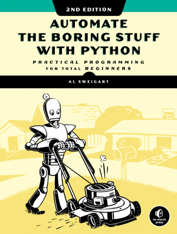

# Programming for Cognitive and Brain Sciences

* Christophe Pallier, researcher (neurolinguist) @ Neurospin

* Cédric Foucault, PhD student in Computational Neuroscience @ Neurospin

---

# Why this course?

Typical tasks for Cognitive Scientists:

- generate (visual, auditory, tactile, ...) stimuli and run experiments
- analyze experimental data (and do reproducible science)
- analyze linguistic corpora
- simulate cognitive or processes (e.g. with neural networks)

And also:

 - need to automate boring tasks ("either you are the slave of your computer or the computer is your slave")

A highly recommended book (as well as all books by Al Stweigart):

https://automatetheboringstuff.com/

**Aim: to teach useful tools for cognitive science, and to help you improve your programming skills, by implementing typical activities**

---

# Plan of the lectures

1. Creating Visual stimuli with pygame

2. Programming simple reaction-time tasks with expyriment

3. Manipulation of sound with Praat. Program a sound discrimination experiment.

4. Search a lexical database / Zipf law / Regular expressions

5.  Numerical Simulations with numpy: Statistics by simulations

6.  Neural networks. Neural data analyses. 

7.  Buffer

--- 
# Pedadogy

**Method**:

Hands-on lecture ("Atelier"**. After 15~30 min of introduction, you are given a series of excercices, we help you during the this phase, sometime we defrief an exercice for the whole class.

**Prerequite**

Prerequisites:

- to have instaled the software described in the documentation
- to have basic knowledge of programming in Python 

**Evaluation** 

- Pass/Fail.
- Being present at each lecture  and send us your code (zip file) at the end of each lecture.

---

# Menu of the day

Go to chapter [Creating Stimuli](https://pcbs.readthedocs.io/en/latest/stimulus-creation.html#creating-stimuli) of  https://pcbs.readthedocs.io:

(Note: If you do not know how to run Python, check out <https://pcbs.readthedocs.io/en/latest/running-python.html>)
