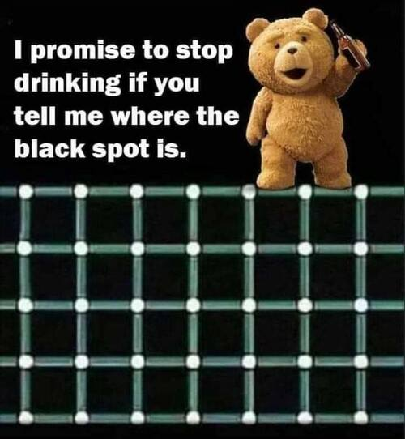

---

Day 1 Menu
==========

(Note: If you do not know how to run Python, check out <https://pcbs.readthedocs.io/en/latest/running-python.html>)

Chapter [Creating Stimuli](https://pcbs.readthedocs.io/en/latest/stimulus-creation.html#creating-stimuli) of  https://pcbs.readthedocs.io:

Using [pygame](http://www.pygame.org), program

* Troxler, 
* Kanisza, 
* Ebbinghaus, 
* Illusory-line-motion

**Any difficulties? questions?**

---

Day 2 Menu
==========

1. Check out [Ebbinghaus Dynamic illusion](https://pcbs.readthedocs.io/en/latest/stimulus-creation.html#id35)

     - Download the script and run it
     - Let's review the code at https://github.com/chrplr/PCBS/tree/master/stimuli/visual-illusions 

2. Same thing with [Lilac_chaser](https://pcbs.readthedocs.io/en/latest/stimulus-creation.html#lilac-chaser)

---
 
Go to chapter [Experiments]https://pcbs.readthedocs.io/en/latest/running-experiments.html)

3.  Download and run `simple-detection-visual-pygame.py`,  and look at your results.

4.  Download and run `simple-detection-visual-expyriment.py` and follow the instructions in the documents to visualize your results.

5. Compare the codes of the two previous scripts. This should convince you to use expyriment if you need to program a psychology experiment.

6. Have a quick look at http://docs.expyriment.org/, especially http://docs.expyriment.org/expyriment.stimuli.html

---

7. Modify ``simple-detection-visual-expyriment.py`` to display a white disk instead of a cross.

8. Modify  ``simple-detection-visual-expyriment.py`` to display a white disk on half of the trials and a gray disk on the other half of the trials (thesis experimental conditions should be shuffled randomly). Then modify it to display disks with four levels of gray. Thus you can assess the effect of luminisity on detection time.   

9. Modify  ``simple-detection-visual-expyriment.py`` to play a short sound (:download:`click.wav <../experiments/expyriment/simple_reaction_times/click.wav>`) in lieu of displaying a visual stimulus (hint: use ``stimuli.Audio()``). Thus, you have created a simple audio detection experiment.

---

10. Download and run  :download:`simple-detection-audiovisual.py <../experiments/expyriment/simple_reaction_times/simple-detection-audiovisual.py>`::  

        python simple-detection-audiovisual.py

There are three blocks of trials: a first one in which the target is always visual, a second one in which it is always a sound, and a third one in which the stimulus is, randomly, visual or auditory. Are we slowed down in the latter condition? Use :download:`analyse_audiovisual_rt.py <../experiments/expyriment/simple_reaction_times/analyse_audiovisual_rt.py>` to analyse the reaction times.

Add python code to ``simple-detection-audiovisual.py`` to display instructions at the start of the experiment. 

11. If there is time left, follow https://pcbs.readthedocs.io/en/latest/running-experiments.html#decision-times

