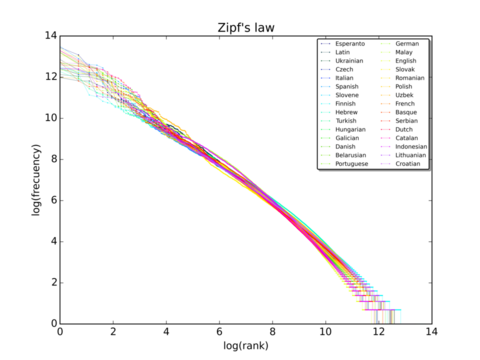

Day 5
=====

## Lexical decision task

Go to the bottom of <https://pcbs.readthedocs.io/en/latest/lexical-decision.html> and do the exercice in the “Data Analysis” section (visual display of results).

---

# Distribution of lexical frequencies

Do you know about Zipf's law? 

See http://en.wikipedia.org/wiki/Zipf%27s_law 

---

1. Write a function that, given a list of words, returns the number of occurrences of each word. This function should return the results in the form of a Python dictionary associating each word to its number of occurrences in the original list.

2. Use this function to compute words' frequencies in [Alice in Wonderland](http://www.umich.edu/~umfandsf/other/ebooks/alice30.txt). 

   - Write code that read the text file and transform it in a list of tokens (items separated by whitspaces), and apply the preceding function.
   
   - Redo the same thing, but use the following function to delete punctuation:

        import string
        def remove_punctuation(text):
            punct = string.punctuation + chr(10)
            return text.translate(str.maketrans(punct, " " * len(punct)))

---

3. Create the Zipf plot for the text of `Alice in Wonderland <../stats-and-data-analyses/Zipf/alice.txt>`__
   showing, on the y axis, the log of the frequency and on the x axis
   the word rank (sorting words from the most frequent to the least
   frequent).
   
(see solutions at <https://github.com/chrplr/PCBS/tree/master/stats-and-data-analyses/Zipf>) 

---

# More on lexical frequency and word length

1.  Display the relationship between word length and word frequency
   from the data in
   :download:`lexical-decision/lexique382-reduced.txt <../stats-and-data-analyses/Zipf/lexique382-reduced.txt>`

2.  Generate random text (each letter from a-z being equiprobable, and
   the spacecharacter being 8 times more probable) of 1 million
   characters. Compute the frequencies of each ‘pseudowords’ and plot
   the rank/frequency diagram.

If you want to know more about lexical frequencies see Harald Baayen (2001) *Word Frequency Distributions* 
   Kluwer  Academic Publishers. and Michel et al. 2010. “Quantitative Analysis of Culture Using Millions of
   Digitized Books.” _Science_, https://doi.org/10.1126/science.1199644. (use scholar.google.com
   to find a pdf copy). 
      
3. Check out **google ngrams** at
      https://books.google.com/ngrams. (Note that at the bottom of the
      page, there is a message “Raw data is available for download
      here”).

---

# Auditory version of Lexical Decision

1. Use a Sound Editor like `Praat <http://www.fon.hum.uva.nl/praat/>` or `Audacity <https://www.audacityteam.org/>` to record three words and three pseudowords (or just download <stims.wav); 

2. Cut the recording into 6 separate wav files. 

If using Praat, see the tutorials at <https://aletheiacui.github.io/tutorials/segmentation_with_praat.html> or <https://www.youtube.com/watch?v=YVJbi0WPqPw> 

2. Transform ``lexdec_v1.py`` into an auditory lexical decision task by playing these sound stimuli.

Remark: For a more advanced example using Praat, check out http://www.pallier.org/lectures/tpexp2/tp.html

