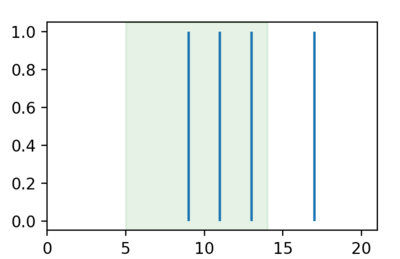
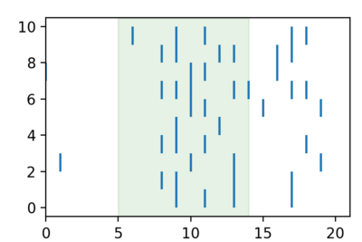
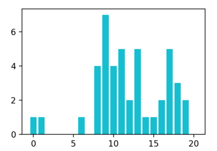

Data Analysis and Statistics
============================

* Data input/ouput and manipulation:

      - pandas: read_csv(), to_csv(), loc[], groupby()
      - json: read/write [json](https://www.json.org/)
      - sqlite3: interface to [SQLite](https://www.sqlite.org) databases
      - h5py: read/write [HDF5](https://en.wikipedia.org/wiki/Hierarchical_Data_Format)

* Graphics

       - [matplotlib](https://matplotlib.org/stable/plot_types/index.html)
       - [seaborn](https://seaborn.pydata.org/)
   
---

* Numerical computations
 
    - [numpy](https://numpy.org/doc/stable/user/quickstart.html)
    - [scipy](https://scipy.org/)
    - [scikit-learn](https://scikit-learn.org/)

* Image manipulation

    - [Pillow](https://github.com/python-pillow/Pillow)
    - [OpenCV](https://www.geeksforgeeks.org/opencv-python-tutorial/)

---

Analyzing spikes
================

(Inspired from Chapter 3 of _Neural Data Science_ by E. L. Nylen & P. Wallisch)

Here is a recording of a 21ms long spiketrain (sampling rate=1kHz), where the neuron was stimlated by light for 9ms (between 5 and 13 ms included).

    spiketrain = np.array([0, 0, 0, 0, 0, 0, 0, 0, 0, 1, 0, 1, 0, 1, 0, 0, 0, 1, 0, 0, 0])

## exercise: generate the following plot

Hint: use the functions ``pyplot.vlines()`` and ``pyplot.axvspan()``

---

## Solution

    import numpy as np
    import matplotlib.pyplot as plt

    spiketrain = np.array([0, 0, 0, 0, 0, 0, 0, 0, 0, 1, 0, 1, 0, 1, 0, 0, 0, 1, 0, 0, 0])

    spiketimes = spiketrain.nonzero()
    plt.vlines(spiketimes, 0, 1)
    plt.xlim([0, len(spiketrain)])
    plt.axvspan(5, 14, alpha=0.1, color='green')
    plt.show()

---

## Exercise:

Given 

    tenSpikeTrains = np.array([[0,0,0,0,0,0,0,0,0,1,0,1,0,1,0,0,0,1,0,0,0], [0,0,0,0,0,0,0,0,1,1,0,0,0,1,0,0,
        0,1,0,0,0],[0,1,0,0,0,0,0,0,0,0,1,0,0,1,0,0,0,0,0,1,0],[0,0,0,0,0,0,0,0,1,1,0,1,0,0,0,0,0,0,1,0,0],
        [0,0,0,0,0,0,0,0,0,1,0,0,1,0,0,0,0,0,0,0,0],[0,0,0,0,0,0,0,0,0,0,1,1,0,0,0,1,0,0,0,1,0],[0,0,0,0,0,
        0,0,0,1,1,1,0,0,1,1,0,0,1,1,0,0],[1,0,0,0,0,0,0,0,0,0,1,1,0,0,0,0,1,0,0,0,0],[0,0,0,0,0,0,0,0,1,1,0
        ,0,1,1,0,0,1,1,0,0,0],[0,0,0,0,0,0,1,0,0,1,0,1,0,0,0,0,0,1,1,0,0]])

Produce the raster plot:

---

## Solution:

    import numpy as np
    import matplotlib.pyplot as plt

    tenSpikeTrains = np.array([[0,0,0,0,0,0,0,0,0,1,0,1,0,1,0,0,0,1,0,0,0], [0,0,0,0,0,0,0,0,1,1,0,0,0,1,0,0,
        0,1,0,0,0],[0,1,0,0,0,0,0,0,0,0,1,0,0,1,0,0,0,0,0,1,0],[0,0,0,0,0,0,0,0,1,1,0,1,0,0,0,0,0,0,1,0,0],
        [0,0,0,0,0,0,0,0,0,1,0,0,1,0,0,0,0,0,0,0,0],[0,0,0,0,0,0,0,0,0,0,1,1,0,0,0,1,0,0,0,1,0],[0,0,0,0,0,
        0,0,0,1,1,1,0,0,1,1,0,0,1,1,0,0],[1,0,0,0,0,0,0,0,0,0,1,1,0,0,0,0,1,0,0,0,0],[0,0,0,0,0,0,0,0,1,1,0
        ,0,1,1,0,0,1,1,0,0,0],[0,0,0,0,0,0,1,0,0,1,0,1,0,0,0,0,0,1,1,0,0]])
        
    for trial, spikes in enumerate(tenSpikeTrains):
         plt.vlines(spikes.nonzero(), trial, trial + 1)
    plt.xlim([0, len(spiketrain)])
    plt.axvspan(5, 14, alpha=0.1, color='green')
    plt.show()

---

## Exercise

Create the peri-stimulus time histogram (PSTH), that is compute, for each step, how many trials showed a spike.  

Hint: think of `tenSpikeTrains` as a matrix.

---

## Solution

     np.sum(tenSpikeTrains, axis=0)
     plt.bar(range(tenSpikeTrains.shape[1]), np.sum(tenSpikeTrains, axis=0))
     plt.show()

---

Permutation test
================

Suppose you have two samples:

     groupA = [168, 174, 175, 176]   # 1st sample
     groupB = [165, 170, 168, 157]   # 2nd sample

To test if they come from populations with the same means, the classic statistical inference approach consists in computing the probability that observed difference  in means is "due to chance" (aka _p-value_).

To compute this probability, one can place the observed difference in means between the groups on the distribution of differences in means between two samples in which the data is assigned randomly (forgetting the initial labels A and B). This is the principle of [permutation tests](https://en.wikipedia.org/wiki/Permutation_test)

Implement a python script that uses a permutation test to compare  the two samples above    

---

## Solution

Check out [permutation_test.py](https://github.com/chrplr/PCBS/blob/master/stats-and-data-analyses/permutation_test/permutation_test.py)

--- 

## Exercise

The file provides measurements obtained in two groups. 

- read the data and compute the means and standards deviations in each group
- draw figures showing the two distributions (1) using side-by-side boxplots (2) using overlapping histograms 
- Use a random permutation test to compute the p-value associated to the hypothesis that the two samples come from populations with the same means.

---

## Solution

    dat = read.csv('two-groups.csv')
    head(dat)
    attach(dat)
    tapply(y, group, mean)
    tapply(y, group, sd)

    plot(y ~ group)
    boxplot(y ~ group)

    require(ggplot2)
    ggplot(dat, aes(x=y)) + 
        geom_histogram(data=subset(dat, group == 1),fill = "red", alpha = 0.2) +
        geom_histogram(data=subset(dat, group == 2),fill = "blue", alpha = 0.2)

    install.packages('exactRankTests')
    require(exactRankTests)
    perm.test(y ~ group)
    t.test(y ~ group)
    detach(dat)

---

Statistical Power of the t-test
===============================

The _Student t test_ is often used to compare two samples. In Python, it is available as [scipy.stats.ttest_ind()](https://docs.scipy.org/doc/scipy/reference/generated/scipy.stats.ttest_ind.html)

1. Use it compute a p-value associated to the previous samples.

2. Let's run it on simulated data.

   - write code that generates two random samples of size `n` from populations having having means `m1` and `m2`, standard deviations `sd1` and `sd2`respectively.

   - Fix m1=100, m2=110, sd1=sd2=10, n=10; Compute the distribution of p-values obtained from t-tests comparing such samples

   - Plot the probability to detect an effect of size 1/2 (that is `m1-m2 = 1/2 * sd1)` as a function of `n`.

---

Regression Analysis
===================

Read about Regression analysis with scikit-learn at <https://realpython.com/linear-regression-in-python/>

For more fun, try <https://inria.github.io/scikit-learn-mooc/>

