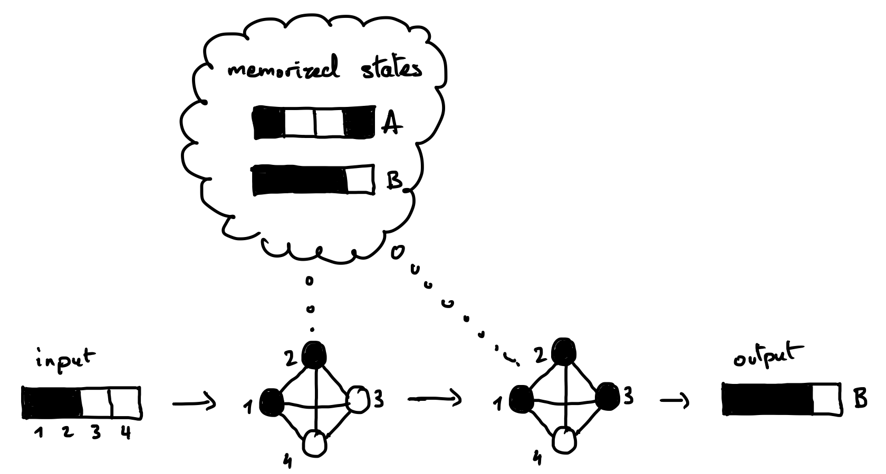

Day 7—Hopfield Networks
=======================

Hopfield networks are a type of artificial neural network that can implement an
associative memory.

A Hopfield network can be wired to memorize certain states: when given an incomplete or corrupted version of one of the memorized state, it will restore the original state.
[Demo](https://www.youtube.com/watch?v=HOxSKBxUVpg).

<!--  -->


---

* A Hopfield network consists of N neurons, each of which can have two states,
+1 or -1. The state of the whole network can be written as a binary vector of size N.
We will use a 1-dimensional array to code that state,
e.g. ```state = np.array([+1, -1, -1, -1])```.

* The weights of the connections between the neurons can be written as a matrix
of size N×N. We will use a 2-dimensional array to code that matrix,
e.g. ```weight = np.array([[0, -1, -2, +1], [-1, 0, +3, -1], [-2, +3, 0, -1], [+1, -1, -1, 0]])```.


* In Hopfield networks, the connections are symmetric and there are no
self-recurrent connections. Thus, the weight matrix is symmetric
(```weight[i, j] == weight[j, i]```) and its diagonal is zero
(```weight[i, i] == 0```).

---

* The state of a neuron is updated according to the sign of the input it receives
in the following way:


* Here we will use the synchronous update rule, where all of the neurons are
updated at the same time from one time step to the next.


---

# Exercise.

- Write a function to compute the next state of a Hopfield network given
the previous state and the weight matrix. **Tip**: You can use a
[matrix multiplication](https://en.wikipedia.org/wiki/Matrix_multiplication)
(to do it in NumPy, [see here](https://numpy.org/doc/stable/user/quickstart.html#basic-operations)).

- Write a function to compute the final state reached by a network given an initial state and its weight matrix. This will either be a *stable state*, starting from which
the next state remains the same, or the state after a max. number of iterations that you will set in case no stable state is reached.

- Test your function with the below initial state and weight matrix.
The final state should be ```[+1, -1, -1, +1]```. Is it a stable state?

        initial_state = np.array([+1, -1, -1, -1])
        weight = np.array([
            [0, -1, -1, +1],
            [-1, 0, +1, -1],
            [-1, +1, 0, -1],
            [+1, -1, -1, 0]])

---

# Exercise.

- A solution: [hopfield_1.py](https://github.com/chrplr/PCBS/blob/master/simulations/hopfield/hopfield_1.py).

---

# Computing the weight matrix

- Suppose you want to memorize the state ```[s1, s2, s3, s4]```. To do so, you
will set the matrix to:

        weight = np.array([
            [0    , s1*s2, s1*s3, s1*s4],
            [s2*s1, 0    , s2*s3, s3*s4],
            [s3*s1, s3*s2, 0    , s3*s4],
            [s4*s1, s4*s2, s4*s3, 0    ]])

## Exercise.

- Try it using your own example state.
Replace the values in the above weight matrix with the values of the state
you want to memorize, then test that it is stable state using the function
you wrote earlier.

- Also try an initial state that is a corrupted version of the memorized state
where one neuron has been flipped. Is the state effectively restored?


---

# Computing the weight matrix

- Now, suppose that you want to memorize multiple states. To do so, you simply
need to sum the weight matrices corresponding to each state according to the
previous formula.

## Exercise.

- Write a function to compute the weight matrix from a set of states.

- If you have time: Implement this function using the outer product (if you haven't done so already). It gives a neat and efficient way to perform this computation.

    **Tip**: Formally, the individual weight matrix to memorize one state
    is the *outer product* of this state with itself. The [wikipedia page](https://en.wikipedia.org/wiki/Outer_product) tells you how to compute this
    outer product with a matrix multiplication.
    You can then think of how to extend this operation for multiple states
    such that it gives you the sum of the outer products of individual states.

- Test your function with two memorized states of size 4. Verify that they are stable states, and that you can recover them starting from a corrupted state with one neuron flipped.

---

# Computing the weight matrix

- A solution: [hopfield_2.py](https://github.com/chrplr/PCBS/blob/master/simulations/hopfield/hopfield_2.py).


---

# Encoding images

- Let's make all of this more visual and fun.
We will encode 5×5 binary images into states.
To define these images, we will use strings such as this one:

        """
        11111
        1....
        11111
        ....1
        11111
        """

## Exercise.

- Write a function to convert such a string into 2d matrix which represents
the image. Test your function and display the image using `matplotlib.pyplot.imshow()`.

- Write a function to convert such a 2d image matrix into a 1d state vector that
can be encoded by a Hopfield network, and another function to convert the state
into a 2d image. [Here is a tip](https://numpy.org/doc/stable/reference/generated/numpy.reshape.html?highlight=reshape#numpy.reshape). Test your functions.

---

# Encoding images

- A solution: [hopfield_3.py](https://github.com/chrplr/PCBS/blob/master/simulations/hopfield/hopfield_3.py).

---

# Exercise—Simulation 1

- Make a network to memorize the [following images](https://github.com/chrplr/PCBS/blob/master/simulations/hopfield/str_pattern_defs.py).

- For each of the [following initial states](https://github.com/chrplr/PCBS/blob/master/simulations/hopfield/str_initial_state_defs.py),
compute the final state that the network reaches and plot the 2d images
corresponding to the initial state and the final state side-by-side.

- What do you observe? Does the network successfully restore the memorized images?
Does it always converge to one of these images? Are there any unexpected behaviors?

---

# Exercise—Simulation 1

- A solution: [hopfield_4.py](https://github.com/chrplr/PCBS/blob/master/simulations/hopfield/hopfield_4.py).

---

# Exercise—Simulation 2

- Now make another network to memorize the [following images](https://github.com/chrplr/PCBS/blob/master/simulations/hopfield/str_pattern_defs_2.py)

- Test the network with those same states as initial states.

- What do you observe?

---

# Exercise—Simulation 2

- A solution: [hopfield_5.py](https://github.com/chrplr/PCBS/blob/master/simulations/hopfield/hopfield_5.py).


---

# Discussion

What do you think are the strengths and weaknesses of such networks as a model of the brain?