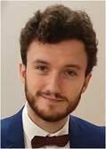

# Programming Experiments for Psychology and Neuroscience

|                                              |                              |
|----------------------------------------------|------------------------------|
| Christophe Pallier  <christophe@pallier.org> |         |
|                                             |                              |
|                                              |                              |
| Maxime Cauté <maxime.caute@free.fr>          |  |

---

## What you will learn

-  How to create visual and auditory stimuli, then program real-time experiments that record participants responses (and to perform basic data processing to analyse results).

- How to program "cleanly", that is, use revision control software (git), and clean code methods that promote scientific reproducibility

Note: the aim is to improve your programming skills; This lecture is of interest even for students who are not going to need to program psychology experiments.

---

## Prerequisites

- Basic knowledge of programming (numbers, strings, lists, variables, loops, conditional, functions) and of Python.

- Having installed the software described in the documentation (Python, pandas, expyriment, git, + an editor)

### Programming languages 

Python (+ pygame + expyriment + pandas) and Javascript (jsPsych) (and a bit of R).

---

**Timetable**: During the first half of the semester, the course consists of short lectures followed by hands-on exercises; then in the second part of the semester, each student must program an experiment of his choice.

**Evaluation**: PASS/FAIL based on:

   * The realisation of a project (each student must provide the running, clean, code of an experiment, correctly documented on github)

   * Attendance. We expect you to be present at each lecture (you can be absent ocassionalt, but send us a email!) and to send us your code at the end of each lecture  (in a zip file with PCBS_xx_your_name.zip where xx is the number of the lecture)

Note: the lecture starts at *9.30*

---

## Plan for the lectures

1-4. Creating stimuli & experiments with Python (pygame & expyriment)

5-6. Programming *on-line* experiments with jsPsych (javascript)

7. Clean code programming, Introduction to Git, Start of the project.

8-13 : Project

---

## Course materials 

- Slides: <https://github.com/chrplr/PCBS/tree/master/slides/2023-PROG201>
- Book:  <https://pcbs.rtfd.io/>
- Code: <https://github.com/chrplr/PCBS>
- Discord forum: <https://discord.gg/dZauP3pb>

---

## Software to run psych. experiments

Two options:

* run locally: best to control precisely the timing: duration of stimuli, synchronisation with recording equipement (e.g. EEG, MEG).

    1. psychtoolbox (Matlab) 
    2. psychopy (Python)
    3. Expyriment (Python)

* run inside an internet browser, allowing to test subjects remotely. 

    1. jsPsych
    2. PsychoJS

    See e.g. https://pavlovia.org/

---

## Menu of the day

* Check that you can create a python script with an editor and run it from the command line (follow the instructions from section 7.3 of 
<https://pcbs.readthedocs.io/en/latest/running-python.html>)

* Create Visual Stimuli with Pygame

Go to chapter [Creating Stimuli](https://pcbs.readthedocs.io/en/latest/stimulus-creation.html#creating-stimuli) of  <https://pcbs.rtfd.io>

Starting from the `square.py` script, you will program:

1. Troxler effect 
2. Kanizsa Square
3. Herman grid
4. Ebbinghaus-Tichener illusion

