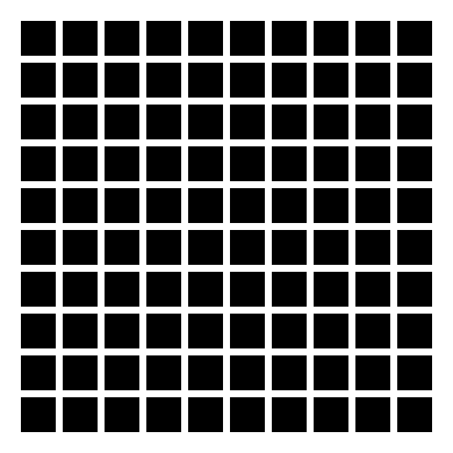

# lecture 2

  * Concept: nested loops (loop over columns nested within loop over rows)
  * Only difficulty: find the coordinates of the topleft corner of each square.

---

Check `grid.py` for a possible solution.
 
Note: all constants are declared on the top of the source file.

We respect the Clean code rule "NO MAGIC NUMBER"

---

We would like to vary the size of the squares and the gap between them. 

* We could edit the script and modify the constants, but that woule be cumbersome. 

* Read https://stackabuse.com/command-line-arguments-in-python/ to learn how to read arguments on the command line use the sys.argv[] list from the sys module.

* Create a version of the grid script that can get the number of columns, rows, the size of sides of squares, and the size of the space between squares. 

* Check `grid-args.py`: access command line argument with `sys.argv[]`

---

For an example of *top-down programming*, check `hermann-grid-cedric.py` 

---

# Dynamic displays

In a nutshell:

    repeat 
	   Draw something
	   pygame.display.flip()
	   pygame.time.wait(xxx)   # xxx in msec

* Goto [11.2 Dynamic visual stimuli](https://pcbs.readthedocs.io/en/latest/stimulus-creation.html#dynamic-visual-stimuli) and program:

    * illusory line motion
    * flash-lag illusion
	
Have a look at `ebbinghaus-dynamic.py`, `lilac_chaser.py` and `lilac_chaser_blurred.py`

---

# Experiments

In a nutshell:

     # prepare stimuli

     for trial_num in range(number_of_trials):
	      present stimulus(trial_num)
		  record response  (button or key press)
		  
	 save responses
		  
		  
			
      

* Goto [12 Experiments](https://pcbs.readthedocs.io/en/latest/running-experiments.html). Do section 1 (simple stimuli)

* Check <https://chrplr.github.io/tutorial-expyriment/>

