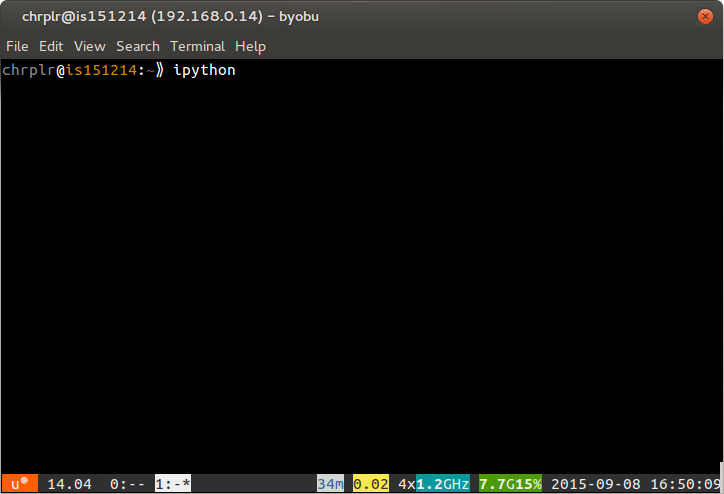

% Starting Python 
% Christophe Pallier
%

You can program in Python in (at least) three different ways: interactively with `jupyter notebook` or with an `ipython` command line, or using an edit-run cycle approach with a program editor (e.g. `atom`, `idle`, `spyder`,...).

In all cases, you need to be able to open a command line window (a.k.a. a **terminal**):
  * Ubuntu-Linux: Ctrl-Alt-T (see https://help.ubuntu.com/community/UsingTheTerminal)
  * MacOSX: Open Finder/Applications/Utilities/Terminal (see http://www.wikihow.com/Get-to-the-Command-Line-on-a-Mac)
  * Windows: Win+X+Command-Prompt (see http://pcsupport.about.com/od/commandlinereference/f/open-command-prompt.htm)


## Using jupyter notebook

The first step is to type `jupyter notebook` in a terminal

    mkdir -p AIP2016-files  # only if AIP2016-file does not yet exist
    cd AIP2016-myfiles
    jupyter notebook

A browser will open a page like the following:

 

By cliking on `New` and selecting `Python [root]`, a new tab will show a page like below, where you can enter python code in 'cells'. To execute the code in a cell, just move the cursor there and press `Ctrl+Enter`


A nice feature of the "n jupyter notebooks" is that they are saved automatically, in .ipynb files that can be shared with other people. This is very handy, for example, to send a data analysis report by email.

Jupyter's documentation si available at http://jupyter.readthedocs.io/en/latest/index.html

## Using ipython

You can launch `ipython` in a terminal, and start typing python commands that are *interpreted* and *executed* when you press 'Enter'.


2. Type `ipython` on the command-line and press `Enter`:

------------------------------ ------------------------------
 
------------------------------ ------------------------------


3. When you terminal looks like the one of the right, you are  "talking" to ipython. Enter the following commands:

```python
	import turtle
	turtle.circle(50)
	turtle;forward(100)
	turtle.circle(50)

	turtle.right(90)
	turtle.forward(100)
	turtle.right(90)
	turtle.heading()
```

. . .

This way of using Python is fine if you need to quickly test an idea. But as soon as you quit `ipython` (by pressing `Ctrl-D`), you lose all traces of what you have done. To avoid that, you want to use the **Edit-run* approach.


## Using a text editor (Edit-run cycle)

Using a **text editor**, e.g. *atom*, you write a python script, that is, a series of commands, that you save in a file; then you give this file to interpret to a python interpreter. Here is how:

1. Open a Text-Editor (e.g. Atom)  and a Terminal window side-by-side:


2. Create a `New File` in the Editor and enter the following text:

```python
	import turtle
	turtle.forward(50)
	turtle.left(120)
	turtle.forward(100)
	turtle.left(120)
	turtle.forward(100)
	turtle.left(120)
	turtle.forward(50)
```


3. Using 'File/Save as',  save the this text under the filename `myscript.py` in your personal (home) directory
* *run* with a python interpreter, by typing `python myscript.py` on a command line of the Terminal. Try it now.

Important: you must make sure that the current working direcoty of the terminal is the same directory where the file myscript.py has been saved. Otherwise, you will get an error message such as 'No such file or directory'. To fix this problem, you must use the 'cd' command to navigate the directory structure.


Remarks:

* You can learn more about Turtle graphics by reading the documentation at <https://docs.python.org/2/library/turtle.html>

