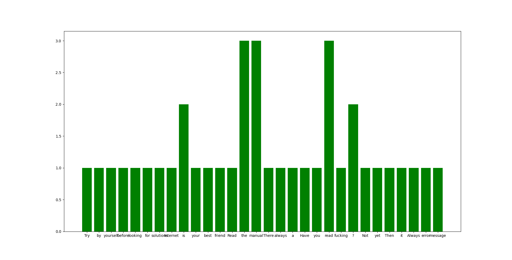

```{r setup, include=FALSE}
knitr::opts_chunk$set(echo = TRUE)
library(reticulate)  
knitr::knit_engines$set(python = reticulate::eng_python)  
```
So far
========================================================

  - Python, its life, its choice

  - Data types: (integer / float / string / boolean)
  
  - **If**, **For** and **While** loops: 

  - Data collections: (list, tuple, set, dictionary)
    
  - Functions
  
  - Higher order function (Recursive function)


Today
========================================================


### - Read and write files


Manipulate files : Open and read a file 1/3
========================================================

- To do so you have one function available in the built-in functions of python
  + https://docs.python.org/3/library/functions.html

- The function **open()**
  + that works like that 
       open(file, mode='r', buffering=- 1, encoding=None, errors=None, newline=None, closefd=True, opener=None)
       
- see https://docs.python.org/3/library/functions.html#open
      
- Mode can be:
  + "r" - Read - Default value. Opens a file for reading, error if the file does not exist
  + "a" - Append - Opens a file for appending, creates the file if it does not exist
  + "w" - Write - Opens a file for writing, creates the file if it does not exist
  + "x" - Create - Creates the specified file, returns an error if the file exist


Manipulate files : Open and read a file 2/3
========================================================

- to manipulate and for example print the text you need to read it using **read()**

- All available function are specified here:
  + https://docs.python.org/3/library/io.html

```{python, echo = TRUE}
Myfile = open('Survival rules for programming.txt', 'r')
print(Myfile.read())
print(Myfile.read(5))
Myfile.close()
```

Manipulate files : Open and read a file 3/3
========================================================
  
  - You can also use:

  + readline() can be used to return one line 
  
  + readlines() can be used to return a list of lines
  
  - NB 1: if the file is not close the next call of readline() or readlines() will take the subsequent lines of the file even though you specified the first index

  - NB 2: As readlines() return a list you can use all the functions in the built in module **string** such as len(), joins(), split()...
  
```{python, echo = TRUE}
Myfile = open('Survival rules for programming.txt', 'r')
print(Myfile.readline())
print(Myfile.readlines(1))
print(Myfile.readlines()[1])
```
Manipulate files : create a file
========================================================

- Note that if you don't specify any path, it will be created in the current directory (ie, same directory as your script). It's called creating a file using a **relative path**

```{python, echo = TRUE}
import os
path = os.getcwd()

print(os.listdir(path))

MyTestFile = open('test.txt', 'x')

print(os.listdir(path))
```
- If you want to create in a precise directory you can specify it using an **absolute path**
```{python, echo = TRUE, eval = FALSE}
MyTestFile = open('/home/henri/Desktop/test.txt', 'x')
```


Manipulate files : write a file
========================================================
   
   - We need an access mode 'w' if we want to create and write anything into a file
   
   - Note that to be able to read a just created file you need to close it and open it again in read mode
   
```{python, echo = TRUE}
MyTestFile = open('test2.txt', 'w')

MyTestFile.write("Once upon a time in a Cognitive Master")

MyTestFile.close()

MyTestFile = open('test2.txt', 'r')

print(MyTestFile.read())
```


Manipulate files : append text to a file
========================================================

- We need an access mode 'a'

```{python, echo = TRUE}
MyTestFile = open('test2.txt', 'a')

MyTestFile.write("There was a module names Intro to programming")

MyTestFile.close()

MyTestFile = open('test2.txt', 'r')

print(MyTestFile.read())
```


Manipulate files : specific character and new lines
========================================================

- Inside a string you can use the antislash to insert special codes:
  + **\\n** return to line
  + **\\t** add a tab
  + **\\r** return to line (same as \n in python)
  + **\\"** add a quotation mark inside a string delimited itself by **"**

```{python, echo = TRUE}
MyTestFile = open('test2.txt', 'a')

MyTestFile.write("\nWith youngs and bright \tstudents \r!!!!!")

MyTestFile.close()

MyTestFile = open('test2.txt', 'r')

print(MyTestFile.read())
MyTestFile.close()
```


Manipulate files : Automatic close of the file
========================================================

- the **with open()** statement automatically close the file

```{python, echo = TRUE}
lines = ['and one last line', '\n... and one last...']

with open("test2.txt", "a") as MyTestFile:
    for line in lines: 
      MyTestFile.write(line)
```

```{python, echo = TRUE}
MyTestFile = open("test2.txt", "r")
print(MyTestFile.read())
```


Exercices
========================================================

  - 1 Write a script that prints the first 10 lines of a file
  - 2 Write a script that prints the last 10 lines of a file (or the whole file is it is less than 10 lines long)
  - 3 Write a script that opens and read a text file, and print all the lines that contain a given target word
  - 4 compute the number of words (removing punctuation) in a text file (Hint: use split() and strip() functions)
  - 5 compute the number of occurrences of each word in a text file
  - 6 print a bar plot of the occurrences found in the previous exercices (using matplotlib)

Exercices 1
========================================================

- 1 Write a script that prints the first 10 lines of a file

```{python, echo = TRUE}
MyTestFile = open('Survival rules for programming.txt', 'r')
lines = MyTestFile.readlines()

for i in range(10):
  print(lines[i])

```
Exercices 1
========================================================

- 1 Write a script that prints the first 10 lines of a file

```{python, echo = TRUE}
MyTestFile = open('Survival rules for programming.txt', 'r')
lines = MyTestFile.readlines()
print(lines[0:9])
```

Exercices 2
========================================================

- 2 Write a script that prints the last 10 lines of a file (or the whole file is it is less than 10 lines long)

```{python, echo = TRUE}
MyTestFile = open('Survival rules for programming.txt', 'r')
lines = MyTestFile.readlines()

for i in range(1,10):
  print(lines[-i])

```
Exercices 3
========================================================

- 3 Write a script that opens and read a text file, and print all the lines that contain a given target word

```{python, echo = TRUE}
def print_line_with_specific_word(text,word):
  for l in range(1,10):
    if word in text[l]:
      print(text[l])
    else :
      print("FALSE")
  

MyTestFile = open('Survival rules for programming.txt', 'r')
text = MyTestFile.readlines()

print_line_with_specific_word(text,"manual")
```

Exercices 4
========================================================

- 4 compute the number of words (removing punctuation) in a text file (Hint: use split() and strip() functions)

```{python, echo = TRUE}
import string

def count_words(text):
  c = 0
  for l in text: # 
    #print(l.split())
    for w in l.strip().split():
      #print(list(w))
      for char in list(w):
        #print(c)
          if char in string.punctuation:
            w =w.replace(char,'') # You replace a punctuation by empty space
      if w != '': # check that you don't have an empty word
        c +=1
      print(w)
          
  return c

MyTestFile = open('Survival rules for programming.txt', 'r')
text = MyTestFile.readlines()

print(count_words(text))
```

Exercices 5
========================================================

- 5 compute the number of occurrences of each word in a text file

```{python, echo = TRUE}
def count_words(text):
  dict_words = {}
  for l in text:
    for w in l.strip().split():
      if w in dict_words:
        dict_words[w] +=1
      else:
        dict_words[w] = 1
  return dict_words


MyTestFile = open('Survival rules for programming.txt', 'r')
text = MyTestFile.readlines()

print(count_words(text))
```

Exercices 6
========================================================

- 6 print a bar plot of the occurrences found in the previous exercices (using matplotlib)

```{python, echo = TRUE, eval = FALSE}
import matplotlib.pyplot as plt

def count_words(text):
  dict_words = {}
  for l in text:
    for w in l.strip().split():
      if w in dict_words:
        dict_words[w] +=1
      else:
        dict_words[w] = 1
  return dict_words

def plot_frequency(dictionary):
  plt.bar(list(dictionary.keys()), dictionary.values(), color='g')
  plt.show()

MyTestFile = open('Survival rules for programming.txt', 'r')
text = MyTestFile.readlines()

plot_frequency(count_words(text))
```


