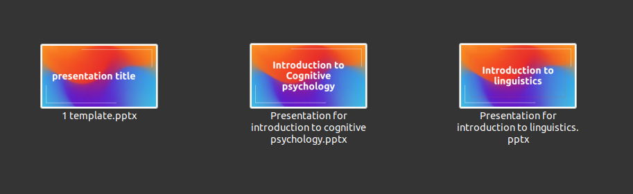
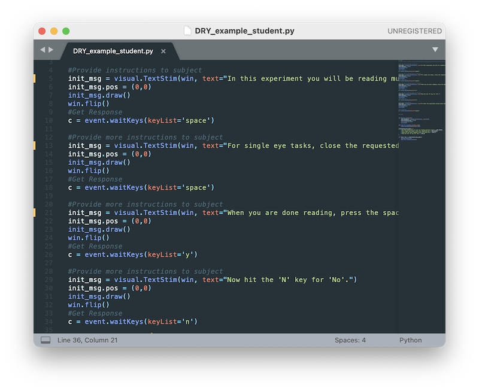
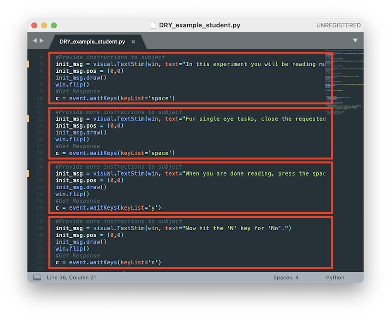
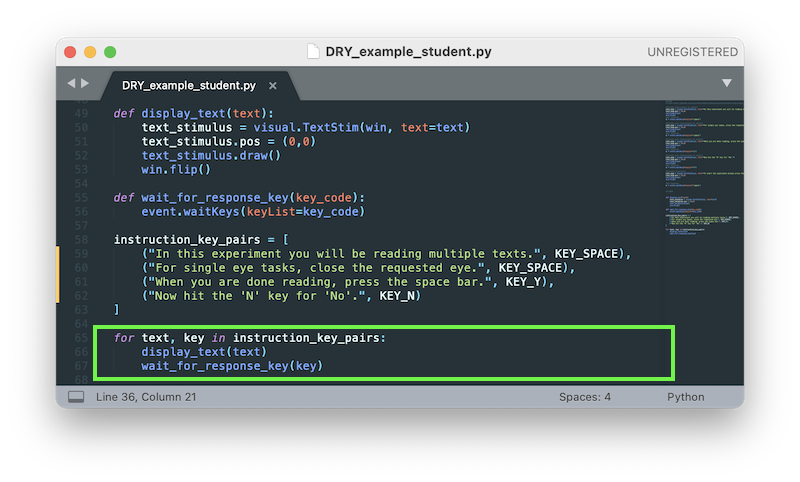

```{r setup, include=FALSE}
library(reticulate)  
knitr::knit_engines$set(python = reticulate::eng_python)  
```

Today
========================================================

  
  - Object-Oriented Programming in Python:
    + Classes
    + Objects
    + Methods
    + Constructors
  
  - Clean Code


Object-Oriented Programming (OOP)
========================================================


> - Programming paradigm based of the concept of "objects"
  
> - Python has been developed with an "oriented-object" approach
  
> - It's not a Python thing. Other object-oriented languages includes: Java, C++, C#, R, PHP ...
  
> - OOP is defined around two key concepts that are **classes** and **objects**
  
  
Classes 1/3
========================================================
  
  - Classes are templates for objects
  
  - Example: You have a power point templates for all your presentations of articles with 
      + a graphic chart
      + your font 
      + your background image
      + all your slides with generic titles (Introduction, study 1, results study 1...)
      
  - That templates in python is a class. A kind of general recipe that define a skeleton for every object (in our case a power point presentation for a class)


  
  

Classes 2/3
========================================================
  
  - A class contains state and behavior
  
  - State: is referring to data or variables. For example: your power point for your class of "introduction to Cognitive psychology" has:
  
    + a specific name 
    + specific graphs
    + a number of pages
  
  - Behavior: is a set of thing the class can do. For example: your power point can have
  
    + animations, 
    + play sounds or videos. 
    + This behavior is define in a method which is like a function but specific to classes.
  
  
  
Classes 3/3
========================================================
  
  - The creation of an object is called an **instantiation**. From your template of power point you'll create a new power point for presenting an article in your class of "introduction to evolutionary anthropology"
  
  - That instantiation will have:
    + specific attributes (a name, a number of slides ....) 
    + common methods (animations, videos, sounds ...) like the other objects

  
  
Objects 
========================================================

  - Objects are instances of classes
  
  - Objects can be stored in variable and its type is the class
  
  - In our metaphor, one object is one specific power-point. For example the power point of your class of "introduction to Cognitive psychology"
  
  - That power-point has the same structure and the same features and characteristics as the power point of your class of "introduction to Linguistics" yet the content differs.

  - You can instantiate multiple objects from the same class.
  
  - Those objects are independent  


Method
========================================================

  - As said before a method is part of the behavior of a class
  
  - A method is very similar to a function but is part of a class when a function is independent
  
  - It can:
      + modify an object's internal state of an object
      + call others methods or functions
      + return values
      + etc ...
      
  - The only difference between function and method is that method belong to a class/object.


  
Create your class 1/2
========================================================

```{python, echo = TRUE}
class Rectangle:
  width = 3
  length = 2
  color = 'red'
  def calculate_area(self):
      return self.width * self.length

type(Rectangle)    

rect=Rectangle

print(rect.width)
print(Rectangle.calculate_area(rect))

```

  - We can see the state:
      + width and height
  - And the behavior, in this case the method calculate_area.
  

Create your class 2/2
========================================================
  
```{python class, echo = TRUE}
class Rectangle:
  width = 3
  length = 2
  color = 'red'
  def calculate_area(self):
      return self.width * self.length

rect=Rectangle

print(rect.width)
print(Rectangle.calculate_area(rect))
```

  - We can note the **self** that refers to its own class and its own variables
  
  - **self** is always the first parameter in order to access all the object's attributes


Constructors
========================================================
  
  - Constructors are special methods. Every class has one and it's used to create an object
  
  - We need to use **__init__**
  
```{python constructor, echo=TRUE}
class Rectangle:
    def __init__(self, width, length, color):
        self.width = width
        self.length = length
        self.color = color
    def calculate_area(self):
      return self.width * self.length
        
rect = Rectangle(3,2, "blue")
print(rect.width)
print(rect.calculate_area())
```

Instantiate an object 1/2
========================================================

  - You can use the constructor to instantiate an object

```{python instatiantion, echo = TRUE}
class Rectangle:
    def __init__(self, width, length, color):
        self.width = width
        self.length = length
        self.color = color
    def calculate_area(self):
      return self.width * self.length
rect = Rectangle(5,3,'red')

print(rect.width)
```  
  
Instantiate an object 2/2
========================================================

  - You can select default variables
  
  - Then you don't have specify the default variable

```{python instatiantion2, echo = TRUE}
class Rectangle:
    def __init__(self, width, length, color='red'):
        self.width = width
        self.length = length
        self.color = color
    def calculate_area(self):
      return self.width * self.length
rect = Rectangle(5,3)

print(rect.width)
```    
  
  
Modify an object
======================================================== 
  
```{python modify, echo = TRUE}
class Rectangle:
    def __init__(self, width, length, color='red'):
        self.width = width
        self.length = length
        self.color = color
    def calculate_area(self):
      return self.width * self.length

rect = Rectangle(5,3)

print(rect.color)

rect.color = "purple"  
print(rect.color)
```


And beyond ... but not for now
======================================================== 

 - A class can have a parent class or superclass.

 - The class with a parent is known as a subclass or child.

 - That class inherits attributes from its parent.

 - The child class can implement extra attributes on top of that which it inherits.
  
  
Clean code: Overview 1/4
======================================================== 

The goal of clean code is to make your code **easy to understand** and **easy to change** !

{width=35%}
  


Clean code: Overview 2/4
========================================================

  - Example with a former exercise with two taxi companies
  
```{python example, echo = TRUE}
def costs(d):
    a = 4.8 + 1.15 * d
    b = 3.2 + 1.20 * d
    return (a, b)

def cheap(d):
    a, b = costs(d)
    if a < b:
        return 'A'
    else:
        return 'B'

for d in range(30, 40):
    print(cheap(d))
```


Clean code: Overview 3/4
========================================================

```{python example2, echo = TRUE}
def costs(distance):
    # Calculate the price with the fixed charge plus the charge for every km
    initial_feeA = 4.8
    initial_feeB = 3.2
    fixed_fee_kmA = 1.15
    fixed_fee_kmB = 1.2
    
    price_A = initial_feeA + fixed_fee_kmA * distance
    price_B = initial_feeB + fixed_fee_kmB * distance
    
    return (price_A, price_B)

def cheapest_company(distance):
    # calculate the cost for every company with a certain distance
    price_comp_a, price_comp_b = costs(distance)
    if price_comp_a < price_comp_b:
        return 'Company A'
    else:
        return 'Company B'

# print the distance from 30km to 50km
for d in range(30, 40):
    print(f"{d} km -> " + cheapest_company(d))
```


Clean code: Overview 4/4  
========================================================

** Even bad code can function. But if code isn't clean, it can bring a development organization to its knees. Every year, countless hours and significant resources are lost because of poorly written code. But it doesn't have to be that way. (https://www.oreilly.com/library/view/clean-code-a/9780136083238/)**

  - We will cover a set of rules or advises to write cleaner code that can be read and edited by other developers
  
  - Clean code is unfortunately never a priority but is a healthy practice
  
  - The clean code principle goes way beyond the scope of this course so bear in mind that we'll see only a small subset of the clean code principle.


Clean code:  CC1. Use meaningful names 1/2
========================================================
  
> - Example:
  
>   ```{python , echo = TRUE, eval = FALSE}
>   w = x2 - x1
>   ```

> - What are w, x1 and x2?

>   + What do they represent?
>   + What are they used for?
  
> - Does "w" stand for "weight", "window", "word", or is it just a symbol for a generic computation?

Clean code: CC1. Use meaningful names 2/2
========================================================
  
  - Instead one can write 
  
```{python , echo = TRUE, eval = FALSE}
width = x_right - x_left
```

  - **Use meaningful names**

Clean code: CC1. Replace magic numbers 1/2
========================================================
  
> - Other example
  
>   ```{python , echo = TRUE, eval = FALSE}
>   width = x_right - x_left +10
>   ```

> - Where does '10' come from?

> - What does it represent? 

> - Can I change it? Is it a constant, a variable.


Clean code: CC1. Replace magic numbers 2/2
========================================================
  
  - Instead one can write 
  
```{python , echo = TRUE, eval = FALSE}
horizontal_margin = 10

width = x_right - x_left + horizontal_margin
```

  - **Replace magic numbers** with named parameters whatever the type of that parameters


Clean code: CC1. Function names should say what they do 1/2
========================================================

  - Example
  
```{python , echo = TRUE, eval = FALSE}
def check_divisible(n, divisor):
    if (n % divisor == 0):
      print(n, ' is divisible by ', divisor)
```  

Clean code:  CC1. Function names should say what they do 1/2
========================================================

> - Example
  
>   ```{python , echo = TRUE, eval = FALSE}
>   def check_divisible(n, divisor):
>     if (n % divisor == 0):
>       print(n, ' is divisible by ', divisor)
> ```  

> - Misleading name: I don't expect "something to be checked" but something to be printed or not
  
>  - A more accurate name would be
>   ```{python , echo = TRUE, eval = FALSE}
>   def print_if_divisible(n, divisor):
>     if (n % divisor == 0):
>       print(n, ' is divisible by ', divisor)
> ```  
    
Clean code: CC1. Fear the ambiguous name 1/2
========================================================

> - Example
  
> ```{python , echo = TRUE, eval = FALSE}
> remove(l, n)
> ```

> - What do you think this does? Ambiguous name:

>   + Does it remove the element in l whose value is equal to n?
>   + Or does it remove the element in l at index n?


Clean code: CC1. Fear the ambiguous name 2/2
========================================================
  
> - Example
  
>   ```{python , echo = TRUE, eval = FALSE}
>   remove_list_element_at_index(l, i)
>   ```

> - [CC1] Choose unambiguous names
  
> - Clarity at the point of use is more important than brevity
  
> - Include all the words needed to avoid ambiguity from the perspective of someone calling the function
  
> - A general naming template: **verb_keywords** (the verb indicates what the function does, the keywords what parameters are expected)


Clean code: CC1. Use different words for different concepts 1/3
========================================================

  - Example: two function calls:
  
```{python , echo = TRUE, eval = FALSE}
add_number(a , b)
add_list(c, d)
```

  - What do you expect from these function ?
  
Clean code: CC1. Use different words for different concepts 2/3
========================================================

> - The implementation of the functions:
  
>   ```{python , echo = TRUE, eval = FALSE}
>   def add_number(a , b):
>     return a + b

>   def add_list(l, e):
>     l.append(e)
> ```

> -Confusing to use the same word "add" for the two functions:
>   + in the first case, add calculates the addition
>   + in the second case, add inserts an element
>   + in the first case, add has no side effects, in the second, it does!

Clean code: CC1. Use different words for different concepts 3/3
========================================================

  - One way to remove the confusion:
  
```{python , echo = TRUE, eval = FALSE}
def add_numbers(a , b):
    return a + b

def append_element_to_list(e, l):
    l.append(e)
```

  - Use different words for different concepts


Clean code: CC2. Functions should do one thing 1/3
======================================================== 

> - Let's revisit an earlier example:
  
>   ```{python , echo = TRUE, eval = FALSE}
>   def print_if_divisible(n, divisor):
>     if (n % divisor == 0):
>       print(n, ' is divisible by ', divisor)
>   ```

> - This function does two things:
>   + Calculating whether an integer is divisible by another
>   + Printing conditionally on the result

> - These are two conceptually distinct operations. There is no good reason for them to be done in the same function.


Clean code:  CC2. Functions should do one thing 2/3
======================================================== 

> A solution:
>   ```{python , echo = TRUE, eval = FALSE}
>   def is_divisible(n, divisor):
>     return (n % divisor == 0)
> ```
    
> - [CC2] Functions should do one thing

> This solution has the added benefit to remove side-effects from the function.


Clean code:  CC2. Functions should do one thing 3/3
======================================================== 

  - CC2. Create functions that do one thing

    + A lot of programming is about chunking
    + Chunking means grouping elements together in a meaningful named chunk (e.g. with a function) that you can manipulate as one conceptual unit
    + These chunks help you reason about your program and control its intellectual complexity


Clean code:  CC3. DRY: Don't Repeat Yourself 1/3
======================================================== 

- Example

{width=65%}

- What's wrong?

Clean code:  CC3. DRY: Don't Repeat Yourself 2/3
======================================================== 

{width=65%}

 - What's wrong? Code duplication.
  
- Why is it wrong?
  
Clean code:  CC3. DRY: Don't Repeat Yourself 3/3
======================================================== 

  - It makes code hard to change.
  
  - One solution
  
{width=65%}

Clean code:  CC4. Explain yourself in code, not comments 1/4
======================================================== 

  - Example
  
```{python , echo = TRUE, eval = FALSE}
def distance_points(couple1,couple2):
    """Function controlling the distance between points
    for our collection of random points"""
    return math.sqrt((couple1[0]-couple2[0])**2+(couple1[1]-couple2[1])**2
```


Clean code: CC4. Explain yourself in code, not comments 2/4
======================================================== 

  - Misleading comment. It does not accurately describe what the function does.
  
```{python , echo = TRUE, eval = FALSE}
def distance_points(couple1,couple2):
    """Function controlling the distance between points
    for our collection of random points"""
    return math.sqrt((couple1[0]-couple2[0])**2+(couple1[1]-couple2[1])**2
```

  - An alternative:
```{python , echo = TRUE, eval = FALSE}
def distance_between_points(point_1, point_2):
    return math.sqrt((couple1[0]-couple2[0])**2+(couple1[1]-couple2[1])**2
```
	
  - Does this need any comments?


Clean code: CC4. Comments do not make up for bad code 1/3
======================================================== 
  
  - Example
  
```{python , echo = TRUE, eval = FALSE}
if shuffledtarg_dist[i][1] == 1: ### IF TARGET ###
    # [some code ...]
elif shuffledtarg_dist[i][1] == 0: ### IF DISTRACTOR ###
    # [some other code ...]
```

  - Why do we need such comments next to if and elif?

Clean code: CC4. Explain yourself in code, not comments 2/3
======================================================== 
  
  - Good intentions, but bad approach
  
```{python , echo = TRUE, eval = FALSE}
if shuffledtarg_dist[i][1] == 1: ### IF TARGET ###
    # [some code ...]
elif shuffledtarg_dist[i][1] == 0: ### IF DISTRACTOR ###
    # [some other code ...]
```

  - Comments do not make up for bad code
  
```{python , echo = TRUE, eval = FALSE}
if stimulus_type == STIMULUS_TYPE_TARGET:
    # [some code ...]
elif stimulus_type == STIMULUS_TYPE_DISTRACTOR:
    # [some other code ...]
```

  - Clear and expressive code with few comments is superior to obscure code with lots of comments
  
Clean code: CC4. Explain yourself in code, not comments 3/3
======================================================== 

```{python , echo = TRUE, eval = FALSE}
if shuffledtarg_dist[i][1] == 1: ### IF TARGET ###
    # [some code ...]
elif shuffledtarg_dist[i][1] == 0: ### IF DISTRACTOR ###
    # [some other code ...]
```

  - An even better solution

```{python , echo = TRUE, eval = FALSE}
if is_target(stimulus):
    # [some code ...]
elif is_distractor(stimulus):
    # [some other code ...]
```

  - [CC4] Clear and expressive code with few comments is superior to obscure code with lots of comments
  
  - Does this need any comments?


Clean code: Summary
======================================================== 

### The goal is to make code easy to understand and easy to change.

  - CC1 Use meaningful names:
    + Reveal purpose. Replace magic numbers. Say what functions do. Reveal/Avoid side-effects. Remove ambiguity. Use different words for different concepts. Use the appropriate level of description.

  - CC2 Create functions that do one thing.

  - CC3 DRY: Don't Repeat Yourself.

  - CC4 Explain yourself in code, not comments.


And now the test
======================================================== 

follow the link and open the questionnaire:
https://www.documents.ens.fr/index.php/s/eWRPfUY6A4aI7DC