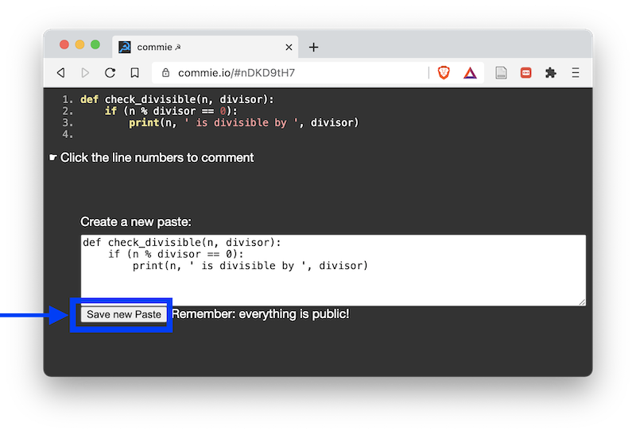
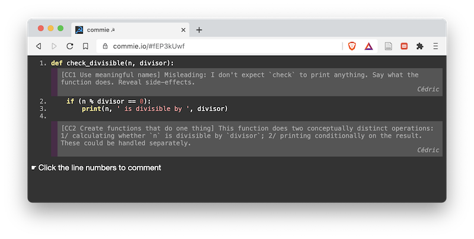
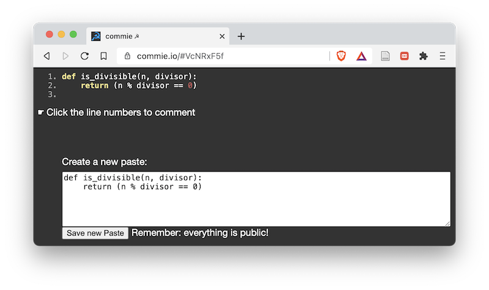

# Clean Code Principles

The goal is to make code **easy to understand** and **easy to change**.

* **CC1 Use meaningful names**.

    Reveal purpose. Replace magic numbers.
    Say what functions do. Reveal/Avoid side-effects. Remove ambiguity.
    Use different words for different concepts.
    Use the appropriate level of description.

* **CC2 Create functions that do one thing**.

* **CC3 DRY: Don't Repeat Yourself**.

* **CC4 Explain yourself in code, not comments**.

---

# Instructions for exercises: Review

1) In each exercise, you will **review** a piece of code and identify issues in the code
using the clean code principles.

2) During your review, you will write each issue you find as a comment on commie.io.

3) After some time, we will gather to share and discuss the issues we have found.

---

# Instructions for exercises: Review

1) In each exercise, you will **review** a piece of code and identify issues in the code
using the clean code principles.

* Open the link and **copy** the code
* Open <https://commie.io/> and **paste** the code in the text field 
* **Click "Save new Paste"** to make a review on your own copy of the code.

---

# Instructions for exercises: Review

2) During your review, you will write each issue you find as a comment on commie.io.

* Read the code and try to understand it.
* Use the clean code principles and your own thinking to find issues.
* Write them down as comments on commie.io.
    If possible, use the following template: "[CC# Name_of_clean_code_principle] Some specific details about the issue."

---

# Instructions for exercises: Review

3) After some time, we will gather to share and discuss the issues we have found.

* You may be asked to share your review,
in which case you will send us the commie.io link of your individual review.

---

# Instructions for exercises: Rewrite

1) You will try to **rewrite** the code to resolve the issues we identified during the review.

* You can use any editor you like to write your code.

2) After some time, we will gather to share and discuss our proposed rewrites.

* You may be asked to share your rewrite, in which case you will paste
your code in commie.io and send us the link.

---

# Exercise 1

Review and rewrite: <https://gist.github.com/cedricfoucault/c9e38bc1c86520dcf96cd329e679e4b1>

Cedric's review:
<https://commie.io/#LV4qePMk>

Cedric's rewrite:
<https://gist.github.com/cedricfoucault/48b59ef9d0757aacfbd911339a579781>

---

# Exercise 2

Review and rewrite: <https://gist.github.com/cedricfoucault/c07392e0697bda5d5f1e35b7c83b1d68>

Cedric's review:
<https://commie.io/#nuFfJsYK>

Cedric's rewrite:
<https://gist.github.com/cedricfoucault/19701e37eb026d579748a618cce2e672>

---

# Exercise 3

Review and rewrite: <https://gist.github.com/cedricfoucault/542daeae1ad5cd85e16e23f94d3a17cc>

Cedric's review:
<https://commie.io/#MZApD1ij>

Cedric's rewrite:
<https://gist.github.com/cedricfoucault/5e56afa4b4cbf5b4bbeadd9b075a46c7>

---

# Exercise 4

Review only: <https://gist.github.com/cedricfoucault/1a388fd9ae6cffdbc934b311bb051e62>

Cedric's review: <https://commie.io/#l0QRPfXR>

---

# Exercise 5

Review and rewrite: <https://gist.github.com/cedricfoucault/d54eca9fc82653e718d44d398c0de483>

Cedric's review: <https://commie.io/#i2ZBT6Ts>

Cedric's rewrite: [paper draft](images/clean_code_dots_functions.png)

Cedric's rewrite: code: <https://gist.github.com/cedricfoucault/656d0964055ab07d95f594cc3fdf511a>

<!-- Remove transition animation between slides -->

<!-- LEFTOVER EXERCISES -->

<!-- CC3 DRY, audiofile -->
<!-- ---

# Exercise

Review and rewrite: <https://commie.io/#7cN1viPY>

Cedric's review: <https://commie.io/#8yOq5KPE>

Cedric's rewrite: <https://commie.io/#aEEduA1r>
clean_code_pulsation_clean.py -->

<!-- CC2 functions do one thing, CC1, monolithic meaningless function, MATLAB-like code -->
<!-- ---

# Exercise

Review only (quick): <https://commie.io/#vcvactHD>

Cedric's review: <https://commie.io/#KJi9rhkq> -->

<!-- CC3 DRY two functions do same operations CC1 function names, occasion to more generic, reusable functions -->
<!-- ---

# Exercise

Review only: <https://commie.io/#g6Dpdzp5>

Cedric's review: <https://commie.io/#ahgvnZw7>

Cedric's rewrite (draft): <https://commie.io/#QJqjYNID>
, clean_code_pridil_clean.py -->

<!-- CC1 use the appropriate level of description. occasion to create a concept of 'cell' -->
<!-- ---
# Exercise 8

Review only: <https://commie.io/#WF85tGSs>

Cedric's review: <https://commie.io/#hIWbSQQH>

 -->