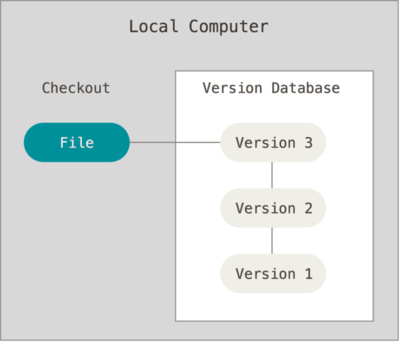
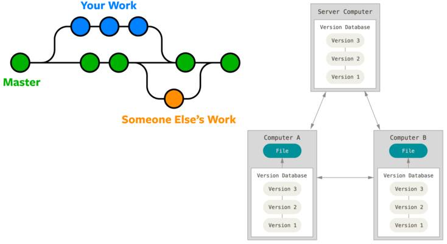

Git: a tool for version control
===============================

It keeps track of the history of a project, by keeping cached copies of the previous versions of files. 

The basic idea is very simple: to create *immutable snapshots* of the project at any given step.
    

This is much, much better than using a numbering scheme and multiple copies of the same file or directory (myfile001.doc, myfiles002.doc, ...). 

---

Creating a local database
=========================

    mkdir myproject
    cd myproject
    git init

    nano readme.txt
    git add readme.txt
    git commit -m 'first version'
    

    nano readme.txt
    git diff  # or git difftool
    

    gti status
    git add readme.txt
    git commit -m 'second version'

    git log

---

Beyond linear versioning
========================

Git permits non-linear development (branching), thus facilitating collaboration with other people.

----

In a nutshell
=============

-  **Bad**: keeps x copies of a file with slightly different names (final.doc, realfinal.doc, thefinaeone.doc...)

-  **Good**: see only the tip of the iceberg (latest version), with older version safe and ready for comparison..

-  **Bad**: use email’s attachments to exchange successive versions of a file.

-  **Good**: collaborate on a project by using a shared git repository

----

Github
=======

1. create a personal account on https://github.com/
 
2. Create a New Repository named `test`

3. On your loca computer, in a terminal

    git clone https://github.com/XXXXXX/test.git   # XXXXX should be your github user_id

    cd test
    nano README.md
    git add README.md
    git commit -m 'first commit'
    git push
    

---

Documentation
=============

- **Git**

   * https://git-scm.com/book/en/v2

   * https://openclassrooms.com/en/courses/5671626-manage-your-code-project-with-git-github?status=published

- **Markdown**

   * https://www.markdownguide.org/getting-started/
