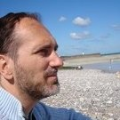
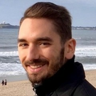

# Programming for Cognitive and Brain Sciences

* Christophe Pallier, researcher (neurolinguist) @ Neurospin

* Cédric Foucault, PhD student in Computational Neuroscience @ Neurospin

---

# Why PCBS?

Cognitive Scientists need to:

- generate stimuli and run experiments
- analyze experimental data (and do reproducible science)
- analyze corpora
- simulate cognitive processes (e.g. with neural nets)

---

# Why PCBS?

Cognitive Scientists need to:

- generate stimuli and run experiments
- analyze experimental data (and do reproducible science)
- analyze corpora
- simulate cognitive processes (e.g. with neural nets)

They also need to:

- automate boring tasks ("either you are the slave of your computer or the computer is your slave")

---

# Why PCBS?

Cognitive Scientists need to:

- generate stimuli and run experiments
- analyze experimental data (and do reproducible science)
- analyze corpora
- simulate cognitive processes (e.g. with neural nets)

They also need to:

- automate boring tasks ("either you are the slave of your computer or the computer is your slave")

- **understand how computers works** and why they are considered a model of the mind (*Computational Theory of Mind, David Marr's levels of description*, ...).

---

# Why PCBS?

Cognitive Scientists need to:

- generate stimuli and run experiments
- analyze experimental data (and do reproducible science)
- analyze corpora
- simulate cognitive processes (e.g. with neural nets)

They also need to:

- automate boring tasks ("either you are the slave of your computer or the computer is your slave")

- **understand how computers works** and why they are considered a model of the mind (*Computational Theory of Mind, David Marr's levels of description*, ...).

=> *Basic Programming skills are a necessity* (not convinced? tell us)

---

# Our Aims

1. Taking into account the vast differences in prior knowledge among students

    - to help those with limited (or no) programming experience bootstrap their own education in programming (our past experiences have shown that this is entirely feasible).
    - to give those who already know to code, some opportunities to acquire new skills (e.g. mastering real-time programming, literate programming, ...) 

---

# Our Aims

1. Taking into account the vast differences in prior knowledge among students

    - to help those with limited (or no) programming experience bootstrap their own education in programming (our past experiences have shown that this is entirely feasible).
    - to give those who already know to code, some opportunities to acquire new skills (e.g. mastering real-time programming, literate programming, ...) 

2. Try to distill in everyone the importance of **writing clean code**

    *Writing programs "that work"" is not sufficient!**

---

# The programming language choice

**Python** is a good compromise.

1. It is general purpose
2. It is quite readable
3. It is popular and there is a lot of help on the web
4. Free
   
Note: We will use Python 3 (>3.7?)

---

# How

Rather than a series of formal lectures, PCBS is essentially a **hands-on course** ("Atelier")

It involves a *great deal of personal involvement* (39+X hours for 2 ECTS !) because learning to program and learning a programming language requires many hours (just as learning how to play an instrument or a second language).

- The first 6 slots: will mostly consist of **exercises**, preceded by **short presentations**, as well as **debriefings** (Comments, Question & Answers). 

- The last 7 slots will be devoted to sessions where you work on a **self-selected project** (related to cognitive (neuro)sciences). 

In a real classroom, we would come to help you individually and check on your progress while you are working on the exercises and the project. In the pure online course, we will support you through **Zoom  backrooms** and a **Slack discussion forum**.

---

# Menu of the day

1. *Christophe* 

    How to use Python (essentially, how to work with a text editor and the command line to create/run a python script.)

2. *Cédric* 
    - how to work on the exercises 
    - "Primer on lists and dictionaries in Python"  (in Room 1)

3. *Christophe* 

    Support students who may need assistance in software installation (Room 2).

4. **Debriefing** 

